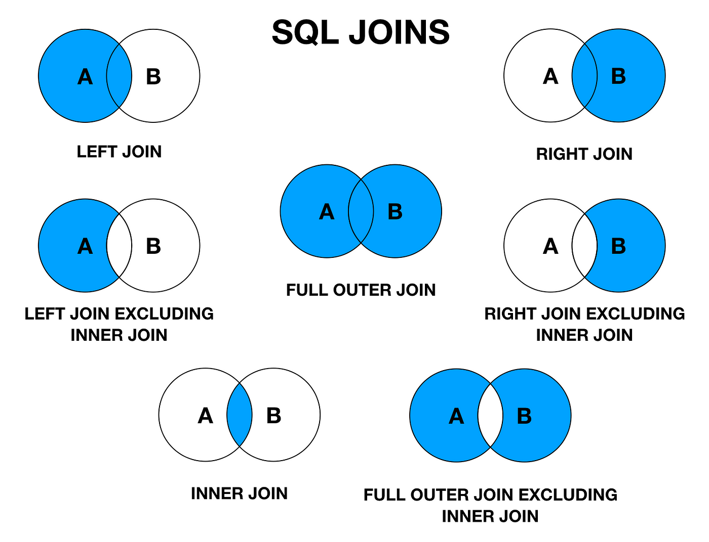
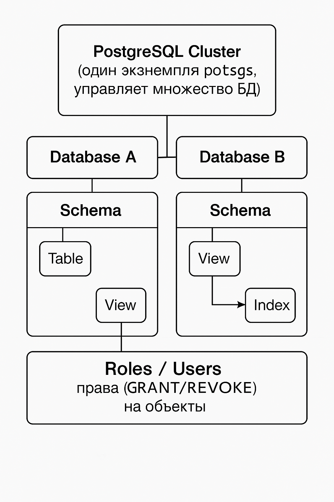

## [Main title](../README.md)
### [Interview questions](full.md)
# DB/SQL

## Оглавление

- [1. Что такое SQL и для чего он используется?](#1-что-такое-sql-и-для-чего-он-используется)
- [2. Разница между SQL и NoSQL базами данных](#2-разница-между-sql-и-nosql-базами-данных)
- [3. Какие операции можно выполнять с помощью SQL, для чего они нужны и их порядок выполнения?](#3-какие-операции-можно-выполнять-с-помощью-sql-для-чего-они-нужны-и-их-порядок-выполнения)
- [4. Какие типы JOIN-ов существуют и в чем их отличия ?](#4-какие-типы-join-ов-существуют-и-в-чем-их-отличия-)
- [5. Что такое алгоритмы соединения таблиц в SQL и какие они бывают ?](#5-что-такое-алгоритмы-соединения-таблиц-в-sql-и-какие-они-бывают-)
- [6. Что такое Hash Join (хэш-соединение)?](#6-что-такое-hash-join-хэш-соединение)
- [7. Что такое первичный ключ (Primary Key) в базе данных?](#7-что-такое-первичный-ключ-primary-key-в-базе-данных)
- [8. Что такое внешний ключ (Foreign Key) и как он используется?](#8-что-такое-внешний-ключ-foreign-key-и-как-он-используется)
- [9. В чем разница между PRIMARY KEY и UNIQUE ключом?](#9-в-чем-разница-между-primary-key-и-unique-ключом)
- [10. Какие виды связей между таблицами существуют и как они реализуются?](#10-какие-виды-связей-между-таблицами-существуют-и-как-они-реализуются)
- [11. Что такое нормализация? Объясните с примерами](#11-что-такое-нормализация-объясните-с-примерами)
- [12. Что такое денормализация и когда её используют?](#12-что-такое-денормализация-и-когда-её-используют)
- [13. Что такое индексы и как они улучшают производительность запросов?](#13-что-такое-индексы-и-как-они-улучшают-производительность-запросов)
- [14. Что такое PL/SQL?](#14-что-такое-plsql)
- [15. Какая разница между процедурным и декларативным подходом в SQL?](#15-какая-разница-между-процедурным-и-декларативным-подходом-в-sql)
- [16. Объясните свойства ACID в контексте баз данных](#16-объясните-свойства-acid-в-контексте-баз-данных)
- [17. Что такое уровень изоляции транзакции (Transaction Isolation Levels)? Какие виды бывают и какие проблемы они решают ?](#17-что-такое-уровень-изоляции-транзакции-transaction-isolation-levels-какие-виды-бывают-и-какие-проблемы-они-решают-)
- [18. Объясните логическую архитектуру PostgreSQL](#18-объясните-логическую-архитектуру-postgresql)
- [19. Опиши физическую структуру PostgreSQL](#19-опиши-физическую-структуру-postgresql)
- [20. Объясните MVCC в PostgreSQL](#20-объясните-mvcc-в-postgresql)
- [21. Что такое масштабирование на примере PostgreSQL?](#21-что-такое-масштабирование-на-примере-postgresql)
- [22. Что такое шардирование?](#22-что-такое-шардирование)
- [23. Что такое репликация?](#23-что-такое-репликация)
- [24. Что такое партиционирование в SQL?](#24-что-такое-партиционирование-в-sql)
- [25. Что такое триггер?](#25-что-такое-триггер)
- [26. В чем разница между триггером и процедурой/функцией?](#26-в-чем-разница-между-триггером-и-процедуройфункцией)
- [27. Что такое представления (views) и каковы их преимущества? Как они могут использоваться в контексте OLAP-систем?](#27-что-такое-представления-views-и-каковы-их-преимущества-как-они-могут-использоваться-в-контексте-olap-систем)
- [28. Что такое эскалация блокировок (lock escalation)?](#28-что-такое-эскалация-блокировок-lock-escalation)
- [29. Что такое ограничения (constraints) в SQL?](#29-что-такое-ограничения-constraints-в-sql)
- [30. Какие виды блокировок бывают?](#30-какие-виды-блокировок-бывают)
- [31. Что такое взаимная блокировка (deadlock)?](#31-что-такое-взаимная-блокировка-deadlock)
- [32. Что такое роли (roles)?](#32-что-такое-роли-roles)
- [33. Что такое оконные функции в SQL и зачем они нужны?](#33-что-такое-оконные-функции-в-sql-и-зачем-они-нужны)
- [34. Чем отличаются агрегатные функции от оконных?](#34-чем-отличаются-агрегатные-функции-от-оконных)
- [35. Что такое PARTITION BY и ORDER BY в оконных функциях?](#35-что-такое-partition-by-и-order-by-в-оконных-функциях)
- [36. Чем отличаются ROW_NUMBER(), RANK() и DENSE_RANK()?](#36-чем-отличаются-row_number-rank-и-dense_rank)
- [37. Для чего нужны LAG() и LEAD()?](#37-для-чего-нужны-lag-и-lead)
- [39. Можно ли использовать оконные функции в WHERE?](#39-можно-ли-использовать-оконные-функции-в-where)
- [40. Что такое QUALIFY?](#40-что-такое-qualify)
- [41. Оптимизация SQL-запросов: EXPLAIN и EXPLAIN ANALYZE](#41-оптимизация-sql-запросов-explain-и-explain-analyze)
- [42. Что такое BASE-подход в базах данных?](#42-что-такое-base-подход-в-базах-данных)
- [43. В чем отличие BASE и ACID подходов?](#43-в-чем-отличие-BASE-и-ACID-подходов)
- [44. У вас есть таблица логов с миллиардами строк. Как вы будете ускорять поиск по дате и `user_id`?](#44-у-вас-есть-таблица-логов-с-миллиардами-строк-как-вы-будете-ускорять-поиск-по-дате-и-user_id)

## 1. Что такое SQL и для чего он используется?

**SQL** (Structured Query Language — язык структурированных запросов) — это предметно-ориентированный декларативный язык программирования, предназначенный для работы с реляционными базами данных.  
Он является основным языком для выполнения таких задач, как:
- извлечение данных,
- изменение данных,
- администрирование базы данных.

### Основные компоненты SQL

- **DDL (Data Definition Language)** — язык определения данных. Используется для описания и изменения структуры базы данных.
- **DML (Data Manipulation Language)** — язык манипулирования данными. Отвечает за добавление, изменение и удаление данных в базе.
- **DCL (Data Control Language)** — язык управления доступом. Используется для управления правами и разрешениями в базе данных.
- **TCL (Transaction Control Language)** — язык управления транзакциями. Регулирует работу с транзакциями (например, фиксация изменений `COMMIT` или их откат `ROLLBACK`). 

## 2. Разница между SQL и NoSQL базами данных

SQL и NoSQL базы данных предлагают разные парадигмы, каждая из которых предназначена для определённых типов данных и способов их обработки.

### Основные различия

- **SQL**: Предназначены в первую очередь для структурированных (и частично полуструктурированных) данных, которые соответствуют заранее определённой схеме.
- **NoSQL**: Подходят для неструктурированных или полуструктурированных данных, которые постепенно эволюционируют, обеспечивая гибкость в схемах.

- **SQL**: Использует язык SQL (Structured Query Language) для модификации и извлечения данных.
- **NoSQL**: Предоставляет различные API (например, интерфейсы для документо-ориентированных и ключ-значение хранилищ); использование структурированных языков запросов зависит от конкретной реализации.

- **SQL**: Обычно гарантирует соответствие принципам **ACID** (атомарность, согласованность, изоляция, долговечность), что обеспечивает целостность данных.
- **NoSQL**: Часто оптимизированы для высокой производительности и горизонтального масштабирования, иногда в ущерб строгой согласованности.

### Основные типы NoSQL баз данных

- **Документо-ориентированные хранилища**
    - Примеры: MongoDB, Couchbase
    - Особенности: каждая запись — это самостоятельный документ (обычно JSON). Связи реализуются через вложенные документы или ссылки.
    - Пример: пользователь и его посты в блоге могут храниться в одном документе или быть связаны через ссылки.

- **Ключ-значение хранилища**
    - Примеры: Redis, Amazon DynamoDB
    - Особенности: данные хранятся в виде уникальных ключей и значений. Нет обязательной схемы.
    - Пример: товары в корзине интернет-магазина, связанные с ID пользователя.

- **Широкостолбцовые базы (Column Families)**
    - Примеры: Apache Cassandra, HBase
    - Особенности: данные группируются в семейства столбцов, аналогичные таблицам, но с гибкой схемой.
    - Пример: профили пользователей, где у одних могут быть уникальные атрибуты.

- **Графовые базы данных**
    - Примеры: Neo4j, JanusGraph
    - Особенности: оптимизированы для данных со сложными связями. Сущности представлены как узлы, а связи — как рёбра.
    - Пример: социальные сети с управлением связями «дружбы».

### Отличия в моделировании данных

- **SQL**: нормализация для минимизации избыточности и аномалий при обновлении.
- **NoSQL**: денормализация — данные упаковываются вместе, чтобы сократить количество запросов.

### Генерация ID

- **SQL**: часто используется автоинкрементное уникальное ID.
- **NoSQL**: уникальные идентификаторы могут генерироваться внешними системами или на уровне документа.

### Работа с отношениями данных

- **SQL**: связи реализуются через ключи (первичные и внешние).
- **NoSQL**: связи могут быть реализованы через вложенные документы, ссылки или графовые структуры.

### Поддержка транзакций

- **SQL**: транзакции — стандартная часть функционала.
- **NoSQL**: поддержка транзакций зависит от реализации.

### Уровни согласованности данных

- **SQL**: обеспечивает строгую согласованность.
- **NoSQL**: предлагает разные модели — от строгой до eventual consistency (согласованности в конечном счёте).

### Масштабируемость

- **SQL**: вертикальная (мощность одного сервера увеличивается).
- **NoSQL**: горизонтальная (распределение нагрузки на множество серверов).

### Гибкость данных

- **SQL**: строгая схема, трудно адаптировать к меняющимся структурам данных.
- **NoSQL**: поддерживает динамическое обновление схемы, что даёт высокую гибкость.

### Целостность и валидация данных

- **SQL**: целостность обеспечивается ограничениями и строгими типами данных.
- **NoSQL**: больше полагается на приложение для управления целостностью и проверкой данных.  

## 3. Какие операции можно выполнять с помощью SQL, для чего они нужны и их порядок выполнения?

В SQL команды делятся на несколько категорий.

### DDL (Data Definition Language) — язык определения данных
Используется для описания и изменения структуры объектов базы данных.

- **CREATE** — создание объектов (таблицы, представления, схемы и т.д.)
- **ALTER** — изменение структуры объектов
- **DROP** — удаление объектов
- **TRUNCATE** — очистка таблицы (быстрое удаление всех строк без возможности отката)
- **RENAME** — переименование объекта

> ⚡ Особенность: DDL-команды фиксируются автоматически (**auto-commit**) и не могут быть откатаны.

### DML (Data Manipulation Language) — язык манипуляции данными
Используется для работы с данными в таблицах.

- **SELECT** — чтение данных
- **INSERT** — добавление строк
- **UPDATE** — изменение строк
- **DELETE** — удаление строк

> ⚡ Особенность: DML-команды поддерживают транзакции и могут быть отменены (**ROLLBACK**).

#### Основные операции в SELECT-запросе
- **SELECT** — определяет столбцы или выражения для вывода
- **FROM** — задаёт источники данных (таблицы, представления)
- **JOIN** — объединяет данные из разных таблиц
- **WHERE** — фильтрует строки до группировки
- **GROUP BY** — группирует строки в агрегаты
- **HAVING** — фильтрует сгруппированные результаты
- **ORDER BY** — сортирует вывод
- **LIMIT** — ограничивает количество возвращаемых строк

#### Логический порядок выполнения запроса
Хотя пишем мы команды в одном порядке, выполняются они так: FROM → JOIN → WHERE → GROUP BY → HAVING → SELECT → ORDER BY → LIMIT

> Это объясняет, например, почему нельзя использовать алиасы из `SELECT` в `WHERE`.

### DCL (Data Control Language) — язык управления доступом
Используется для работы с правами пользователей.

- **GRANT** — выдаёт права
- **REVOKE** — отзывает права

### TCL (Transaction Control Language) — язык управления транзакциями
Регулирует выполнение транзакций.

- **COMMIT** — зафиксировать изменения
- **ROLLBACK** — откатить изменения
- **SAVEPOINT** — установить точку сохранения в транзакции

📌 **Краткий итог:**
- DDL управляет структурой базы (CREATE/ALTER/DROP).
- DML управляет данными (SELECT/INSERT/UPDATE/DELETE).
- DCL управляет доступом (GRANT/REVOKE).
- TCL управляет транзакциями (COMMIT/ROLLBACK/SAVEPOINT).
- Логический порядок выполнения SELECT отличается от синтаксического и это важно для правильного понимания запросов.  

## 4. Какие типы JOIN-ов существуют и в чем их отличия ?

**JOIN** в SQL используется для объединения строк из двух или более таблиц на основе связанного столбца (обычно ключа).  
Понимание типов соединений важно для правильной работы с нормализованными данными и предотвращения случайных декартовых произведений.

### Основные типы JOIN

- **INNER JOIN** — возвращает только совпадающие строки в обеих таблицах.
- **LEFT JOIN** — возвращает все строки из левой таблицы и совпадения из правой; если совпадений нет, подставляются `NULL`.
- **RIGHT JOIN** — противоположен LEFT JOIN: возвращает все строки из правой таблицы и совпадения из левой.
- **FULL JOIN (FULL OUTER JOIN)** — возвращает все строки из обеих таблиц, подставляя `NULL` там, где нет совпадений.
- **CROSS JOIN** — формирует декартово произведение (каждая строка из первой таблицы соединяется со всеми строками второй).
- **SELF JOIN** — соединение таблицы с самой собой (часто используется для иерархий, например «сотрудник → менеджер»).

### Визуализация типов JOIN



## 5. Что такое алгоритмы соединения таблиц в SQL и какие они бывают ?

Когда мы пишем `JOIN`, СУБД должна выбрать **алгоритм соединения**.  
Основные варианты:

### Nested Loop Join (вложенные циклы)
- Простейший алгоритм: для каждой строки из первой таблицы ищем совпадение во второй.
- Работает как «двойной цикл».

**Когда эффективен:**
- Маленькие таблицы.
- Есть индекс по ключу соединения (тогда внутренняя таблица быстро ищется).

**Минусы:**
- Очень медленный на больших данных (O(N*M)).

### Merge Join (соединение слиянием)
- Обе таблицы сортируются по ключу соединения.
- Затем СУБД «идёт» по двум спискам, сравнивая строки.

**Когда эффективен:**
- Таблицы уже отсортированы (например, по индексу).
- Подходит для больших объёмов данных.

**Минусы:**
- Требует сортировки, если данные не упорядочены.

### Hash Join (соединение через хэш-таблицу)
- Строится **хэш-таблица** для меньшей таблицы по ключу соединения.
- Для строк из второй таблицы ищутся совпадения через хэш.

**Когда эффективен:**
- Большие таблицы без индексов.
- Соединение по условию равенства (`=`).

**Минусы:**
- Требует памяти для хэш-таблицы.
- При очень больших таблицах может сбрасывать данные на диск (Hash Join spill).

### Adaptive Join (динамический выбор, в SQL Server, Oracle)
- СУБД начинает выполнение, а потом **меняет алгоритм на лету**, если оценка кардинальности (число строк) оказалась неверной.

### Сравнение алгоритмов

| Алгоритм        | Подходит для              | Сложность      | Требования                |
|-----------------|---------------------------|----------------|---------------------------|
| Nested Loop     | Маленькие таблицы, индекс | O(N*M)         | Индекс для ускорения      |
| Merge Join      | Отсортированные данные    | O(N+M)         | Нужна сортировка          |
| Hash Join       | Большие неотсортированные | O(N+M)         | Память под хэш-таблицу    |
| Adaptive Join   | Динамическая оптимизация  | Зависит от СУБД| Нужна поддержка в движке  |


#### Итог
- **Nested Loop** — прост, но медленный без индекса.
- **Merge Join** — хорош при сортированных данных.
- **Hash Join** — самый частый выбор для больших таблиц.
- **Adaptive Join** — «умный» выбор, если СУБД поддерживает.

## 6. Что такое Hash Join (хэш-соединение)?

**Hash Join** — это алгоритм соединения таблиц в SQL, который использует **хэш-таблицу** для ускорения поиска совпадений между строками.  
Применяется, когда мы делаем `JOIN` двух таблиц по условию равенства (`=`).

### Как работает Hash Join
Алгоритм обычно состоит из двух фаз:

1. **Build (построение)**
  - СУБД выбирает меньшую таблицу (или результат подзапроса).
  - Создаёт по ключу соединения **хэш-таблицу** в памяти.
  - В этой хэш-таблице строки хранятся в виде пар «ключ → строка».

2. **Probe (поиск)**
  - СУБД последовательно читает строки из второй (большей) таблицы.
  - Для каждой строки вычисляет хэш по ключу соединения.
  - Проверяет, есть ли совпадение в хэш-таблице.
  - Если есть — строки соединяются и попадают в результат.

### Пример
```sql
  SELECT *
  FROM orders o
  JOIN customers c
    ON o.customer_id = c.customer_id;
```
- PostgreSQL может выбрать **Hash Join**, если:
  - `customers` небольшая таблица → для неё строится хэш-таблица.
  - `orders` большая таблица → для каждой строки ищется совпадение по `customer_id` в хэше.

### Когда эффективен Hash Join
- Соединение по условию **равенства** (`=`).
- Таблицы большие, и у них **нет подходящего индекса**.
- Одна таблица существенно меньше другой.

### Сравнение с другими алгоритмами
| Алгоритм     | Как работает                                  | Когда лучше |
|--------------|-----------------------------------------------|-------------|
| **Nested Loop** | Для каждой строки левой таблицы ищет в правой | Хорошо для маленьких таблиц или при наличии индекса |
| **Merge Join**  | Сортирует обе таблицы и проходит их последовательно | Эффективно при отсортированных данных |
| **Hash Join**   | Строит хэш-таблицу и ищет совпадения через хэш | Оптимально для больших таблиц без индексов |

### Итог
- **Hash Join** — это соединение через хэш-таблицу.
- Обычно быстрее Nested Loop, если данных много и индексов нет.
- Но требует дополнительной памяти для хранения хэш-таблицы.

## 7. Что такое первичный ключ (Primary Key) в базе данных?

**Первичный ключ** — это столбец или набор столбцов, которые однозначно идентифицируют каждую строку в таблице базы данных.

### Основные свойства:
- Значения **должны быть уникальными**.
- Значения **не могут быть NULL**.
- В таблице может быть **только один первичный ключ**, но он может состоять из нескольких столбцов (**составной ключ**).
- Большинство СУБД автоматически создают индекс для первичного ключа, чтобы ускорить поиск.

### Пример

```sql
CREATE TABLE employees (
    employee_id INT PRIMARY KEY,
    name VARCHAR(100)
);
```
### Что делает этот код?

1. Создаёт таблицу `employees`.
2. Определяет столбец `employee_id` как **PRIMARY KEY**.
3. Обеспечивает уникальность каждого значения `employee_id`.
4. Запрещает использование `NULL` для `employee_id`.
5. Даёт возможность использовать `employee_id` как ссылку (внешний ключ) в других таблицах.
6. Автоматически создаёт индекс по `employee_id` для ускорения поиска. 

## 8. Что такое внешний ключ (Foreign Key) и как он используется?

**Внешний ключ (FOREIGN KEY)** — это столбец или набор столбцов в одной таблице, которые ссылаются на первичный ключ в другой таблице.

### Основные свойства:
- Внешний ключ всегда указывает на **PRIMARY KEY** или **UNIQUE ключ** в родительской таблице.
- Его назначение — обеспечивать **ссылочную целостность**, то есть согласованность связей между таблицами.
- Он не допускает вставку значений, которых нет в родительской таблице.
- Может определять действия при изменении или удалении строки в родительской таблице:
  - `ON DELETE CASCADE` — удаляет связанные записи.
  - `ON DELETE SET NULL` — устанавливает значение `NULL` во внешнем ключе.
  - `RESTRICT` — запрещает удаление/обновление, если есть связанные записи.

### Пример

```sql
CREATE TABLE employees (
    employee_id INT PRIMARY KEY,
    department_id INT,
    FOREIGN KEY (department_id) REFERENCES departments(department_id)
);
```

## 9. В чем разница между PRIMARY KEY и UNIQUE ключом?

### PRIMARY KEY
- Однозначно идентифицирует каждую строку в таблице.
- Может состоять из **одного или нескольких столбцов** (составной ключ).
- В таблице может быть **только один PRIMARY KEY**.
- Значения **не могут быть NULL**.
- При создании автоматически создаётся индекс.

### UNIQUE ключ
- Гарантирует, что значения в столбце (или наборе столбцов) будут уникальны.
- В таблице может быть **несколько UNIQUE ключей**.
- В отличие от PRIMARY KEY, допускает **одно значение NULL** (поведение может отличаться в разных СУБД).
- Тоже создаёт уникальный индекс, но не обязательно является «основным идентификатором» таблицы.

### Кратко
- `PRIMARY KEY` — главный идентификатор строки, обязателен для таблицы и всегда **NOT NULL + UNIQUE**.
- `UNIQUE` — дополнительное ограничение для предотвращения дубликатов в других столбцах, но допускает `NULL` (в большинстве СУБД).

### Пример

```sql
CREATE TABLE users (
    user_id INT PRIMARY KEY,
    email VARCHAR(255) UNIQUE,
    phone VARCHAR(20) UNIQUE
);
```

## 10. Какие виды связей между таблицами существуют и как они реализуются?

В реляционных базах данных существуют три основных типа связей между таблицами: **1:1 (один к одному)**, **1:M (один ко многим)** и **M:N (многие ко многим)**.

### Связь 1:1 (One-to-One)

**Определение:** каждой записи в первой таблице соответствует не более одной записи во второй, и наоборот.

**Пример:**
- Таблица `users` — основная информация о пользователях.
- Таблица `user_profiles` — дополнительная информация (например, паспортные данные).

**Реализация:**  
Во второй таблице (`user_profiles`) создаётся внешний ключ (`FOREIGN KEY`), который также является `PRIMARY KEY`.  
Это гарантирует, что у каждого пользователя будет не более одного профиля.

```sql
CREATE TABLE users (  
  user_id INT PRIMARY KEY,  
  name VARCHAR(100)  
);

CREATE TABLE user_profiles (  
  user_id INT PRIMARY KEY,  
  address VARCHAR(200),  
  FOREIGN KEY (user_id) REFERENCES users(user_id)  
);
```

### Связь 1:M (One-to-Many)

**Определение:** каждой записи в первой таблице может соответствовать много записей во второй, но каждая запись во второй таблице относится только к одной записи в первой.

**Пример:**
- Таблица `departments` — список отделов.
- Таблица `employees` — список сотрудников.

**Реализация:**  
Во второй таблице (`employees`) создаётся внешний ключ, который ссылается на первичный ключ первой таблицы (`departments`).

```sql
CREATE TABLE departments (  
  department_id INT PRIMARY KEY,  
  department_name VARCHAR(100)  
);

CREATE TABLE employees (  
  employee_id INT PRIMARY KEY,  
  name VARCHAR(100),  
  department_id INT,  
  FOREIGN KEY (department_id) REFERENCES departments(department_id)  
);
```

### Связь M:N (Many-to-Many)

**Определение:** каждой записи в первой таблице может соответствовать много записей во второй, и наоборот.

**Пример:**
- Таблица `students` — студенты.
- Таблица `courses` — курсы.
- Один студент может посещать много курсов, и один курс может посещаться многими студентами.

**Реализация:**  
Создаётся третья таблица (промежуточная или связующая), которая хранит пары ключей.

```sql
CREATE TABLE students (  
  student_id INT PRIMARY KEY,  
  name VARCHAR(100)  
);

CREATE TABLE courses (  
  course_id INT PRIMARY KEY,  
  course_name VARCHAR(100)  
);

CREATE TABLE student_courses (  
  student_id INT,  
  course_id INT,  
  PRIMARY KEY (student_id, course_id),  
  FOREIGN KEY (student_id) REFERENCES students(student_id),  
  FOREIGN KEY (course_id) REFERENCES courses(course_id)  
);
```

Таблица `student_courses` связывает студентов и курсы, реализуя связь «многие ко многим».

## 11. Что такое нормализация? Объясните с примерами

**Нормализация** — это метод проектирования базы данных, направленный на упорядочение структуры таблиц с целью уменьшения избыточности данных и повышения их целостности.  
Процесс выполняется поэтапно и разделён на несколько нормальных форм (1NF, 2NF, 3NF, BCNF, 4NF), каждая из которых имеет свои правила.

### Пример нормализации (сценарий «Customer Invoices»)

#### Ненормализованная таблица (0NF)

| ID | Name | Invoice No. | Invoice Date | Item No. | Description | Quantity | Unit Price |
|----|------|-------------|--------------|----------|-------------|----------|------------|

В таком виде все данные хранятся в одной таблице без структурной логики. Записи содержат и данные о клиенте, и данные о счёте, и данные о товарах. Это приводит к избыточности и аномалиям.

#### Первая нормальная форма (1NF)

**Правило:** все ячейки должны быть атомарными (только одно значение). Нужно разделять связанные группы данных.

В примере выделяем отдельные таблицы:

**Customer Details Table**

| ID | Name |
|----|------|

**Invoices Table**

| Invoice No. | Customer_ID | Invoice Date |
|-------------|-------------|--------------|

**Items Table**

| Invoice No. | Item No. | Description | Quantity | Unit Price |
|-------------|----------|-------------|----------|------------|

Теперь каждая таблица отвечает за свою сущность.

#### Вторая нормальная форма (2NF)

**Правило:** каждый неключевой столбец должен зависеть от всего составного ключа.

В примере таблица `Items` уже удовлетворяет 2NF, так как `Description` и `Unit Price` зависят от всего ключа `(Invoice No., Item No.)`.

#### Третья нормальная форма (3NF)

**Правило:** не должно быть транзитивных зависимостей. Неключевые столбцы должны зависеть только от первичного ключа.

В нашем случае таблица `Invoices` уточняется так:

**Updated Invoices Table**  

| Invoice No. | Customer_ID | Invoice Date |
|-------------|-------------|--------------|

Здесь `Customer_ID` — единственный атрибут, связанный с клиентом.

### Практические последствия

- Более высокие нормальные формы повышают целостность данных, но могут усложнять работу с ними.
- Нужно учитывать специфику приложения при выборе целевой нормальной формы.

### Применение в реальном мире

- Большинство баз данных стремится хотя бы к 3NF.
- Для задач, где важна полная целостность данных, используются 4NF и выше.

### Пример SQL реализации (3NF)

Создание таблицы клиентов:

```sql
CREATE TABLE Customers (  
  ID INT PRIMARY KEY,  
  Name VARCHAR(50)  
);

--Создание таблицы счетов:

CREATE TABLE Invoices (  
  InvoiceNo INT PRIMARY KEY,  
  Customer_ID INT,  
  InvoiceDate DATE,  
  FOREIGN KEY (Customer_ID) REFERENCES Customers(ID)  
);

--Создание таблицы товаров:

CREATE TABLE Items (  
  InvoiceNo INT,  
  ItemNo INT,  
  Description VARCHAR(100),  
  Quantity INT,  
  UnitPrice DECIMAL(10,2),  
  PRIMARY KEY (InvoiceNo, ItemNo),  
  FOREIGN KEY (InvoiceNo) REFERENCES Invoices(InvoiceNo)  
);
```

Эта структура в 3NF разделяет клиентов, счета и товары на отдельные таблицы, что обеспечивает целостность данных и удобство при работе.

## 12. Что такое денормализация и когда её используют?

**Денормализация** — это процесс оптимизации производительности базы данных за счёт уменьшения числа соединений (JOIN) и ускорения выборок, путём преднамеренного добавления избыточности данных.  
Это противоположный подход нормализации: мы жертвуем частью целостности ради скорости.

### Основные техники денормализации

1. **Уплощение связей (Flattening Relationships)**
  - Объединение связанных таблиц для минимизации числа JOIN.
  - Пример: объединение таблиц `Order` и `Product`, чтобы убрать связь многие-ко-многим.

2. **Агрегация данных (Aggregating Data)**
  - Предварительный расчёт значений для снижения нагрузки при запросах.
  - Пример: добавление колонки `Sales_Total` в таблицу `Order`.

3. **Добавление избыточных данных (Adding Redundant Data)**
  - Дублирование информации для уменьшения числа соединений.
  - Пример: таблицы `Customer` и `Sales` обе содержат поле `Country`, хотя оно связано через `Customer`.

### Типовые сценарии применения

- **Отчёты и аналитика (Reporting and Analytics)**
  - Отчёты часто требуют соединений большого числа таблиц.
  - Денормализация упрощает структуру и ускоряет генерацию отчётов.

- **Высоконагруженные транзакционные системы (High-Volume Transaction Systems)**
  - Если допустима кратковременная несогласованность данных, денормализация ускоряет операции.
  - Пример: в e-commerce допускается небольшая задержка обновления данных о продажах ради более быстрого оформления заказов.

- **Системы с преобладанием чтения (Read-Mostly Applications)**
  - Там, где много операций чтения и мало записи.

- **Системы с интенсивным поиском и запросами (Search- and Query-Intensive Applications)**
  - Поисковые движки часто хранят данные в денормализованной форме для ускорения поиска.

- **Распределённые системы (Partitioning Data)**
  - В NoSQL или Hadoop данные часто хранятся с избыточностью для ускорения доступа на разных узлах.

### Соображения и компромиссы

- **Производительность vs. согласованность**
  - Денормализация ускоряет запросы, но снижает консистентность данных.

- **Сложность обслуживания (Maintenance Challenges)**
  - Избыточные данные нужно синхронизировать и обновлять.

- **Простота эксплуатации (Operational Simplicity)**
  - Иногда простая денормализованная структура удобнее, чем строгая нормализация.

- **Гибкость запросов (Query Flexibility)**
  - Нормализованные данные проще адаптировать под новые запросы и изменения схемы, а денормализованные структуры требуют дополнительных усилий для модификаций.

### Итог

Денормализация используется, когда **важнее скорость доступа и упрощение запросов**, чем строгая целостность данных.  
Обычно она применяется:
- в аналитических системах,
- при очень больших объёмах данных,
- в поисковых движках,
- в e-commerce для ускорения отклика.

## 13. Что такое индексы и как они улучшают производительность запросов?

**Индекс** — это дополнительная структура данных в СУБД, которая хранит значения столбца (или столбцов) в отсортированном/оптимизированном для поиска виде вместе с указателями на соответствующие строки таблицы.

**Аналогия:**
- Без индекса: ищешь слово в книге, перелистывая каждую страницу (полный перебор, table scan).
- С индексом: смотришь в алфавитный указатель и сразу находишь нужную страницу.

### Основные виды индексов

#### Clustered Index (кластерный)
1. **Что делает:** задаёт физический порядок хранения строк в таблице.
2. **Ограничение:** только один на таблицу.
3. **Пример:** если сделать `PRIMARY KEY order_id` (например, в SQL Server), по умолчанию это будет clustered-индекс — строки реально будут расположены по `order_id`.
4. **Плюс:** быстрый поиск и сортировка по ключу.
5. **Минус:** при вставке значений «не в конец» строки нужно переставлять → может быть медленно.

#### Non-Clustered Index (некластерный)
- **Что делает:** хранит копию ключей + указатель на место в таблице (Row ID или кластерный ключ).
- **Сколько можно:** хоть десятки на одну таблицу.
- **Пример:**

```sql
  CREATE INDEX idx_orders_customer  
  ON orders(customer_id);
```

- **Плюс:** быстро искать по неосновным полям.
- **Минус:** после нахождения ключа СУБД всё равно идёт в таблицу за остальными полями (lookup).

#### Covering Index (покрывающий)
- **Что делает:** содержит все поля, нужные для конкретного запроса — ключи и INCLUDE-колонки.
- **Зачем:** чтобы не ходить в таблицу — всё читается из индекса.
- **Пример:**
```sql
CREATE INDEX idx_orders_cover  
ON orders(customer_id, order_date)  
INCLUDE(total_amount);
```
Запрос:
```sql
SELECT customer_id, order_date, total_amount  
FROM orders  
WHERE customer_id = 101;
```
может выполниться полностью из индекса.

#### Unique Index
- **Назначение:** обеспечивает уникальность значений.
- **Где появляется:** создаётся автоматически при `PRIMARY KEY` и `UNIQUE` ограничениях.

### Как индекс устроен внутри

- Чаще всего используется **B-tree**: в узлах хранятся диапазоны значений и ссылки; поиск — `O(log N)` (а не `O(N)`).
- Для полнотекстовых/геоданных могут применяться другие структуры: **hash**, **GiST**, **R-tree**.

### Когда индекс помогает

- Условие в `WHERE` по колонке с индексом, выбирающее **малую долю строк**.
- `JOIN` по индексированным колонкам.
- `ORDER BY` / `GROUP BY` по индексируемым столбцам.
- Частые точечные (`=`) и диапазонные (`BETWEEN`, `>`, `<`) запросы.

### Когда индекс не помогает

- Очень маленькая таблица — полный скан быстрее.
- Запросы, которые выбирают **>20–30%** строк — чтение всей таблицы может быть выгоднее.
- Условия с функциями/выражениями на колонке (индекс не используется):

```sql
    WHERE YEAR(order_date) = 2024    ← индекс по `order_date` не применится
```
- Несeлeктивные условия (например, `WHERE gender = 'M'`, если 90% значений — `'M'`).

---

### Минусы индексов

- **Память:** занимают место на диске.
- **Запись:** замедляют `INSERT/UPDATE/DELETE`, потому что индексы тоже нужно обновлять.
- **Поддержка:** при изменении структуры таблицы индексы нужно перестраивать.

### Как проверить, используется ли индекс

**PostgreSQL (текст SQL):**

```sql
  EXPLAIN ANALYZE  
  SELECT *
  FROM orders  
  WHERE customer_id = 123;
```

Смотри, есть ли в плане **Index Scan** (PostgreSQL) или **Index Seek**/**Index Scan** (SQL Server).
- *Index Seek* — быстрый адресный поиск по дереву.
- *Index Scan* — последовательное чтение индекса целиком (лучше, чем table scan, но хуже seek).

### Практический кейс

**Проблема:** в отчёте Power BI запрос

```sql
  SELECT customer_id, SUM(amount)  
  FROM orders  
  WHERE order_date >= '2024-01-01'  
  GROUP BY customer_id;
```

работал ~2 минуты.

**Решение:** создали покрывающий индекс
```sql
CREATE INDEX idx_orders_perf  
ON orders(order_date, customer_id)  
INCLUDE(amount);
```

— время выполнения сократилось до ~5 секунд.

## 14. Что такое PL/SQL?

**a.** PL/SQL (Procedural Language/SQL) — это процедурное расширение Oracle для SQL,  
которое позволяет комбинировать SQL-операторы с возможностями процедурного программирования.

**b. Основные свойства:**
1. **Блочная структура** — код организован в декларативные, исполняемые и обработчики исключений.
2. **Интеграция с SQL** — позволяет встраивать DML-операторы и SELECT-запросы внутрь процедурного кода.
3. **Переменные и типы данных** — поддержка SQL-типов данных и возможность объявления переменных, констант и курсоров.
4. **Управляющие структуры** — поддержка `IF-THEN-ELSE`, `CASE` и циклов (`FOR`, `WHILE`, `LOOP`).
5. **Обработка исключений** — встроенный механизм обработки ошибок через блоки `EXCEPTION`.
6. **Модульность** — поддержка процедур, функций, пакетов и триггеров.
7. **Производительность** — снижение сетевого трафика за счёт выполнения логики непосредственно в базе данных.

**Пример:**
```sql
  DECLARE
  v_total NUMBER;
  BEGIN
    SELECT COUNT(*) INTO v_total FROM employees;
    DBMS_OUTPUT.PUT_LINE(’Total employees: ’ || v_total);
  EXCEPTION
  WHEN OTHERS THEN
    DBMS_OUTPUT.PUT_LINE(‘Error occurred’);
  END;
```
**Ограничения PL/SQL:**
1. **Сложность сопровождения** — чрезмерное размещение бизнес-логики в БД усложняет отладку и тестирование.
2. **Ограниченная повторная используемость** — код PL/SQL нельзя напрямую использовать во внешних приложениях, написанных на других языках.
3. **Зависимость от версии** — некоторые функции доступны только в новых версиях Oracle.
4. **Потенциальная нагрузка на БД** — перенос тяжёлой логики в PL/SQL может перегрузить сервер вместо распределения нагрузки на уровень приложений.
5. **Необходимость специализированных навыков** — не все разработчики владеют PL/SQL, что может ограничить гибкость команды.

**Вывод:**  
PL/SQL лучше всего использовать выборочно, сочетая логику на стороне базы данных с обработкой на стороне приложений.

## 15. Какая разница между процедурным и декларативным подходом в SQL?

**Declarative SQL** — фокусируется на том, *какой результат* нужен, оставляя *как* его получить на усмотрение СУБД.
  Например, простой оператор `SELECT` указывает требуемые данные, а СУБД сама определяет лучший план выполнения. Декларативный SQL лаконичен и оптимизируется базой данных, но предоставляет мало контроля над порядком выполнения.

**Procedural SQL** — объединяет SQL с программными конструкциями для явного указания, *как* выполнять операции.
В PL/SQL, например, можно использовать циклы, условия и обработку ошибок для реализации сложной бизнес-логики.
Такой подход даёт больше контроля и гибкости, но может быть многословным и сложнее в сопровождении.

## 16. Объясните свойства ACID в контексте баз данных

Свойства **ACID** описывают основные гарантии, которые должна обеспечивать система управления базами данных (СУБД) при выполнении транзакций. Они включают:

1. **Atomicity (Атомарность)**
  - Транзакция рассматривается как единое целое: либо выполняется полностью, либо не выполняется вовсе.
  - Если во время выполнения возникает ошибка, все изменения откатываются (rollback).

2. **Consistency (Согласованность)**
  - Транзакция должна переводить базу данных из одного согласованного состояния в другое.
  - Все правила, ограничения и связи данных (constraints, triggers) сохраняются.

3. **Isolation (Изолированность)**
  - Одновременное выполнение транзакций не должно приводить к конфликтам.
  - Результат работы параллельных транзакций эквивалентен их последовательному выполнению (serializability).

4. **Durability (Надёжность/Долговечность)**
  - После фиксации (commit) результат транзакции сохраняется в базе данных даже при сбоях системы или отключении питания.

**Пример:**  
Если пользователь переводит деньги между счетами:
- Атомарность гарантирует, что деньги спишутся с одного счёта и зачислятся на другой, либо операция не произойдёт вообще.
- Согласованность гарантирует, что сумма на обоих счетах будет соответствовать правилам.
- Изолированность гарантирует, что параллельные переводы не «перепутают» данные.
- Надёжность гарантирует, что после успешного перевода данные не потеряются.  

## 17. Что такое уровень изоляции транзакции (Transaction Isolation Levels)? Какие виды бывают и какие проблемы они решают ?
**Уровень изоляции транзакции** — это правило, определяющее, как одна транзакция видит данные, изменяемые другими транзакциями, и насколько строго база данных защищает данные от конкурирующих изменений.

Стандартизированы в **SQL (ANSI/ISO SQL-92)**.

### Проблемы, которые решает изоляция
При параллельном выполнении транзакций могут возникать аномалии:

1. **Dirty Read (грязное чтение)**
  - Транзакция читает данные, которые ещё не зафиксированы (`COMMIT`).
  - Если транзакция-источник откатится, данные окажутся «несуществующими».

2. **Non-Repeatable Read (неповторяемое чтение)**
  - В одной транзакции дважды читается одна и та же строка, но результат разный, так как другая транзакция изменила данные.

3. **Phantom Read (фантомные чтения)**
  - В одной транзакции выполняется запрос по условию (например, `WHERE salary > 1000`).
  - При повторном выполнении появляются новые строки (вставленные другой транзакцией).

4. **Lost Update (потерянное обновление)**
  - Две транзакции читают строку, меняют её и сохраняют.
  - Обновление одной транзакции «перетирается» другой.

### Уровни изоляции

1. **READ UNCOMMITTED**
  - Минимальная изоляция.
  - Разрешены *грязные чтения*.
  - Быстро, но небезопасно.
  - Применяется редко (например, для аналитики, где допустимы неточные данные).

2. **READ COMMITTED** (по умолчанию в PostgreSQL, Oracle, MS SQL)
  - Запрещает *грязные чтения*.
  - Но допускает *неповторяемые чтения* и *фантомы*.
  - Баланс между производительностью и безопасностью.

3. **REPEATABLE READ** (по умолчанию в MySQL InnoDB)
  - Гарантирует, что при повторном чтении строк результат будет одинаковым.
  - Исключает *грязные* и *неповторяемые чтения*.
  - Но фантомы могут появляться (в PostgreSQL решаются через MVCC и фактически фантомов нет).

4. **SERIALIZABLE**
  - Максимальная изоляция.
  - Эмулирует последовательное выполнение транзакций.
  - Исключает все аномалии (грязные, неповторяемые, фантомы).
  - Но очень дорогой по производительности (много блокировок или проверки конфликтов).

### Сравнение уровней изоляции

| Уровень           | Dirty Read | Non-Repeatable Read | Phantom Read | Производительность |
|-------------------|------------|---------------------|--------------|--------------------|
| READ UNCOMMITTED  | ✔          | ✔                   | ✔            | Очень высокая      |
| READ COMMITTED    | ✘          | ✔                   | ✔            | Высокая            |
| REPEATABLE READ   | ✘          | ✘                   | ✔*           | Средняя            |
| SERIALIZABLE      | ✘          | ✘                   | ✘            | Низкая             |

\* В PostgreSQL при `REPEATABLE READ` фантомов нет из-за механизма MVCC.

### Плюсы и минусы

- **READ UNCOMMITTED**
  - ✅ Быстрее всего
  - ❌ Грязные данные, риск ошибок

- **READ COMMITTED**
  - ✅ Хороший баланс для OLTP
  - ❌ Возможны неповторяемые чтения, фантомы

- **REPEATABLE READ**
  - ✅ Подходит для отчётности и аналитики
  - ❌ Может блокировать больше строк, чем нужно

- **SERIALIZABLE**
  - ✅ Максимальная корректность
  - ❌ Сильное падение параллельности, блокировки/конфликты

### 6. Итог
- Уровни изоляции нужны для выбора компромисса между **целостностью данных** и **производительностью**.
- Чем выше уровень — тем больше защита от аномалий, но тем ниже конкурентность транзакций.
- На практике:
  - `READ COMMITTED` — стандарт для OLTP-систем.
  - `REPEATABLE READ` — хорош для аналитики.
  - `SERIALIZABLE` — редко, когда нужна абсолютная корректность.

## 18. Объясните логическую архитектуру PostgreSQL

Логическая архитектура PostgreSQL определяет, как данные организованы и как к ним осуществляется доступ на концептуальном уровне.

**Основные компоненты:**
1. **Cluster** — коллекция баз данных, управляемых одним экземпляром PostgreSQL.
2. **Database** — изолированный контейнер для схем, таблиц и ролей.
3. **Schema** — пространство имён, которое группирует объекты базы данных и предотвращает конфликты имён.
4. **Table** — основная структура хранения данных в строках и столбцах.
5. **Index** — ускоряет выполнение запросов за счёт быстрого поиска.
6. **View** — логическое представление результата запроса (может быть обычным или материализованным).
7. **Role/User** — управляют доступом и правами пользователей.

**Как работает выполнение запроса:**
- PostgreSQL проверяет права доступа.
- Разбирает (парсит) запрос.
- Генерирует план выполнения.
- Извлекает данные из соответствующих логических объектов (таблиц, представлений и индексов) без прямого доступа к физическим файлам.  



## 19. Опиши физическую структуру PostgreSQL

Физическая архитектура PostgreSQL описывает, как база данных организована на уровне файловой системы и как фоновые процессы управляют хранением, извлечением и восстановлением данных. Она состоит из **файлов данных, конфигурационных файлов, фоновых процессов, структур памяти и механизмов журналирования транзакций**.

### Структура файловой системы
1. **Data Directory (PGDATA)** — корневая папка, содержащая все файлы базы данных.
2. **base/** — хранит подкаталоги для каждой базы данных в кластере с отдельными файлами для таблиц и индексов.
3. **global/** — хранит данные уровня кластера (например, роли и определения табличных пространств).
4. **pg_wal/** — содержит WAL-сегменты (Write-Ahead Log), фиксирующие все изменения до их применения к файлам данных.
5. **pg_tblspc/** — символьные ссылки на табличные пространства, созданные пользователем вне директории по умолчанию.
6. **pg_stat/** и **pg_stat_tmp/** — хранят собранную статистику, используемую планировщиком запросов.

### Фоновые процессы
PostgreSQL использует модель *process-per-connection* (процесс на подключение). Основные фоновые процессы:

- **Postmaster** — главный управляющий процесс, запускает и управляет остальными процессами сервера.
- **Backend Process** — выполняет SQL-запросы для конкретного клиента.
- **WAL Writer** — записывает изменения транзакций в WAL для обеспечения надёжности.
- **Background Writer** — сбрасывает изменённые ("грязные") страницы из буфера в диск.
- **Checkpointer** — периодически сбрасывает все страницы на диск, создавая согласованную точку восстановления (checkpoint).
- **Autovacuum Launcher & Workers** — удаляют "мертвые" записи и поддерживают производительность.
- **Archiver** — переносит завершённые WAL-сегменты в архив (для high-availability и резервного копирования).

### Write-Ahead Logging (WAL)
1. Все изменения сначала записываются в WAL, а затем в файлы данных.
2. Обеспечивает **надёжность (durability)** и возможность восстановления после сбоев, а также репликацию.
3. WAL используется для **point-in-time recovery** и **streaming replication**.

### Структуры памяти
1. **Shared Buffers** — основной кэш таблиц и индексов, общий для всех подключений.
2. **WAL Buffers** — временное хранилище для записей WAL перед их сбросом на диск.
3. **Work Memory** — выделяется для выполнения операций запроса (сортировки, соединения и т.д.).
4. **Maintenance Work Memory** — используется для служебных задач (vacuum, создание индексов).

### Поток данных (Data Flow)
1. Клиент отправляет SQL-запрос.
2. Backend-процесс парсит и планирует запрос.
3. Запрос выполняется и данные читаются из Shared Buffers (или с диска, если не кэшированы).
4. Обновления записываются в WAL.
5. Background Writer и Checkpointer сбрасывают данные на диск.

## 20. Объясните MVCC в PostgreSQL

MVCC (Multi-Version Concurrency Control) — механизм, позволяющий нескольким транзакциям одновременно читать и изменять данные без взаимной блокировки, при этом сохраняя изоляцию транзакций.  
Вместо блокировки строк для читателей PostgreSQL хранит несколько версий строки и использует "снимки транзакций" (snapshots) для определения видимости данных.

### Как это работает:
1. Каждая строка имеет два скрытых системных столбца:
  - **xmin** — ID транзакции, создавшей строку.
  - **xmax** — ID транзакции, удалившей или изменившей строку.
2. При `UPDATE` PostgreSQL помечает старую версию строки значением `xmax` и вставляет новую строку с новым `xmin`.
3. При `SELECT` база данных возвращает только те версии строк, которые видимы в снимке текущей транзакции.
4. Старые версии становятся «мертвыми кортежами» (dead tuples) и удаляются с помощью `VACUUM` или `Autovacuum`.

### Преимущества:
1. Читатели не блокируют писателей и наоборот.
2. Улучшается параллельность и производительность в системах с высокой нагрузкой.
3. Бесшовная работа с WAL для обеспечения восстановления после сбоев.

### Недостатки:
1. Требуется регулярный `VACUUM` для освобождения пространства.
2. Может возникать «разбухание таблиц» (table bloat), если обновлений много, а очистка задерживается.

## 21. Что такое масштабирование на примере PostgreSQL?

Масштабирование — процесс увеличения производительности и пропускной способности PostgreSQL, чтобы обрабатывать больше данных или больше одновременных запросов.

### Основные подходы:
1. **Vertical Scaling (масштабирование «вверх»)**
  - Увеличение ресурсов одного сервера: CPU, RAM, диски.
  - Простой путь: обновить «железо» или параметры конфигурации PostgreSQL.
  - Пример: увеличить `shared_buffers`, перейти на более мощный сервер.

   **Плюсы:**
  - Легко реализовать.
  - Не требует изменения архитектуры приложения.

   **Минусы:**
  - Есть физический предел (дорого и не бесконечно).
  - Один сервер остаётся «узким горлышком».

2. **Horizontal Scaling (масштабирование «вширь»)**
  - Добавление нескольких серверов для распределения нагрузки.
  - В PostgreSQL реализуется через:
    1. **Read Replicas (Streaming Replication)** — реплики для чтения.
    2. **Logical Replication** — репликация на уровне таблиц/записей, можно частично синхронизировать данные.
    3. **Sharding** — разделение данных по серверам (нет встроенной поддержки; используют Citus, Yugabyte и др.).
    4. **Pgpool-II / PgBouncer** — балансировка нагрузки между серверами.

   **Плюсы:**
  - Нет жёсткого ограничения по мощности.
  - Можно масштабировать чтение и частично запись.

   **Минусы:**
  - Более сложная настройка и поддержка.
  - Консистентность данных сложнее обеспечить.

### Часто используемые подходы в продакшене:
1. Для **OLTP-систем**: вертикальное масштабирование и read replicas.
2. Для **OLAP-систем**: шардирование, распределённые базы (например, Citus, Greenplum).  

## 22. Что такое шардирование?

Шардирование — метод **горизонтального масштабирования**, при котором база данных делится на несколько частей (**шардов**). Каждый шард хранится на отдельном сервере или экземпляре PostgreSQL.

### Как работает:
1. Данные распределяются по шардам по ключу шардирования (например, `customer_id`, `region`, диапазон дат).
2. Каждый шард — это полноценная база PostgreSQL, содержащая только часть данных.
3. Логика маршрутизации запросов (какой шард использовать) находится:
  - в приложении,
  - в промежуточном ПО (middleware),
  - или в расширении PostgreSQL (например, **Citus**).

### Типы шардирования:
1. **Range sharding** — разделение по диапазонам значений.
2. **Hash sharding** — распределение по хэш-функции:
  - обеспечивает равномерное распределение данных по шардам;
  - предотвращает «горячие узлы» (например, для ключей `user_id`).
  - Общая схема:
    1. Выбираем ключ шардирования (`user_id`, `order_id`, `region_id`).
    2. Считаем хэш (например, MD5, SHA-1).
    3. Преобразуем hex-строку хэша в число.
    4. Берём остаток от деления на количество шардов (`% N`).
    5. Получаем номер шарда.
3. **Directory-based sharding** — отдельная таблица-словарь хранит соответствие ключа и шарда.

### Плюсы:
1. Почти неограниченный рост данных.
2. Возможность параллельной обработки запросов на разных шардах.
3. Распределение нагрузки.

### Минусы:
1. Сложные запросы, охватывающие несколько шардов.
2. Сложности в транзакциях между шардами.
3. Более сложная инфраструктура и поддержка.  

## 23. Что такое репликация?

Репликация — это процесс **копирования данных** с основного сервера (**primary**) на один или несколько резервных серверов (**standby**) для повышения доступности, производительности и отказоустойчивости.

### Потоковая репликация (Streaming Replication)
- Использует **WAL (Write-Ahead Log)** для передачи изменений в реальном времени.
- Бывает:
  1. **Асинхронная** — primary не ждёт ответа standby.
    - Плюс: быстрее.
    - Минус: возможна небольшая потеря данных при сбое.
  2. **Синхронная** — primary ждёт подтверждения standby.
    - Плюс: нет потери данных.
    - Минус: выше задержка.

### Логическая репликация (Logical Replication)
1. Передаёт изменения на уровне строк и таблиц.
2. Можно реплицировать только **определённые таблицы**.
3. Подходит для интеграции с другими системами или частичного копирования данных.

### Каскадная репликация (Cascading Replication)
- Реплика может сама быть источником данных для других реплик.

### Плюсы:
1. Высокая доступность.
2. Масштабирование чтения (запросы можно переносить на реплики).
3. Резервное копирование в реальном времени.

### Минусы:
1. Нет масштабирования записи (реплики — только для чтения).
2. В синхронной репликации — выше задержки.
3. В асинхронной репликации — риск потери последних транзакций.

## 24. Что такое партиционирование в SQL?

Партиционирование — это разбиение одной большой таблицы на более мелкие **партиции** в рамках **одной базы данных и одного сервера**.  
Для пользователя это выглядит как одна логическая таблица, но физически — это набор отдельных таблиц.

### Типы партиционирования в PostgreSQL:
1. **Range** — разделение по диапазонам значений (например, по датам).
2. **List** — разделение по спискам значений (например, по регионам).
3. **Hash** — распределение по хэш-функции.

### Плюсы:
1. Повышение производительности за счёт **partition pruning** (читается только нужная партиция).
2. Удобство обслуживания (можно удалять или архивировать старые партиции).
3. Подходит для работы с большими таблицами и временными рядами.

### Минусы:
1. Все партиции хранятся на **одном сервере** → масштабирование ограничено его ресурсами.
2. Настройка и поддержка могут быть сложнее, чем у обычных таблиц.

### Ключевое отличие от других подходов:
1. **Шардирование** — масштабирование «вширь» (данные на разных серверах).
2. **Партиционирование** — оптимизация внутри одного сервера.
3. **Репликация** — дублирование данных для отказоустойчивости и масштабирования чтения.  

## 25. Что такое триггер?

Триггер — это объект базы данных, который автоматически выполняет заданный блок кода (обычно на языке PL/pgSQL) **при наступлении определённого события** в таблице или представлении.  
Он «срабатывает» без явного вызова из приложения — при вставке, обновлении, удалении или других событиях.

### Виды триггеров по моменту выполнения:
1. **BEFORE** — до выполнения операции (можно изменить данные или отменить действие).
2. **AFTER** — после выполнения операции (можно записать в журнал, обновить другие таблицы).
3. **INSTEAD OF** — используется для представлений, заменяя операцию на свою.

### Типы событий для триггеров:
- **INSERT** — вставка строки.
- **UPDATE** — изменение строки.
- **DELETE** — удаление строки.
- **TRUNCATE** — очистка таблицы.

### Пример в PostgreSQL
```sql
– Функция, которую будет вызывать триггер
CREATE OR REPLACE FUNCTION log_update()
RETURNS trigger AS $$
BEGIN
  INSERT INTO audit_log(table_name, operation, changed_at)
  VALUES (TG_TABLE_NAME, TG_OP, NOW());
  RETURN NEW;
END;
$$ LANGUAGE plpgsql;

– Создаём триггер
CREATE TRIGGER trg_log_update
AFTER UPDATE ON employees
FOR EACH ROW
EXECUTE FUNCTION log_update();
```

В этом примере:
- **TG_TABLE_NAME** — системная переменная с именем таблицы.
- **TG_OP** — тип операции (INSERT, UPDATE, DELETE).

### Плюсы триггеров:
1. Автоматизация задач (логирование, валидация, каскадные изменения).
2. Централизация логики на уровне БД.
3. Гарантия, что правило выполнится независимо от приложения.

### Минусы триггеров:
1. Скрытая логика (труднее отлаживать).
2. Может замедлять операции при сложной логике.
3. Риск рекурсивного вызова триггеров.  

## 26. В чем разница между триггером и процедурой/функцией?

### Функция или процедура
- **Функция (FUNCTION)** — объект, который выполняет код и возвращает значение.
  - Может использоваться в запросах, выражениях, других функциях.
  - В PostgreSQL может возвращать простое значение или таблицу (`RETURNS TABLE`).
  - Вызывается явно:
    ```
    SELECT my_function(123);
    ```
- **Процедура (PROCEDURE)** — появилась в PostgreSQL 11.
  - Не обязана возвращать значение.
  - Может выполнять транзакционные команды (`COMMIT`, `ROLLBACK`).
  - Вызывается командой:
    ```
    CALL my_procedure(123);
    ```

### Триггер
  **Триггер (TRIGGER)** — объект, который **не вызывается явно**, а выполняется **автоматически** при наступлении определённого события (`INSERT`, `UPDATE`, `DELETE`, `TRUNCATE`).
  Сам триггер кода не содержит, а **ссылается на функцию**, которая выполняется при срабатывании.
  В PostgreSQL триггерная функция должна возвращать `NEW` или `OLD` (для BEFORE-триггеров), либо `NULL` (если операция должна быть отменена).


### Ключевые отличия

| Характеристика     | Функция / Процедура                           | Триггер                                       |
|--------------------|-----------------------------------------------|-----------------------------------------------|
| **Как вызывается** | Явно (`SELECT` или `CALL`)                   | Автоматически при событии                     |
| **Возврат значения** | Функция — да, процедура — нет               | Зависит от типа (`NEW` / `OLD`)               |
| **Привязка**       | Не привязаны к таблице                       | Привязаны к конкретной таблице или `VIEW`     |
| **Использование**  | Вычисления, бизнес-логика, операции с данными | Логирование, валидация, каскадные изменения   |
| **Видимость логики** | Очевидна в коде приложения                  | Может быть скрыта внутри БД                   |

## 27. Что такое представления (views) и каковы их преимущества? Как они могут использоваться в контексте OLAP-систем?

**View** в SQL — это виртуальная таблица, основанная на результате заранее определённого запроса.
  Данные в view не хранятся (кроме **материализованных представлений**, где данные сохраняются).
  Представления могут объединять таблицы, фильтровать строки и выдавать агрегированные результаты.

### Преимущества представлений
1. **Simplification** — упрощают работу, скрывая сложные запросы за одним объектом.
2. **Security** — можно выдавать доступ только к нужным колонкам/строкам без раскрытия всей таблицы.
3. **Reusability** — бизнес-логику можно переиспользовать в разных приложениях.
4. **Abstraction** — скрывают приложения от изменений в схеме базы данных.
5. **Aggregation** — позволяют создавать заранее агрегированные результаты для аналитики.

### Использование в OLAP-системах
1. Представление агрегированных показателей (например, продажи по регионам и месяцам).
2. Работа в качестве **семантического слоя** между хранилищем данных и BI-инструментами.
3. Использование **материализованных представлений** для хранения предагрегированных данных и ускорения отчётов.
4. Упрощение многомерных запросов (инкапсуляция сложных `JOIN` и фильтров).

### Пример
```sql
  CREATE VIEW sales_summary AS
  SELECT region, date_trunc(‘month’, sale_date) AS month, SUM(amount) AS total_sales
  FROM sales
  GROUP BY region, date_trunc(‘month’, sale_date);
```
> Такое представление можно напрямую использовать в BI-инструменте для получения ежемесячных сводных данных без повторного пересчёта агрегатов.  

## 28. Что такое эскалация блокировок (lock escalation)?

Эскалация блокировок — это процесс, при котором СУБД автоматически заменяет множество мелких блокировок на одну более крупную.

### Зачем это делается:
1. Чтобы сократить ресурсы, затрачиваемые на управление блокировками.
2. Чтобы избежать превышения лимита на количество блокировок.

### Как это работает:
- Если транзакция блокирует слишком много строк или страниц, СУБД может «повысить» уровень блокировки:
  - вместо множества **row-level locks** (уровень строк) → одна **table-level lock** (уровень таблицы).

**Результат:**
1. СУБД управляет меньшим количеством блокировок → меньше затрат памяти и CPU.
2. Но снижается параллелизм — другие транзакции не смогут работать с таблицей.

### Эскалация блокировок в PostgreSQL
- В PostgreSQL **автоматической** эскалации блокировок **нет** (в отличие от, например, MS SQL Server).
- Однако аналогичный эффект может возникнуть, если вручную взять блокировку более высокого уровня:
```sql
    LOCK TABLE employees IN EXCLUSIVE MODE;
```
- Также при долгих транзакциях с множеством обновлений может возникнуть конкуренция за доступ → другие сессии будут ждать.

### В других СУБД
1. **SQL Server** — lock escalation может происходить с уровня row/page до table.
2. **Oracle** — более гибкая стратегия, эскалация не всегда автоматическая.
3. Основная причина — оптимизация использования памяти в lock manager.

### Плюсы:
1. Меньше накладных расходов на управление блокировками.
2. Снижение нагрузки на lock manager.

### Минусы:
1. Резкое падение параллелизма.
2. Риск блокировки всей таблицы из-за одной транзакции.

## 29. Что такое ограничения (constraints) в SQL?

Constraint — это правило на уровне базы данных, которое **ограничивает допустимые значения в колонках или таблицах**, чтобы гарантировать целостность и корректность данных.

### Основные типы ограничений в SQL:
1. **PRIMARY KEY**
  - Уникально идентифицирует каждую строку.
  - Не допускает `NULL`.
  - Может быть составным (несколько колонок).

2. **FOREIGN KEY**
  - Ссылается на ключ в другой таблице.
  - Обеспечивает ссылочную целостность (referential integrity).
  - Можно задать действия при удалении/обновлении:
    - `ON DELETE CASCADE`
    - `SET NULL`
    - `RESTRICT`

3. **UNIQUE**
  - Гарантирует уникальность значений в колонке (или наборе колонок).
  - Может содержать `NULL` (в зависимости от СУБД).

4. **NOT NULL**
  - Запрещает хранить `NULL` в колонке.

5. **CHECK**
  - Позволяет задать произвольное условие.  
```sql
    CHECK (salary > 0)
```
6. **EXCLUDE** (специфично для PostgreSQL)
- Запрещает одновременное выполнение определённого условия для разных строк.
- Полезно для геоданных и временных интервалов.

### Преимущества использования constraints:
1. Гарантия качества данных — даже при ошибках в приложении.
2. Целостность данных на уровне БД.
3. Упрощение логики — часть проверок переносится с кода приложения в базу.

### Недостатки:
1. Чрезмерное количество сложных ограничений может замедлять вставку и обновление данных.
2. Не всегда гибко для сложной бизнес-логики (часть правил проще реализовать в приложении).  

## 30. Какие виды блокировок бывают?

### Блокировки на уровне строк (Row-level locks)
- **Назначение:** предотвращают одновременное изменение одной и той же строки несколькими транзакциями.
- **Примеры команд:**
  1. `SELECT ... FOR UPDATE` — блокирует выбранные строки для изменения.
  2. `SELECT ... FOR SHARE` — блокирует строки для чтения с запретом изменения.
- **Характеристики:**
  - Позволяют параллельную работу с другими строками в таблице.
  - Записи блокируются только в момент их выбора.
- **Плюсы:** минимизация конфликта между транзакциями.
- **Минусы:** при массовых блокировках возможна конкуренция за доступ  
  (в PostgreSQL нет автоматической эскалации до table-level lock).

### Блокировки на уровне таблицы (Table-level locks)
- **Назначение:** блокируют всю таблицу или накладывают ограничения на определённые действия.
- **Примеры команд:**
  1. `LOCK TABLE table_name IN ACCESS EXCLUSIVE MODE;` — полная блокировка для любых операций.
  2. Автоматически применяются при DDL-операциях (`ALTER TABLE`, `DROP TABLE`).
- **Режимы блокировок:**
  - От `ACCESS SHARE` (минимальное ограничение, разрешено только читать).
  - До `ACCESS EXCLUSIVE` (полный запрет на чтение/запись другими транзакциями).
- **Плюсы:** упрощает контроль целостности при массовых операциях.
- **Минусы:** может серьёзно снизить параллелизм.

### Advisory Locks (советующие блокировки)
- **Назначение:** блокировки, управляемые вручную из приложения, не автоматические в PostgreSQL.
- **Особенности:**
  1. Не связаны с конкретной строкой или таблицей.
  2. Могут использоваться для синхронизации между процессами/приложениями.
- **Примеры команд:**
  1. `pg_advisory_lock(key)` — захват блокировки с заданным числовым ключом.
  2. `pg_try_advisory_lock(key)` — попытка захватить блокировку без ожидания.
  3. `pg_advisory_unlock(key)` — освобождение блокировки.
- **Плюсы:** гибкий контроль за логикой блокировок, возможность строить собственные механизмы синхронизации.
- **Минусы:** разработчик сам отвечает за захват и освобождение. 

## 31. Что такое взаимная блокировка (deadlock)?

Deadlock возникает, когда два процесса ожидают друг друга, удерживая при этом блокировки, необходимые для продолжения работы.  
Например:
- Процесс 1 заблокировал строку A и ждёт строку B.
- Процесс 2 заблокировал строку B и ждёт строку A → Оба процесса не могут продолжить выполнение.

В БД это часто происходит из-за неправильного порядка захвата блокировок или долгих транзакций.  
Блокировки снимаются автоматически при выполнении `COMMIT`/`ROLLBACK` или если один из процессов завершён принудительно.

### Deadlock в PostgreSQL
- PostgreSQL **сам обнаруживает** взаимные блокировки.
- Чтобы предотвратить зависание:
  1. Одна из транзакций **прерывается**.
  2. Другая продолжает выполнение.
  3. Сообщение *`deadlock detected`* появляется, если PostgreSQL находит циклическую зависимость.

### Основные причины deadlock:
1. Разный порядок доступа к ресурсам в транзакциях.
2. Долгие транзакции, удерживающие блокировки слишком долго.
3. Массовые обновления/удаления в нескольких таблицах без согласованного порядка.

### Итог:
Deadlock — это ошибка проектирования или управления транзакциями, и его нужно предотвращать с помощью:
- согласованного порядка блокировок;
- минимизации времени удержания блокировок;
- разбиения долгих транзакций на более короткие.  

## 32. Что такое роли (roles)?

Роли — это именованные группы привилегий, которые могут назначаться пользователям или другим ролям.

### Основные возможности ролей:
1. Управление доступом к объектам базы данных (таблицам, схемам, функциям).
2. Централизация прав доступа: вместо назначения прав каждому пользователю отдельно, можно объединять их в роли.
3. Возможность создания иерархий: роль может содержать другие роли.

### Типичные роли в PostgreSQL:
- **LOGIN ROLE (пользователь)** — роль, которой можно войти в систему.
- **GROUP ROLE (группа)** — роль, которая объединяет права нескольких пользователей.

### Примеры:
```sql
    --Создание роли:
    CREATE ROLE analyst;
    --Назначение роли пользователю: 
    GRANT analyst TO user1; 
    --Создание роли с правами входа:
    CREATE ROLE app_user LOGIN PASSWORD ‘secret’;
```

## 33. Что такое оконные функции в SQL и зачем они нужны?

**Оконные функции (window functions)** — это специальные функции SQL, которые выполняют вычисления **над набором строк (окном)**, сохраняя при этом детализацию каждой строки.

Отличие от агрегатных функций:
- агрегаты (`SUM`, `AVG` и др.) **сворачивают строки** в один результат,
- оконные функции **сохраняют каждую строку** и добавляют дополнительное вычисленное значение.

### Зачем нужны оконные функции?
Они позволяют решать аналитические задачи, которые сложно выразить с помощью обычных агрегатов или подзапросов:
- сравнение текущей строки с другими (предыдущая/следующая запись);
- нумерация строк и ранжирование;
- кумулятивные суммы и скользящие средние;
- вычисление процентов и долей;
- упрощение построения отчётов (например, «топ N по каждой группе»).

### Синтаксис
```sql
  <function>() OVER (
      PARTITION BY <разделение>
      ORDER BY <сортировка>
      ROWS|RANGE <окно>
  )
```
- PARTITION BY — делит строки на группы (как GROUP BY, но без агрегации).
- ORDER BY — порядок строк в окне.
- ROWS / RANGE — рамки окна (текущая, предыдущие, все до текущей и т.п.).

### Примеры
1. Нумерация строк
```sql
  SELECT
    employee_id,
    department,
    ROW_NUMBER() OVER (PARTITION BY department ORDER BY salary DESC) AS rank_in_dept
  FROM employees;
```

2. Кумулятивная сумма
```sql
  SELECT
    order_id,
    order_date,
    SUM(amount) OVER (ORDER BY order_date) AS running_total
  FROM orders;
```

3. Сравнение с предыдущим значением
```sql
  SELECT
    order_id,
    amount,
    LAG(amount, 1) OVER (ORDER BY order_date) AS prev_amount
  FROM orders;
```

4. Доля в группе
```sql
  SELECT
   department,
   salary,
   salary * 100.0 / SUM(salary) OVER (PARTITION BY department) AS pct_in_dept
  FROM employees;
```

### Основные типы оконных функций

1. **Агрегатные функции как оконные**
  - `SUM`
  - `AVG`
  - `COUNT`
  - `MAX`
  - `MIN`

2. **Ранжирование**
  - `ROW_NUMBER()` — уникальный номер строки
  - `RANK()` / `DENSE_RANK()` — ранжирование с пропусками или без
  - `NTILE(N)` — деление на группы

3. **Функции смещения**
  - `LAG()` / `LEAD()` — доступ к предыдущей или следующей строке
  - `FIRST_VALUE()` / `LAST_VALUE()` — первое/последнее значение в окне  

### Преимущества

- Читаемость SQL-запросов (без сложных подзапросов).
- Более высокая производительность, чем вложенные запросы и джойны.
- Поддержка аналитических задач (BI, OLAP).
- Универсальность (PostgreSQL, Oracle, SQL Server, MySQL ≥ 8). 

## 34. Чем отличаются агрегатные функции от оконных?

### Агрегатные функции
Агрегатные функции (`SUM`, `AVG`, `COUNT`, `MAX`, `MIN` и др.)
- Применяются к **множеству строк** и возвращают **одно значение** для всей группы.
- Используются вместе с `GROUP BY`.

**Пример:**
```sql
  SELECT department, AVG(salary) AS avg_salary
  FROM employees
  GROUP BY department;
```
→ Для каждого департамента возвращается **одна строка** с усреднённой зарплатой.

### Оконные функции
Оконные функции используют те же агрегаты, но с добавлением `OVER()`.
- Сохраняют **все строки** в результате.
- Добавляют новое вычисляемое значение для каждой строки на основе "окна".

**Пример:**
```sql
  SELECT
    employee_id,
    department,
    salary,
    AVG(salary) OVER (PARTITION BY department) AS avg_salary_in_dept
  FROM employees;
```
→ Каждому сотруднику добавляется колонка со средней зарплатой по его департаменту, но строки **не сворачиваются**.

### Итог
- **Агрегатные функции** отвечают: *«Каков общий результат для группы?»*
- **Оконные функции** отвечают: *«Каков результат для этой строки в контексте её группы?»*  

## 35. Что такое PARTITION BY и ORDER BY в оконных функциях?

#### PARTITION BY
- Разбивает набор строк на **группы (partitions)**, внутри которых применяется оконная функция.
- Похоже на `GROUP BY`, но главное отличие — строки не сворачиваются, а остаются в результате.

**Пример:**
```sql
  SELECT
    employee_id,
    department,
    salary,
    AVG(salary) OVER (PARTITION BY department) AS avg_salary_in_dept
  FROM employees;
```
→ Средняя зарплата считается **отдельно по каждому департаменту**, но все строки сотрудников сохраняются.

### ORDER BY
- Определяет **порядок строк внутри каждой группы (partition)**.
- Влияет на то, как функция считает значения (особенно для `ROW_NUMBER`, `RANK`, `LAG`, `LEAD`, кумулятивных сумм).

**Пример:**
```sql
  SELECT
    employee_id,
    department,
    salary,
    ROW_NUMBER() OVER (PARTITION BY department ORDER BY salary DESC) AS rank_in_dept
  FROM employees;
```
→ В каждом департаменте сотрудники будут пронумерованы по зарплате от самой большой к самой маленькой.

### Использование вместе
Обычно `PARTITION BY` и `ORDER BY` работают **в паре**:
- `PARTITION BY` отвечает за разделение на группы.
- `ORDER BY` определяет порядок внутри группы.

**Пример:**
```sql
  SELECT
    order_id,
    customer_id,
    order_date,
    SUM(amount) OVER (
      PARTITION BY customer_id
      ORDER BY order_date
    ) AS running_total
  FROM orders;
```
→ Для каждого клиента (`customer_id`) вычисляется **накопительная сумма заказов** по дате.

### Итог
- **PARTITION BY** — задаёт «окно» для функции, определяя группы.
- **ORDER BY** — определяет последовательность строк внутри каждой группы.  
  Вместе они позволяют создавать мощные аналитические вычисления прямо в SQL.  

## 36. Чем отличаются ROW_NUMBER(), RANK() и DENSE_RANK()?

#### ROW_NUMBER()
- Присваивает уникальный порядковый номер строке в рамках окна.
- **Номера всегда идут подряд** (1, 2, 3 …), даже если значения одинаковые.

**Пример:**
```sql
  SELECT
    employee_id,
    department,
    salary,
    ROW_NUMBER() OVER (PARTITION BY department ORDER BY salary DESC) AS row_num
  FROM employees;
```
→ В каждом департаменте сотрудникам присвоятся уникальные номера по зарплате. Даже при одинаковых зарплатах номера будут разные.

### RANK()
- Присваивает ранг строкам в зависимости от значения.
- При одинаковых значениях назначается **одинаковый ранг**, но дальше будут «пропуски».

**Пример:**
```sql
  SELECT
    employee_id,
    department,
    salary,
    RANK() OVER (PARTITION BY department ORDER BY salary DESC) AS rank_in_dept
  FROM employees;
```
→ Если два сотрудника делят 1-е место, оба получат `1`, а следующий — `3` (будет пропуск).

### DENSE_RANK()
- Работает как `RANK()`, но **без пропусков**.
- При одинаковых значениях строки получают одинаковый ранг, но следующий идёт сразу по порядку.

**Пример:**
```sql
  SELECT
    employee_id,
    department,
    salary,
    DENSE_RANK() OVER (PARTITION BY department ORDER BY salary DESC) AS dense_rank_in_dept
  FROM employees;
```
→ Если два сотрудника делят 1-е место, оба получат `1`, а следующий — `2` (без пропуска).

### Итог
- **ROW_NUMBER()** — уникальная нумерация строк.
- **RANK()** — учитывает равенство значений, но оставляет «дыры» в нумерации.
- **DENSE_RANK()** — как `RANK()`, но без пропусков.  

## 37. Для чего нужны LAG() и LEAD()?

- **LAG()** и **LEAD()** — оконные функции смещения, которые позволяют получить значение **предыдущей** или **следующей** строки без использования подзапросов или JOIN.
- Используются в аналитике для сравнения текущей строки с соседними.

### LAG()
- Возвращает значение из **предыдущей строки** в рамках окна.
- Если предыдущей строки нет, можно указать значение по умолчанию.

**Пример:**
```sql
  SELECT
    order_id,
    order_date,
    amount,
    LAG(amount, 1, 0) OVER (ORDER BY order_date) AS prev_amount
  FROM orders;
```
→ Для каждого заказа добавляется сумма предыдущего заказа (`0`, если предыдущего нет).

### LEAD()
- Возвращает значение из **следующей строки** в рамках окна.
- Тоже можно указать значение по умолчанию.

**Пример:**
```sql
  SELECT
    order_id,
    order_date,
    amount,
    LEAD(amount, 1, 0) OVER (ORDER BY order_date) AS next_amount
  FROM orders;
```
→ Для каждого заказа добавляется сумма следующего заказа (`0`, если следующего нет).

### Практическое применение
1. Анализ динамики (например, разница между текущим и предыдущим значением).  
```sql
  SELECT
    order_date,
    amount,
    amount - LAG(amount) OVER (ORDER BY order_date) AS diff_from_prev
  FROM orders;
```
2. Нахождение «провалов» или «скачков» в данных.
3. Сравнение текущего и следующего события (например, определить время до следующего заказа клиента).
4. В финансовых и BI-отчётах — подсчёт изменения показателей по периодам.

---

### Итог
- **LAG()** — достаёт данные из прошлой строки.
- **LEAD()** — достаёт данные из следующей строки.  
  Обе функции упрощают аналитику, заменяя сложные подзапросы и делая SQL более читаемым. 

### 38. Что такое ROWS BETWEEN и как это работает?

`ROWS BETWEEN` — это часть конструкции `OVER()` в оконных функциях, которая задаёт **рамки (frame)** окна относительно текущей строки.  
Она определяет, какие строки попадут в вычисление для каждой строки результата.

#### Синтаксис
```sql
  () OVER (
    PARTITION BY …
    ORDER BY …
    ROWS BETWEEN <frame_start> AND <frame_end>
  )
```

### Варианты рамок окна
- `UNBOUNDED PRECEDING` — от первой строки до текущей.
- `n PRECEDING` — n строк до текущей.
- `CURRENT ROW` — только текущая строка.
- `n FOLLOWING` — n строк после текущей.
- `UNBOUNDED FOLLOWING` — до последней строки.

### Примеры

**a) Кумулятивная сумма (от начала до текущей строки):**
```sql
  SELECT
    order_id,
    order_date,
    amount,
    SUM(amount) OVER (
      ORDER BY order_date
      ROWS BETWEEN UNBOUNDED PRECEDING AND CURRENT ROW
    ) AS running_total
  FROM orders;
```
→ Показывает накопительный итог для каждой строки.

**b) Скользящее среднее (текущая строка + 2 предыдущие):**
```sql
  SELECT
    order_id,
    amount,
    AVG(amount) OVER (
      ORDER BY order_date
      ROWS BETWEEN 2 PRECEDING AND CURRENT ROW
    ) AS moving_avg
  FROM orders;
```
→ Для каждой строки берутся её значение и два предыдущих, затем считается среднее.

**c) Сравнение с соседями (предыдущая, текущая, следующая):**
```sql
  SELECT
    order_id,
    amount,
    SUM(amount) OVER (
      ORDER BY order_date
      ROWS BETWEEN 1 PRECEDING AND 1 FOLLOWING
    ) AS local_sum
  FROM orders;
```
→ Для каждой строки сумма считается из трёх значений: предыдущая + текущая + следующая.

### Итог
- `ROWS BETWEEN` управляет тем, какие строки попадают в расчёт оконной функции.
- Позволяет делать **кумулятивные итоги**, **скользящие средние**, **локальные агрегаты**.
- Отличается от простого `PARTITION BY` + `ORDER BY` тем, что даёт тонкий контроль над рамками окна. 

## 39. Можно ли использовать оконные функции в WHERE?

Нет, **оконные функции нельзя использовать напрямую в `WHERE`**.  
Причина:
- `WHERE` выполняется **до** вычисления оконных функций.
- Оконные функции считаются уже на этапе формирования результирующего набора (после `FROM` → `WHERE` → `GROUP BY` → `HAVING` → `WINDOW/SELECT` → `ORDER BY`).

### Что будет, если попробовать?
```sql
  SELECT
    employee_id,
    department,
    salary,
    ROW_NUMBER() OVER (PARTITION BY department ORDER BY salary DESC) AS row_num
  FROM employees
  WHERE row_num = 1;  – Ошибка!
```
→ Ошибка: колонка `row_num` не существует на момент выполнения `WHERE`.

### Как правильно использовать?
Есть три основных подхода:

**a) Подзапрос (derived table / CTE)**
```sql
  WITH ranked AS (
    SELECT
      employee_id,
      department,
      salary,
      ROW_NUMBER() OVER (PARTITION BY department ORDER BY salary DESC) AS row_num
    FROM employees
  )
  SELECT *
  FROM ranked
  WHERE row_num = 1;
```
→ Получим по одному сотруднику с максимальной зарплатой в каждом департаменте.

**b) Фильтрация через `QUALIFY` (если поддерживается)**
Некоторые СУБД (Snowflake, BigQuery, Oracle 23c, DuckDB) поддерживают `QUALIFY`:  
```sql
  SELECT
    employee_id,
    department,
    salary,
    ROW_NUMBER() OVER (PARTITION BY department ORDER BY salary DESC) AS row_num
  FROM employees
  QUALIFY row_num = 1;
```
→ Упрощённый синтаксис, который фильтрует по оконным функциям.

**c) Использование оконной функции в `HAVING` (редко)**
Обычно не применяется напрямую, так как `HAVING` идёт после агрегатов, но теоретически можно обернуть в подзапрос.

### Итог
- **Нельзя** использовать оконные функции в `WHERE` напрямую.
- **Можно** фильтровать по их результату через **CTE**, **подзапрос** или **QUALIFY** (если поддерживается).  

## 40. Что такое QUALIFY?

### Определение
`QUALIFY` — это оператор SQL, который позволяет фильтровать строки **по результатам оконных функций**, подобно тому как:
- `WHERE` фильтрует по обычным колонкам,
- `HAVING` фильтрует по агрегатам.

Иными словами:  
`QUALIFY` = "WHERE для оконных функций".

### Зачем нужен?
Оконные функции считаются **после** выполнения `WHERE` и `GROUP BY`.  
Обычно, чтобы отфильтровать по оконной функции (`ROW_NUMBER`, `RANK`, `LAG` и др.), приходится использовать CTE или подзапрос.

`QUALIFY` упрощает это: позволяет писать фильтрацию по оконным функциям прямо в основном запросе.

### Пример без QUALIFY (через CTE)
```sql
  WITH ranked AS (
    SELECT
      employee_id,
      department,
      salary,
      ROW_NUMBER() OVER (PARTITION BY department ORDER BY salary DESC) AS row_num
    FROM employees
  )
  SELECT *
  FROM ranked
  WHERE row_num = 1;
```

### Тот же запрос с QUALIFY
```sql
  SELECT
    employee_id,
    department,
    salary,
    ROW_NUMBER() OVER (PARTITION BY department ORDER BY salary DESC) AS row_num
  FROM employees
  QUALIFY row_num = 1;
```
→ Получим сотрудников с **максимальной зарплатой** в каждом департаменте, но запись выглядит намного короче.

### Где поддерживается QUALIFY
- **BigQuery** (Google)
- **Snowflake**
- **Teradata**
- **DuckDB**
- **Oracle 23c** (новые версии)

⚠️ В PostgreSQL, MySQL, MS SQL Server **оператора QUALIFY нет**, там используют CTE или подзапрос.

## 41. Оптимизация SQL-запросов: EXPLAIN и EXPLAIN ANALYZE

### Оптимизация SQL-запросов
СУБД (PostgreSQL, MySQL, Oracle, SQL Server и др.) имеют **оптимизатор запросов**, который:
- выбирает лучший план выполнения (`execution plan`);
- решает, какие индексы использовать;
- определяет порядок соединений (`join order`);
- выбирает алгоритм соединений (Nested Loop, Merge Join, Hash Join);
- оценивает стоимость (`cost`) каждой операции.

Чтобы понять, **как именно будет выполнен запрос**, используют команду `EXPLAIN`.

### Что такое EXPLAIN?
`EXPLAIN <query>` показывает **план выполнения** запроса:
- какие шаги СУБД предпримет для получения результата;
- будут ли использоваться индексы или полный скан таблицы (Seq Scan);
- порядок соединений таблиц;
- оценочную стоимость выполнения (`cost`).

**Пример:**
```sql
  EXPLAIN SELECT * FROM orders WHERE customer_id = 123;
    --Вывод (PostgreSQL):
    -- Seq Scan on orders  (cost=0.00..431.00 rows=10 width=64)
    -- Filter: (customer_id = 123)
```
→ Запрос будет делать последовательное сканирование всей таблицы (`Seq Scan`).

### Что такое EXPLAIN ANALYZE?
- `EXPLAIN ANALYZE <query>` выполняет запрос реально и показывает:
  - фактическое время выполнения каждого шага;
  - количество реально прочитанных строк;
  - сколько строк вернуло каждое действие;
  - разницу между **оценками оптимизатора** и **реальностью**.

**Пример:**
```sql
    EXPLAIN ANALYZE
    SELECT * FROM orders WHERE customer_id = 123;
    Вывод:
    Seq Scan on orders  (cost=0.00..431.00 rows=10 width=64) (actual time=0.012..15.234 rows=8 loops=1)
    Filter: (customer_id = 123)
    Rows Removed by Filter: 5000
    Execution Time: 15.300 ms
```

### Как анализировать результат
1. **Тип сканирования**
  - `Seq Scan` — полный проход таблицы (медленно для больших данных).
  - `Index Scan` / `Index Only Scan` — использование индекса (быстрее).
  - `Bitmap Heap Scan` — комбинированное чтение через индекс.

2. **Join методы**
  - `Nested Loop` — хорошо для маленьких выборок.
  - `Merge Join` — хорошо для отсортированных данных.
  - `Hash Join` — хорошо для больших неотсортированных таблиц.

3. **Cost**
  - Записывается как `cost=начало..конец`.
  - Это «оценка стоимости» (чем меньше, тем лучше).
  - Используется оптимизатором для выбора плана.
  - - Из чего складывается cost
      Оптимизатор учитывает:
    - **Сканирование строк**
      - последовательно (`Seq Scan`) дороже для больших таблиц;
      - через индекс (`Index Scan`) дешевле, если выборка небольшая.
    - **Селективность** условия (сколько строк попадёт в результат).
    - **Стоимость чтения с диска vs из памяти** (в PostgreSQL настраивается параметрами `seq_page_cost`, `random_page_cost`, `cpu_tuple_cost`).
    - **Сортировка** и **соединения** таблиц.

4. **Rows**
  - `rows=10` — прогноз оптимизатора.
  - `actual rows=...` — реальные данные при `EXPLAIN ANALYZE`.
  - Большая разница → оптимизатор неправильно оценил селективность условия.

5. **Time**
  - `actual time=0.012..15.234` — реальное время выполнения шага.
  - `Execution Time` — общее время выполнения запроса.

### Как использовать для оптимизации
- Если видишь `Seq Scan` на большой таблице → нужен **индекс**.
- Если слишком много строк «Rows Removed by Filter» → возможно, стоит **переписать условие**.
- Если `Nested Loop` на больших таблицах → стоит подумать о **Hash Join** или **Merge Join**.
- Если `actual rows` сильно отличается от `rows` → стоит обновить статистику (`ANALYZE`) или переписать запрос.

### Итог
- `EXPLAIN` — показывает план выполнения (оценки оптимизатора).
- `EXPLAIN ANALYZE` — реально выполняет запрос и показывает **фактические цифры**.
- Оптимизация сводится к:
  - использованию индексов,
  - выбору правильного типа соединений,
  - минимизации лишнего чтения строк,
  - обновлению статистики таблиц.  

## 42. Что такое BASE-подход в базах данных?

**BASE** — это акроним, противопоставляемый классической модели **ACID**.  
Используется в основном в **NoSQL** и распределённых базах данных, где важна масштабируемость и доступность.

BASE расшифровывается как:
- **Basically Available** — «в основном доступная» (система всегда отвечает, пусть даже не всегда с актуальными данными).
- **Soft state** — «мягкое состояние» (состояние системы может со временем меняться, даже без новых операций, например, при репликации).
- **Eventually consistent** — «согласованность в конечном итоге» (данные в разных узлах со временем синхронизируются, но не мгновенно).

### Отличие от ACID
- **ACID**: строгое соблюдение атомарности, согласованности, изоляции и долговечности транзакций.
- **BASE**: жертвует строгой согласованностью ради **доступности и масштабируемости**.

### Где применяется
- Распределённые системы (Cassandra, DynamoDB, CouchDB, Riak).
- Высоконагруженные веб-приложения, где важнее, чтобы система **не падала** и отвечала быстро.
- Когда допустима некоторая задержка синхронизации данных.

### Пример
Система бронирования авиабилетов в стиле BASE:
- Несколько пользователей могут одновременно видеть один и тот же «последний билет».
- Возможно, что система продаст билет двум клиентам.
- Но через короткое время данные синхронизируются, и реальная доступность исправляется.

### Плюсы
- Высокая доступность даже при сбоях.
- Отличная масштабируемость в распределённых системах.
- Более высокая производительность.

### Минусы
- Нет строгой согласованности (можно временно читать «устаревшие» данные).
- Сложнее разрабатывать приложения, где требуется жёсткая транзакционная логика.
- Согласованность достигается не мгновенно, а «со временем».

### Итог
**BASE** — это подход, противопоставляемый ACID, ориентированный на **масштабируемость и доступность** ценой строгой согласованности.  
Он идеально подходит для NoSQL и распределённых систем, где важно «лучше ответить неточно, чем не ответить совсем».  

## 43. В чем отличие BASE и ACID подходов?

### ACID (традиционный подход для реляционных БД)
- **Atomicity (Атомарность)** — транзакция выполняется полностью или не выполняется вовсе.
- **Consistency (Согласованность)** — данные всегда остаются в согласованном состоянии.
- **Isolation (Изолированность)** — параллельные транзакции не мешают друг другу.
- **Durability (Надёжность)** — данные сохраняются даже при сбое.

➡ Подходит для банковских, финансовых систем, где важна **строгая корректность**.

### BASE (подход для распределённых NoSQL систем)
- **Basically Available** — система всегда отвечает, даже если не все данные согласованы.
- **Soft State** — состояние данных может меняться со временем (например, при репликации).
- **Eventually Consistent** — в конечном итоге данные синхронизируются, но не обязательно мгновенно.

➡ Подходит для масштабируемых и высоконагруженных приложений (соцсети, онлайн-магазины), где важна **доступность** и **быстродействие**.

### Сравнение ACID vs BASE

| Критерий           | ACID                                   | BASE                                      |
|--------------------|----------------------------------------|-------------------------------------------|
| **Цель**           | Корректность и надёжность              | Масштабируемость и доступность            |
| **Согласованность** | Сразу и всегда                         | В конечном итоге (eventual consistency)   |
| **Характер данных**| Строгое состояние                      | Мягкое состояние (soft state)             |
| **Транзакции**     | Строгие, атомарные                     | Ослабленные, распределённые               |
| **Применение**     | Банки, финансы, ERP-системы            | Big Data, соцсети, e-commerce, IoT        |
| **Плюсы**          | Высокая корректность                   | Высокая доступность и масштабируемость    |
| **Минусы**         | Ограниченная масштабируемость          | Возможна временная несогласованность      |

### Итог
- **ACID** = строгая согласованность и надёжность, но меньше гибкости при масштабировании.
- **BASE** = высокая доступность и масштабируемость, но согласованность достигается не сразу.  

## 44. У вас есть таблица логов с миллиардами строк. Как вы будете ускорять поиск по дате и `user_id`?

Оптимизация должна строиться по нескольким направлениям:

### 1. Партиционирование
- Разбить таблицу по дате (`RANGE PARTITION BY ts`), чтобы запросы сразу отбрасывали ненужные партиции (*partition pruning*).
- Для больших партиций можно добавить субпартиционирование по хэшу `user_id`.  
  → Это позволит читать только релевантные куски данных.

### 2. Индексы
- Создать составной индекс `(user_id, ts)` или `(ts, user_id)` — порядок выбирается по реальным паттернам запросов.
- Для широких диапазонов дат использовать **BRIN-индекс** по `ts`, он очень лёгкий и хорошо работает на больших append-only логах.
- Для часто используемых «горячих» данных сделать **частичный индекс**, например, только за последние 30 дней.
- Если запросы возвращают дополнительные поля — использовать **covering-индекс (INCLUDE)**.

### 3. Переписывание запросов
- Не использовать функции над колонкой даты (`date(ts)`) — это ломает использование индекса.
- Вместо этого задавать диапазон:
```sql
  ts >= ‘2025-08-24 00:00:00’ AND ts < ‘2025-08-25 00:00:00’
```
### 4. Кластеризация и обслуживание
- Использовать `CLUSTER` или `pg_repack` для поддержания локальности данных.
- Следить за статистикой (`ANALYZE`) и параметрами `autovacuum`.

### 5. Дополнительно
- Для сложных аналитических сценариев использовать **TimescaleDB (hypertables)** или материализованные представления.
- Проверять реальный план выполнения через:
```sql
  EXPLAIN (ANALYZE, BUFFERS)
    SELECT …
```

### Итог
- **Партиционирование по дате** + **индексы по `user_id` и `ts`** — основное решение.
- **BRIN и частичные индексы** дают выигрыш для огромных объёмов.
- Ключевой принцип — «чтобы СУБД читала как можно меньше строк и страниц».  