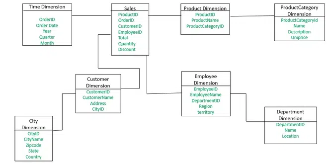
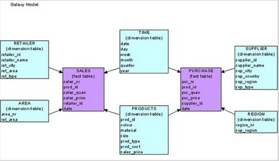

## [Main title](../README.md)
# ETL

## Table of Contents
- [1. What is ETL?](#1-what-is-etl)
- [2. What is ELT?](#2-what-is-elt)
- [3. What are the key differences between ETL and ELT? When to use ETL and ELT?](#3-what-are-the-key-differences-between-etl-and-elt-when-to-use-etl-and-elt)
- [4. What is an ETL pipeline?](#4-what-is-an-etl-pipeline)
- [5. What are the triggers for ETL/ELT pipelines?](#5-what-are-the-triggers-for-etlelt-pipelines)
- [6. Explain the three-layer architecture of the ETL cycle](#6-explain-the-three-layer-architecture-of-the-etl-cycle)
- [7. What is a Data Warehouse (DWH)?](#7-what-is-a-data-warehouse-dwh)
- [8. What systems make up a Data Warehouse?](#8-what-systems-make-up-a-data-warehouse)
- [9. What are facts and dimensions in a Data Warehouse?](#9-what-are-facts-and-dimensions-in-a-data-warehouse)
- [10. What is a Snowflake Schema?](#10-what-is-a-snowflake-schema)
- [11. What is a Star Schema?](#11-what-is-a-star-schema)
- [12. What is a Galaxy Schema?](#12-what-is-a-galaxy-schema)
- [13. What is an OLAP system?](#13-what-is-an-olap-system)
- [14. What is an OLTP system?](#14-what-is-an-oltp-system)
- [15. What is the difference between OLAP and OLTP systems?](#15-what-is-the-difference-between-olap-and-oltp-systems)
- [16. What is the difference between Data Warehouse and Operational Database?](#16-what-is-the-difference-between-data-warehouse-and-operational-database)
- [17. What is an OLAP cube?](#17-what-is-an-olap-cube)
- [18. How are OLAP cubes structured?](#18-how-are-olap-cubes-structured)
- [19. What is idempotency and how to implement it in ETL?](#19-what-is-idempotency-and-how-to-implement-it-in-etl)
- [20. What is dbt (Data Build Tool)?](#20-what-is-dbt-data-build-tool)
- [21. What is orchestration in the context of ETL and data pipelines?](#21-what-is-orchestration-in-the-context-of-etl-and-data-pipelines)
- [22. What problems does Apache Airflow solve?](#22-what-problems-does-apache-airflow-solve)
- [23. What is a DAG and what does it mean in the context of ETL?](#23-what-is-a-dag-and-what-does-it-mean-in-the-context-of-etl)
- [24. How to solve the problem of concurrent data access in ETL?](#24-how-to-solve-the-problem-of-concurrent-data-access-in-etl)
- [25. What ETL Architecture Patterns do you know?](#25-what-etl-architecture-patterns-do-you-know)
- [26. What are Data Lake and Lakehouse?](#26-what-are-data-lake-and-lakehouse)
- [27. What approaches exist for error handling during pipeline execution?](#27-what-approaches-exist-for-error-handling-during-pipeline-execution)
- [28. What are Slowly Changing Dimensions (SCD)?](#28-what-are-slowly-changing-dimensions-scd)
- [29. What are Long Updating Dimensions (LUD)?](#29-what-are-long-updating-dimensions-lud)
- [30. Practical task](#30-practical-task)
-----
- [31. What is IBM DataStage?](#31-what-is-ibm-datastage)
- [32. What are the main components of DataStage architecture?](#32-what-are-the-main-components-of-datastage-architecture)
- [33. What in DataStage is a conductor node?](#33-what-in-datastage-is-a-conductor-node)
- [34. What is the difference between Server Jobs and Parallel Jobs in DataStage?](#34-what-is-the-difference-between-server-jobs-and-parallel-jobs-in-datastage)
- [35. What are the differences between Sequential File, Dataset, and Fileset in DataStage?](#35-what-are-the-differences-between-sequential-file-dataset-and-fileset-in-datastage)
- [36. What are DataStage stages and what types of stages exist?](#36-what-are-datastage-stages-and-what-types-of-stages-exist)
- [37. What is a Transformer stage in DataStage and how does it work?](#37-what-is-a-transformer-stage-in-datastage-and-how-does-it-work)
- [38. What is a Lookup stage in DataStage and when to use it?](#38-what-is-a-lookup-stage-in-datastage-and-when-to-use-it)
- [39. What other kinds of lookups can DataStage support?](#39-what-other-kinds-of-lookups-can-datastage-support)
- [40. What is partitioning in DataStage and what partitioning methods exist?](#40-what-is-partitioning-in-datastage-and-what-partitioning-methods-exist)
- [41. How do you use the command line to run a DataStage job?](#41-how-do-you-use-the-command-line-to-run-a-datastage-job)
- [42. What is a DataStage job sequence and how to use it?](#42-what-is-a-datastage-job-sequence-and-how-to-use-it)
- [43. How to handle errors and exceptions in DataStage jobs?](#43-how-to-handle-errors-and-exceptions-in-datastage-jobs)
- [44. What are DataStage containers and what types exist?](#44-what-are-datastage-containers-and-what-types-exist)
- [45. How to optimize DataStage job performance?](#45-how-to-optimize-datastage-job-performance)
- [46. What is DataStage Director and what functions does it provide?](#46-what-is-datastage-director-and-what-functions-does-it-provide)
- [47. What is DataStage Administrator and how to configure it?](#47-what-is-datastage-administrator-and-how-to-configure-it)
- [48. How to implement data quality checks in DataStage?](#48-how-to-implement-data-quality-checks-in-datastage)
- [49. What is DataStage metadata and how to manage it?](#49-what-is-datastage-metadata-and-how-to-manage-it)
- [50. How to deploy DataStage jobs from development to production?](#50-how-to-deploy-datastage-jobs-from-development-to-production)
- [51. What are DataStage routines and how to create them?](#51-what-are-datastage-routines-and-how-to-create-them)
- [52. How to implement slowly changing dimensions (SCD) in DataStage?](#52-how-to-implement-slowly-changing-dimensions-scd-in-datastage)
- [53. What is DataStage parallel processing and how does it work?](#53-what-is-datastage-parallel-processing-and-how-does-it-work)
- [54. How to monitor and debug DataStage jobs?](#54-how-to-monitor-and-debug-datastage-jobs)
- [55. What steps would you take if DataStage jobs are running slower than expected?](#55-what-steps-would-you-take-if-datastage-jobs-are-running-slower-than-expected)
- [56. How do you diagnose and resolve DataStage job failures?](#56-how-do-you-diagnose-and-resolve-datastage-job-failures)
- [57. What is DataStage repository and how to manage it?](#57-what-is-datastage-repository-and-how-to-manage-it)
- [58. How to implement incremental data loading in DataStage?](#58-how-to-implement-incremental-data-loading-in-datastage)
- [59. What are DataStage parameters and how to use them?](#59-what-are-datastage-parameters-and-how-to-use-them)
- [60. How to implement data archiving and purging in DataStage?](#60-how-to-implement-data-archiving-and-purging-in-datastage)
- [61. What is DataStage job design best practices?](#61-what-is-datastage-job-design-best-practices)
- [62. How are complex jobs implemented in DataStage to improve performance?](#62-how-are-complex-jobs-implemented-in-datastage-to-improve-performance)
- [61. Explain Usage Analysis in DataStage?](#61-explain-usage-analysis-in-datastage)
- [62. What is Balanced Optimization in DataStage?](#62-what-is-balanced-optimization-in-datastage)


## 1. What is ETL?

**ETL (Extract, Transform, Load)** is a process in data engineering and analytics used to extract data from different sources, transform it into a convenient format, and load it into a centralized storage (usually a data warehouse).

### ETL Stages
1. **Extract (extraction):**
   - Data is collected from various sources:
      - databases,
      - APIs,
      - file systems,
      - third-party platforms.
   - Main goal: collect all necessary data.

2. **Transform (transformation):**
   - Data is cleaned, standardized, enriched, combined, or aggregated.
   - Examples of transformations:
      - removing duplicates,
      - normalizing formats (e.g., dates),
      - combining reference data,
      - calculating metrics.
   - Main goal: bring data to unified business rules and analytical requirements.

3. **Load (loading):**
   - Transformed data is loaded into the target system:
      - Data Warehouse (Snowflake, BigQuery, Redshift),
      - Data Lake,
      - analytical platform.
   - Main goal: prepare data for building reports, dashboards, and BI.

- Ensures **accuracy and consistency** of data.
- Makes data **structured and suitable for analysis**.
- Is the foundation for building **data pipelines** and **analytics platforms**.
- Accelerates analysts' access to information.

### Summary
ETL is a fundamental data processing workflow that ensures collection, processing, and delivery of information to analytical systems in a convenient and reliable form.

## 2. What is ELT?

**ELT (Extract, Load, Transform)** is a modern approach to data integration, most commonly used in cloud architectures.  
The main difference from ETL: data is first **extracted and loaded into storage**, and transformations are performed **inside the data warehouse itself** (e.g., Snowflake, BigQuery, Redshift).

### ELT Stages

1. **Extract (extraction):**
   - Data is taken from sources (databases, APIs, files).
   - Goal: quickly collect data in "raw" form.

2. **Load (loading):**
   - Extracted data is immediately loaded into **centralized storage** or **data lake** in unchanged form.

3. **Transform (transformation):**
   - All transformations are performed **inside the warehouse** using its native capabilities:
      - SQL queries,
      - specialized tools (e.g., **dbt**),
      - built-in parallel processing mechanisms.

### Key Features of ELT

1. **Uses the power of cloud DWH**  
   Modern warehouses (Snowflake, BigQuery, Redshift) are optimized for large-scale parallel processing.

2. **Faster loading (faster ingestion)**  
   Data is loaded without waiting for transformations → faster entry into the warehouse.

3. **Flexibility**  
   Raw data is available for different scenarios (not only analytics, but also data science, machine learning).

4. **Modularity and version control**  
   Works excellently with tools like **dbt**, allowing building modular, documented, and testable pipelines.

### Summary
ELT is an approach where the "raw" data layer is immediately saved to storage, and all transformations are performed on the DWH side.  
It's better suited for cloud solutions where you can scale computations and flexibly manage transformations.

## 3. What are the key differences between ETL and ELT? When to use ETL and ELT?

### Main Difference
- **ETL (Extract, Transform, Load):**
   - Data is first extracted (**Extract**),
   - then transformed outside the warehouse (by a separate ETL server or tool) (**Transform**),
   - and only then loaded into the warehouse in ready form (**Load**).

- **ELT (Extract, Load, Transform):**
   - Data is extracted (**Extract**),
   - immediately loaded into the warehouse in "raw" form (**Load**),
   - transformations are performed inside the warehouse itself (**Transform**) using its computational power (e.g., SQL).

### When to use **ETL**
- You work with **on-premise systems** or traditional DWH with limited computational resources (Teradata, Oracle).
- **Security and compliance** requirements require processing before loading.
- Complex transformations are more convenient to do **outside the warehouse** (in Python, Java).

### When to use **ELT**
- You work with **cloud-scalable DWH** (Snowflake, BigQuery, Redshift).
- Need to store "raw" data for **reprocessing or audit**.
- Want to use the advantages of built-in DWH capabilities for SQL transformations (and tools like **dbt**).
- **Flexibility, modularity, and CI/CD-friendly pipelines** are important.

### Comparison Table

| Characteristic              | **ETL**                              | **ELT**                                |
|-----------------------------|--------------------------------------|----------------------------------------|
| Operation order            | Extract → Transform → Load           | Extract → Load → Transform             |
| Where Transform is executed | External server / ETL tool           | Inside DWH (SQL, dbt, etc.)           |
| Suitable for                | On-premise systems, legacy DWH       | Cloud, scalable DWH                    |
| Loading speed               | Slower (waiting for transformations) | Faster (data loads immediately)       |
| Raw data storage            | Usually not saved                    | Saved for reprocessing/audit           |
| Flexibility and DevOps      | Limited                              | High (suitable for CI/CD)              |

### Summary
- **ETL** — classic approach, optimal for old systems and strict security requirements.
- **ELT** — modern cloud standard, allowing scaling processing and storing "raw" data for different scenarios.

## 4. What is an ETL pipeline?

**ETL pipeline** is an automated process (workflow) that moves data through three main stages:  
**Extract → Transform → Load**.

It's responsible for ensuring that data is sequentially extracted, transformed, and loaded into storage or analytical system.

### ETL Tools
1. **Classic ETL platforms**:
   - *Informatica, Talend, SSIS*.

2. **Custom code**:
   - in *Python, SQL, Apache Spark*.

3. **Modern orchestrators**:
   - *Apache Airflow, Prefect*.

### Types of Data Pipelines
1. **Batch pipeline**
   - Runs on schedule (e.g., every hour, once a day).
   - Suitable for regular reports and planned data loading.

2. **Real-time / Streaming pipeline**
   - Processes data "on the fly" as it arrives.
   - Uses technologies like *Kafka, Flink*.
   - Applied for real-time analytics and monitoring.

3. **Incremental pipeline**
   - Loads only new or changed data.
   - Very efficient approach, reduces system load.

### Summary
ETL pipeline is a "conveyor belt" for data. It can work in batch, real-time, or incrementally and is built using ETL tools, custom code, or modern orchestrators.

## 5. What are the triggers for ETL/ELT pipelines?

ETL/ELT pipelines can be triggered differently depending on the architecture and orchestration tools.  
A trigger determines the **condition for starting pipeline execution**.

### Main Types of Triggers

1. **Scheduled Trigger (by schedule, Cron-based)**
   - Pipeline runs at fixed intervals (hourly, daily).
   - Used in: *Airflow, dbt Cloud, GitHub Actions*.

2. **Upstream Dependency (dependency on other tasks, DAG-based)**
   - Pipeline starts after successful completion of another task or pipeline.
   - Often used in: *Airflow, Prefect*.

3. **Event-based Trigger**  
   Triggered by external events, for example:
   - appearance of new file (S3, FTP),
   - completion of synchronization (e.g., Fivetran),
   - message from *Kafka* or webhook.

4. **Manual Trigger**
   - Launch via CLI, UI, or API.
   - Applied for ad hoc tasks or debugging.
   - Example: button in *Airflow UI*, `dbt run` command.

5. **Git-based CI/CD Trigger**
   - Triggered by changes in version control system (Git).
   - Example: push to main branch triggers `dbt run` via GitHub Actions.

### Summary
Triggers allow flexible management of ETL/ELT pipeline launches:
- from simple schedule (cron),
- to event-based and CI/CD integrations.  
  This makes it easy to integrate pipelines into the overall data processing and delivery infrastructure.


## 6. Explain the three-layer architecture of the ETL cycle

**Three-layer architecture** in ETL is a design pattern where data processing is divided into **three sequential layers**.  
Goal: improve **clarity, manageability, and performance** of pipelines.

### Architecture Layers

1. **Staging Layer (loading/buffering layer)**
   - Here data is **extracted** from source systems and loaded **without transformations** or with minimal formatting.
   - Contains "raw", unfiltered data (*e.g.: stg_orders, stg_customers*).
   - Used for:
      - data validation,
      - backups,
      - reproducibility of loads.

2. **Core / Integration Layer (core/integration layer)**
   - At this level, data is **standardized and integrated** from different sources.
   - Performed: table joins, data enrichment (*e.g.: core_orders, core_customers*).
   - Business rules are applied:
      - date normalization,
      - duplicate removal.
   - **Single source of truth** is formed for facts and dimensions.

3. **Data Marts / Presentation Layer (data marts/presentation layer)**
   - Final layer where data is **aggregated and structured** for specific analytics and BI tasks.
   - Examples of ready tables: *sales_summary, customer_lifetime*.
   - Often organized in schemas:
      - **star schema**,
      - **snowflake schema**.

### Summary
Three-layer architecture allows:
- storing **raw data** for verification and recovery,
- building **standardized core** with business rules,
- providing **ready data marts** for analytics and BI.

## 7. What is a Data Warehouse (DWH)?

**Data Warehouse (data warehouse)** is a centralized system designed for **storing, integrating, and analyzing data** from different sources.  
DWH is used to support:
- reporting,
- business intelligence (BI),
- decision-making.

### Key Characteristics
1. **Storage of historical and structured data**
   - usually for many years,
   - data is immutable (append-only).

2. **Optimization for analytical queries (read-heavy)**
   - not for transactional processing (like OLTP),
   - but for complex aggregations and analytics.

3. **Support for complex operations**
   - aggregates,
   - joins,
   - time series analysis.

4. **Structuring by schemas**
   - *star schema*,
   - *snowflake schema*,
   - fact and dimension tables.

### Examples of Data Warehouses
- **Snowflake**
- **Azure Synapse Analytics**
- **Google BigQuery**
- **Amazon Redshift**

### Summary
DWH is the foundation of analytical infrastructure.  
It combines data from different systems, makes it structured and accessible for building BI reports, dashboards, and advanced analytics.

## 8. What systems make up a Data Warehouse?

### Main DWH Components

1. **Source Systems (data sources)**
   - Transactional databases (OLTP: PostgreSQL, MySQL, Oracle).
   - CRM, ERP, financial systems.
   - APIs, log files, IoT, external data.

2. **ETL/ELT Layer (data loading process)**
   - Used for **extracting, transforming, and loading** data.
   - Tools: *Informatica, Talend, SSIS, dbt, Apache Airflow, Fivetran, Spark*.
   - Forms staging and core layers.

3. **Staging Area (loading buffer/raw layer)**
   - Stores "raw" data. (Snowflake)
   - Used for validation and reproducibility.

4. **Integration / Core Layer (warehouse core)**
   - Here data is cleaned, normalized, combined.
   - **Single source of truth** is formed.

5. **Data Marts (data marts)**
   - Optimized for specific analytical tasks.
   - Often built as **star schema** or **snowflake schema**.
   - Examples: *sales_mart, customer_mart*.

6. **Metadata & Master Data Management**
   - Metadata describes sources, transformations, lineage.
   - MDM is responsible for unified reference data (e.g., customer list).

7. **BI & Analytics Tools (consumption tools)**
   - Reporting and visualization: *Power BI, Tableau, Looker, Qlik*.
   - Data Science and ML: Python, R, Databricks.

### Summary
DWH is not just a database, but a **whole ecosystem** that includes:
- data sources,
- loading layer (ETL/ELT),
- staging, core, and data marts,
- metadata management,
- BI tools.

## 9. What are facts and dimensions in a Data Warehouse?

**Facts** are numerical, measurable data that describe business events or transactions.  
They are stored in **Fact Tables** and are usually subject to aggregation (summation, averaging, counting).

📌 Examples of facts:
- sale amount (`sales_amount`),
- quantity of goods sold (`quantity`),
- profit (`profit`),
- number of clicks (`clicks`),
- call duration (`duration`).

**Dimensions** are descriptive attributes that provide context for facts.  
They are stored in **Dimension Tables** and are used for grouping, filtering, and analytics.

📌 Examples of dimensions:
- **Time:** date, month, year, quarter,
- **Product:** name, category, brand,
- **Customer:** name, age, region, segment,
- **Store:** city, country, store type.

### Example:

**Fact Table: Sales**
```sql
    DateKey | ProductKey | CustomerKey | StoreKey | SalesAmount | Quantity
```
**Dimension: Product**
```sql
    ProductKey | ProductName | Category | Brand
```
**Dimension: Time**
```sql
    DateKey | Date | Month | Year | Quarter
```
**Dimension: Customer**
```sql
    CustomerKey | Name | Age | Region | Segment
```

### Summary:
- **Facts = what happened (numerical metrics).**
- **Dimensions = in what context it happened (time, customer, product, location).**

📊 Example analytical question:  
*"How many sales (fact) were made by customers from Moscow (dimension) in 2023 (dimension)?"*

## 10. What is a Snowflake Schema?

**Snowflake Schema** is a type of database schema in Data Warehouse where the fact table is connected to **normalized dimension tables**.  
The name "snowflake" comes from the fact that the diagram has a tree-like structure with branches resembling a snowflake.

### Structure
- **Fact Table**
   - contains numerical metrics (e.g., `sales_amount`, `quantity`, `profit`),
   - keys referencing dimension tables.

- **Dimension Tables**
   - describe context of facts (e.g., `customer`, `product`, `time`, `region`).
   - unlike Star Schema, dimensions here are **normalized**:
      - `product` table can be split into `product → category → department`,
      - `location` table can be split into `city → state → country`.

### Example


### Advantages
- Memory savings (no duplication in dimensions).
- Improved data structure.
- Suitable for cases where **normalization** and avoiding redundancy are important.

### Disadvantages
- More complex queries (more JOINs needed).
- Slower compared to **Star Schema**.
- More difficult for business users to understand.

### Summary
- **Snowflake Schema** = normalized dimension model (multi-level structure).
- Used in Data Warehouse when you need to optimize storage and maintain strict data structure.
- Contrasts with **Star Schema**, which is simpler and faster, but stores data with redundancy.


## 11. What is a Star Schema?

**Star Schema** is a type of data organization in Data Warehouse where:
- in the center is a **Fact Table** with numerical metrics,
- around it are **Dimension Tables** directly connected to the fact table.

Since the connections form a structure resembling a star ⭐ — the schema is called **Star Schema**.

### Structure

### Example


### Advantages of Star Schema
- Simplicity of understanding and use (closer to business logic).
- High query execution speed (fewer JOINs).
- Excellent for BI tools (Power BI, Tableau).
- Convenient for building **OLAP cubes**.

### Disadvantages
- Data redundancy (e.g., product category name can be duplicated).
- Requires more storage space than Snowflake Schema.

### Difference from Snowflake Schema
- In **Star Schema** dimension tables are **denormalized** (all attributes stored in one table).
- In **Snowflake Schema** dimensions are **normalized** and can be split into several related tables.

### Summary
- **Star Schema** = simple and fast structure for analytics.
- Used when **performance and BI convenience** are important, not minimizing redundancy.

## 12. What is a Galaxy Schema?

**Galaxy Schema** (or **Fact Constellation Schema**) is a data organization model in Data Warehouse where **multiple fact tables** are used, which can **share common dimension tables**.

It's called **"galaxy schema"** or **"fact constellation"** because it combines several "stars" (Star Schemas) into a unified system.

### Example


### Advantages:
- Ability to analyze **multiple business processes** in one model.
- Space savings through shared dimension tables.
- Support for more complex analytics (e.g., comparing sales and returns).

### Disadvantages:
- More complex structure than Star or Snowflake Schema.
- Queries can be heavier (more JOINs).
- Requires careful design to avoid confusion.

### Difference from other schemas:
- **Star Schema** → one fact table + simple dimensions.
- **Snowflake Schema** → one fact table + normalized dimensions.
- **Galaxy Schema** → multiple fact tables + shared dimensions.

### Summary:
**Galaxy Schema** is used in large data warehouses where you need to model and analyze **multiple business processes simultaneously**: sales, returns, logistics, finance, etc.

## 13. What is an OLAP system?

**OLAP (Online Analytical Processing)** is a type of system designed to support:
- **complex data analysis**,
- **reporting**,
- **decision-making**,

usually on large volumes of **historical data**.

### Main OLAP Characteristics:
1. **Historical data storage** — aggregated and structured data from different sources.
2. **Optimization for analytical queries** (read-heavy workload), not transactional processing.
3. **Support for multidimensional analysis**: dimensions (time, product, region) and facts (sales, profit).
4. **High performance for aggregations and slices** (drill-down, roll-up, slice & dice).
5. Often implemented based on **star schema** or **snowflake schema**.

### Examples of OLAP Systems:
- **Microsoft Analysis Services (SSAS)**,
- **Oracle OLAP**,
- **SAP BW**,
- **Snowflake, BigQuery, Redshift** (in BI and analytics context),
- **Cognos, MicroStrategy, Tableau** (as OLAP cube consumers).

### Summary:
OLAP system is a tool for building analytics on large historical data.  
It gives business the ability to quickly answer questions like:  
*"What was the revenue (fact) for 'Electronics' category (dimension) by regions over the last 3 years (dimension)?"*

## 14. What is an OLTP system?

**OLTP (Online Transaction Processing)** is a type of database management system designed for processing **operational transactions** in real time.  
Such systems are used for **daily business operations**.

### Main OLTP Characteristics:
1. **Operational transaction processing** (insert, update, delete).
2. **Support for large number of concurrent users**.
3. **Optimization for writing and fast access to individual rows**.
4. **Data stored in normalized form** to avoid redundancy.
5. High speed of simple queries (e.g.: find order by ID).

### Examples of OLTP Systems:
- E-commerce sites (creating and paying orders).
- Banking systems (transactions, payments, transfers).
- CRM and ERP systems (customer management, inventory, logistics).
- Databases: **PostgreSQL, MySQL, Oracle, SQL Server** (in OLTP mode).

### Summary:
- **OLTP** = system for **real-time operations** (create order, process payment).
- **OLAP** = system for **data analysis** (reports, analytics, forecasts).

## 15. What is the difference between OLAP and OLTP systems?

**OLTP (Online Transaction Processing)** and **OLAP (Online Analytical Processing)** solve different tasks in data work.  
OLTP is used for **operational transactions in real time**, while OLAP is for **analysis and reporting on large volumes of historical data**.

### OLTP vs OLAP Comparison

| Characteristic        | OLTP (operational systems) | OLAP (analytical systems) |
|------------------------|-----------------------------|-------------------------------|
| Purpose           | Daily transactions (order creation, payments, inventory) | Data analysis, reporting, decision-making |
| Data                | Current, detailed   | Historical, aggregated |
| Workload type          | Many write and update operations | Many read and aggregation operations |
| Storage model       | Normalized (3NF)       | Denormalized (Star, Snowflake Schema) |
| Number of users  | Thousands (operators, cashiers, managers) | Hundreds (analysts, BI, management) |
| Queries               | Simple and short (search by ID) | Complex, with aggregations and groupings |
| Performance    | Optimized for transactions | Optimized for analytics |
| System examples        | PostgreSQL, MySQL, Oracle (OLTP mode) | Snowflake, BigQuery, Redshift, SSAS |

### Summary:
- **OLTP** = fast transactions and real-time operations.
- **OLAP** = data analysis, building reports and business analytics.

📌 In practice, data from OLTP systems **enters OLAP through ETL/ELT processes**:  
👉 *OLTP (operational data) → ETL → Data Warehouse (OLAP for analysis)*.


## 16. What is the difference between Data Warehouse and Operational Database?

**Data Warehouse (DWH)** is a system designed for storing and analyzing **historical data**.  
It supports **analytical processing (OLAP)**, used for building reports and decision-making.

**Operational Database (OLTP)** is a system for managing **operational data** in real time.  
It supports **transactional processing** and is used for daily business operations.

### Data Warehouse vs Operational Database Comparison

| Characteristic          | Data Warehouse (DWH)         | Operational Database (OLTP) |
|--------------------------|------------------------------|------------------------------|
| Main purpose            | Analytics and reporting       | Real-time operational transactions |
| Data type               | Historical, aggregated | Current, actual |
| Workload type             | **Reading (read-heavy)**      | **Writing and updates (write-heavy)** |
| Queries                  | Complex, with aggregations       | Simple, fast transactions |
| Number of users     | Analysts, BI, management   | Managers, cashiers, customers |
| Storage model          | Denormalized (star, snowflake) | Normalized (3NF) |
| Data volume             | Very large (TB–PB)        | Comparatively smaller |
| System examples           | Snowflake, BigQuery, Redshift | PostgreSQL, MySQL, Oracle, SQL Server |

### Summary:
- **Data Warehouse (OLAP)** = storage for **analytics, reports, strategic decisions**.
- **Operational Database (OLTP)** = database for **real-time operations** (payments, orders, CRM).

📌 In practice:  
👉 Data from **OLTP** systems is transferred to **DWH** using **ETL/ELT processes**.

## 17. What is an OLAP cube?

**OLAP Cube** is a multidimensional data structure used in **OLAP systems** for fast analysis of large volumes of information.  
It's called a "cube" because data is organized not in flat tables, but in **multidimensional dimensions**, allowing analysis from different angles.

### Main OLAP Cube Elements:
1. **Facts** — numerical indicators (sales, profit, number of orders).
2. **Dimensions** — context for facts:
   - Time (year, month, day),
   - Geography (country, city, region),
   - Product (category, brand, model),
   - Customer (age, segment).
3. **Measures** — fact aggregates (SUM, AVG, COUNT).

### Example:
**Analyst's question:**  
*"What is the total sales amount (fact) by products (dimension) in regions (dimension) by months (dimension)?"*

In OLAP cube:
- X-axis = Time (Year → Month → Day),
- Y-axis = Products (Category → Brand → SKU),
- Z-axis = Geography (Region → City).

At the intersection of these dimensions, the metric is stored: **SalesAmount**.

### OLAP Cube Operations:
- **Slice** — selecting one slice (e.g., sales only for 2024).
- **Dice** — selecting subset by multiple dimensions (e.g., phone sales in Europe in 2023).
- **Drill-down** — detailing (year → month → day).
- **Roll-up** — aggregation (day → month → year).
- **Pivot (Rotate)** — rotating cube to change analysis perspective.

### OLAP Cube Advantages:
- Very fast analytical query execution.
- Convenience of multidimensional analysis.
- Support for business users (BI, reports, dashboards).

### Summary:
**OLAP Cube** is a way to store and analyze data in multidimensional structure that allows performing complex analytical queries (aggregations, groupings) quickly and conveniently.

## 18. How are OLAP cubes structured?

**OLAP Cube (Online Analytical Processing Cube)** is a multidimensional data structure used for analyzing large volumes of information.  
It stores **facts (measures)** and connects them with **dimensions**, forming multidimensional space for analytics.

### Main Cube Elements
- **Facts** — numerical indicators that are analyzed (e.g.: sales, number of orders, profit).
- **Dimensions** — attributes that provide context for facts (e.g.: time, product, region, customer).
- **Measures** — fact aggregates (SUM, AVG, COUNT).
- **Cube cells** — intersection of dimensions with specific fact values.

### Logical Structure
OLAP cube looks like an **n-dimensional array**:
- 3 dimensions → cube (3D),
- 4 dimensions → hypercube (4D),
- in reality, cube can have dozens of dimensions.

### Physical OLAP Cube Implementation
There are three approaches:

1. **MOLAP (Multidimensional OLAP)**
   - Data is stored in multidimensional arrays.
   - Very fast access (O(1)), as data is indexed by coordinates.
   - Problem: many empty cells (sparse data) → compression needed.

2. **ROLAP (Relational OLAP)**
   - Data is stored in relational tables (star, snowflake).
   - Cube is implemented as Fact Table + Dimension Tables.
   - Queries executed via SQL (JOIN + GROUP BY).
   - Slower, but scales better.

3. **HOLAP (Hybrid OLAP)**
   - Hybrid approach: aggregates stored in multidimensional structure (MOLAP),
   - detailed data — in relational DB (ROLAP).
   - Balance of speed and flexibility.

### Data Storage and Search
- Cube data is usually **sparse**, so only non-empty cells are stored.
- For faster search, the following are used:
   - **Bitmap indexing** (masks for categorical attributes),
   - **Pre-aggregation** (materialized views),
   - **Star-join optimization** (SQL query optimization).

### OLAP Cube Operations
- **Slice** — selecting one dimension (e.g., sales only for 2024).
- **Dice** — selecting subset by multiple dimensions (e.g., phone sales in Europe).
- **Drill-down** — detailing (year → month → day).
- **Roll-up** — aggregation (day → month → year).
- **Pivot** — rotating cube to change analysis angle.

### Summary:
OLAP cubes are **multidimensional data structures** where:
- facts (numbers) are connected with dimensions (context),
- data can be stored in multidimensional arrays (MOLAP), relational tables (ROLAP), or hybrid (HOLAP),
- support fast multidimensional analysis through slice, dice, drill-down, and roll-up operations.

## 19. What is idempotency and how to implement it in ETL?

**Idempotency** is a property of an operation where repeated execution gives the same result as single execution.

In the context of **ETL**, this means that if the same data loading or transformation process is executed multiple times, the target system state won't change incorrectly (no duplicates, repeated aggregation, etc.).

### Why Idempotency is Needed in ETL
- **Reliability:** in case of failures or job crashes, you can safely restart the loading.
- **Predictability:** repeated runs always lead to the same result.
- **Production safety:** especially critical when working with big data and incremental updates.

### Examples of Idempotency in ETL

1. **Loading data into staging table with full cleanup**
```sql
   TRUNCATE TABLE staging_orders;
    INSERT INTO staging_orders SELECT * FROM source_orders;
```
- Repeated run always gives the same staging state.

2. **Using UPSERT (MERGE) instead of INSERT**
```sql
   MERGE INTO target_orders AS t
   USING staging_orders AS s
   ON t.order_id = s.order_id
   WHEN MATCHED THEN UPDATE SET t.amount = s.amount
   WHEN NOT MATCHED THEN INSERT (order_id, amount) VALUES (s.order_id, s.amount);
```
- Repeated run won't create duplicates.

3. **Unique keys and constraints**
```sql
   CREATE UNIQUE INDEX idx_orders_id ON target_orders(order_id);
```
- Even with erroneous repeated insertion, duplicate won't appear.

4. **Idempotency Key in streaming loads**
- For each data batch, store unique loading identifier (batch_id).
- Before loading, check if this batch_id was already processed.
```sql
   IF NOT EXISTS (SELECT 1 FROM etl_log WHERE batch_id = '2024-08-26-001')
   THEN insert data
   ELSE skip
```

### Approaches to Implementing Idempotency in ETL
1. **Full rewrite (full refresh)** — clean and load again.
2. **Incremental loading with upsert** — update only new/changed records.
3. **Hash comparison** — compare row hashes to determine changes.
4. **Batch_id logging** — exclude repeated processing of the same data batch.

### Summary
In ETL, idempotency means that the process can be safely restarted without risk of duplication or data corruption.  
Implemented through:
- `TRUNCATE + INSERT`,
- `UPSERT (MERGE)`,
- unique keys,
- batch_id control,
- row hashing.

## 20. What is dbt (Data Build Tool)?

**dbt (Data Build Tool)** is an open-source framework for **transforming data inside a warehouse (data warehouse)** using SQL, while using best practices from software development: modularity, testing, version control.

### Main dbt Capabilities
1. **SQL as primary language**
   - All transformations are written in SQL, without complex ETL code.
   - dbt manages dependencies and execution order.

2. **Building models**
   - SQL scripts become **tables or views** inside the warehouse.
   - Example model:
     ```
     SELECT
         customer_id,
         SUM(amount) AS total_sales
     FROM raw.sales
     GROUP BY customer_id
     ```

3. **Dependency management**
   - Uses `ref()` macro for references to other models.
   - dbt builds DAG (dependency graph) and runs models in correct order.

4. **Incremental loading and materialization**
   - Support for **incremental refresh** (updating only new data).
   - Different materialization strategies: `view`, `table`, `incremental`, `ephemeral`.

5. **Version control and CI/CD**
   - Full Git integration.
   - Support for automated pipelines (GitHub Actions, GitLab CI).

6. **Testing and documentation**
   - Ability to set data quality tests (e.g., `unique`, `not_null`).
   - Automatic documentation and lineage generation (dependency chains).

7. **Support for modern cloud DWH**
   - Works with **Snowflake, BigQuery, Redshift, Databricks, Postgres**.

### Summary
**dbt** is a tool that allows:
- managing transformations **directly in the warehouse**,
- writing everything in SQL, but using engineering practices (Git, CI/CD, testing),
- easily building repeatable and transparent data pipelines.

It has become the de facto standard for **Modern Data Stack**.


## 21. What is orchestration in the context of ETL and data pipelines?

**Orchestration** is automated coordination, planning, and monitoring of task execution within a data pipeline.  
It ensures task launches:
- **in correct order**,
- **at correct time**,
- **with correct parameters**,
- and guarantees proper error handling.

### Main Orchestration Tasks
1. **Dependency management**
   - Task B starts only after successful completion of task A.

2. **Scheduling**
   - Tasks execute on schedule (e.g., every day at 2:00 AM).

3. **Error handling and retries**
   - Automatic retry on failure.
   - Sending notifications (e.g., to Slack or email).

4. **Parallelization and resource optimization**
   - Multiple tasks can execute simultaneously if no dependencies.
   - Flexible load distribution.

5. **Environment and parameter control**
   - Separation of execution in dev/staging/prod.
   - Parameter passing to pipelines.

### Examples of Orchestration Tools
- **Apache Airflow** — most popular tool (DAGs, Python + UI).
- **Prefect** — modern analog, focus on simplicity and cloud integration.
- **Luigi** — used for building pipelines.
- **Dagster** — data orchestrator with advanced testing capabilities.
- **Azure Data Factory / AWS Step Functions / GCP Composer** — cloud orchestration solutions.

### Example Scenario
ETL pipeline for loading sales data:
1. **Extract** — load CSV from S3.
2. **Transform** — clean data (remove duplicates, normalize dates).
3. **Load** — load data into DWH (e.g., Snowflake).
4. **Report** — build aggregated tables for BI.

Orchestrator guarantees that steps execute sequentially and will restart in case of error.

### Summary
Orchestration is the "conductor" in the ETL world: it manages dependencies, launch timing, retries, and pipeline monitoring. Without it, complex ETL/Data Engineering processes become chaotic and unreliable.

## 22. What problems does Apache Airflow solve?

**Apache Airflow** is an open-source platform for managing and scheduling workflows (ETL, data pipelines, analytics).  
It's used for automating complex data processing processes built from multiple dependent tasks.

### Main Problems Airflow Solves

1. **Pipeline management**
   - Allows **describing, planning, and monitoring** pipelines as DAG (Directed Acyclic Graph).
   - All dependencies between tasks are explicitly defined.

2. **Centralized logging**
   - All task execution logs are available in one place.
   - Convenient for monitoring and debugging.

3. **Error handling**
   - Ability to configure **callbacks** on failure (e.g., notifications to Slack/Discord/email).
   - Support for retry policies (repeated execution attempts).

4. **User interface (UI)**
   - Web interface for visualizing DAGs and monitoring progress.
   - Ability to manually restart failed tasks.

5. **Tool integration**
   - Support for working with databases, clouds (AWS, GCP, Azure), Spark, dbt, Kubernetes, etc.
   - Uses operators and sensors for integration.

6. **Flexibility and extensibility**
   - Pipelines are described in **Python**, allowing use of loops, conditions, parameters.
   - Can create custom operators.

7. **Open-source and community**
   - Free and actively supported by community.
   - Many plugins and ready integrations.

### Example Usage
Airflow is often used for:
- ETL/ELT processes (extract → transform → load into DWH),
- ML pipeline runs (model training on schedule),
- analytical report automation,
- managing complex workflows in production.

### Summary
Apache Airflow solves the problem of **orchestration and data pipeline management**:  
it provides transparency, control, integration with various systems, and reliable error handling, making it the de facto standard for modern data engineering teams.

## 23. What is a DAG and what does it mean in the context of ETL?

**DAG (Directed Acyclic Graph)** is a **directed acyclic graph**, a structure where:
- **nodes** — are tasks (e.g., extract, transform, load),
- **edges** — dependencies between tasks,
- **no cycles** — a task cannot depend on itself directly or indirectly.

### DAG in ETL Processes
In ETL context, DAG describes the sequence of step execution:
1. **Extract** — loading data from sources,
2. **Transform** — cleaning, aggregation, enrichment,
3. **Load** — loading into warehouse or data mart.

Each task starts **only after completion of previous ones**, guaranteeing **logical and predictable order** of data processing.

### Example DAG for Sales Data Processing
```
   [ extract_crm_data ]
   ↓
   [ transform_customers ]
   ↓
   [ join_sales_and_customers ]
   ↓
   [ aggregate_sales_by_region ]
   ↓
   [ export_to_dashboard ]
```
- Each task starts only after completion of the previous one.
- Executes once (or with parameters, but without looping).

### Where DAGs are Used?
1. **Apache Airflow**
   - Each pipeline in Airflow is a DAG.
   - DAG is described in Python.

   Example:
   ```python
   with DAG('sales_pipeline') as dag:
       t1 = PythonOperator(task_id='extract', python_callable=extract_func)
       t2 = PythonOperator(task_id='transform', python_callable=transform_func)
       t3 = PythonOperator(task_id='load', python_callable=load_func)

       t1 >> t2 >> t3   # execution order
   ```
2. Prefect / Luigi / Dagster — alternative orchestrators where pipelines are also represented as DAGs.

### Why DAGs are Needed?
- Explicitly show dependencies between tasks.
- Guarantee correct execution order.
- Ensure repeatability and reliability of pipelines.
- Simplify monitoring and maintenance of ETL processes.

### Summary
DAG is the foundation of ETL orchestration.
It turns a complex process of multiple tasks into a clear dependency scheme, allowing systems like Airflow to manage pipelines transparently and predictably.

## 24. How to solve the problem of concurrent data access in ETL?

### Main Goals
- Avoid duplication (double data processing)
- Prevent write conflicts
- Guarantee consistency for reading processes
- Make repeated runs safe (idempotency)

### 1. Idempotent Records
- Use **upsert/merge** instead of simple inserts.
- Create **unique indexes** on business keys.
- Track **batch_id** and skip already loaded batches.

### 2. Managing Concurrent Writes
### a) Single-writer (one writer)
Use **locks or leases**
### b) At orchestrator level
- In Airflow use **pools** or concurrency limits.
- In distributed systems — **Redis/ZooKeeper locks**.

### c) Partition separation
- Each process writes only to its **date/region/shard** to avoid intersections.

### 3. Isolating Readers from Writers
### a) Snapshots (MVCC / snapshot isolation)
- Readers get consistent data view.
- In warehouses — use copy-on-write (Delta Lake, Iceberg, Hudi).

### b) Staging + atomic replacement
- Load data into temporary table, then change reference.

### 4. Exactly-once and Deduplication
- Store **offset / watermark** (e.g., max id or timestamp).
- Add **dedupe key** (business key hash + time).

### 5. Working with Files (Data Lake)
- First write to temporary folder: `/incoming/_tmp/run123/*`
- Then **atomically rename** to working directory.
- For ACID operations use Delta/Iceberg/Hudi.

### 6. SCD (Slowly Changing Dimensions)
- For Type-2 control non-overlapping date ranges.

### 7. Error Handling and Retries
- All steps should be **idempotent**.
- Use retries with delay (**jitter**).

### 8. Observability
- Track: **row counts, checksums, list of files/partitions**.
- Check data quality after batch completion.

### Summary
For reliable ETL pipeline:
- Use **idempotency + unique keys**,
- Do loading through **staging and atomic swap**,
- Provide **snapshot isolation** for readers,
- Separate responsibility (partitioning / sharding),
- Store **offsets and batch_id** for control.

This approach eliminates most concurrent access problems and makes the process robust.

## 25. What ETL Architecture Patterns do you know?

### 1. Single-tier Architecture
**Description:**
- Data is extracted from sources and immediately loaded into analytical system without intermediate layers.

**Example:** Excel or Access, where data is loaded directly from CSV or database.

**Pros:**
- Simple implementation.
- Minimal delays (fewer steps).

**Cons:**
- No data cleaning before loading.
- No flexibility, difficult to scale.

### 2. Two-tier Architecture
**Description:**
- Sources → data warehouse.
- Transformations are performed on-the-fly during loading.

**Example:** Old DWH projects where ETL server (e.g., DataStage, SSIS) writes directly to Warehouse.

**Pros:**
- Fast building.
- Fewer systems to maintain.

**Cons:**
- Difficult to add new sources.
- No staging layer for debugging.

### 3. Three-tier Architecture (classic)
**Description:**
- Includes:
   1. **Staging Layer** → stores "raw" data.
   2. **Integration/Core Layer** → cleans, combines, and normalizes.
   3. **Presentation Layer / Data Marts** → aggregated data for analytics.

**Example:** Classic enterprise warehouses (Teradata, Oracle DWH).

**Pros:**
- Scalability and flexibility.
- Support for historicity (SCD).
- Data validation at each layer.

**Cons:**
- High storage cost.
- Delays due to batch loads.

### 4. Lambda Architecture
**Description:**
- Combines batch + streaming.
- Two paths:
   - Batch layer → loading large volumes (e.g., daily).
   - Speed/Stream layer → real-time event stream processing.

**Example:** IoT, click analytics in advertising.

**Pros:**
- Support for real-time and historical data.
- Balance between speed and completeness.

**Cons:**
- Logic duplication.
- Architecture complexity.

### 5. Kappa Architecture
**Description:**
- All data is processed in streaming, no batch.
- Historical data can be "replayed" through the same stream.

**Example:** Event-driven systems (Kafka + Flink / ksqlDB).

**Pros:**
- No batch/stream duplication.
- Minimal delay.

**Cons:**
- Requires powerful infrastructure.
- Difficult to implement complex transformations.

### 6. ELT (Extract → Load → Transform)
**Description:**
- Data is first loaded "as is" into DWH, then transformations are performed inside.
- Used in **cloud data warehouses**.

**Example:** BigQuery + dbt, Snowflake.

**Pros:**
- Scalability (DWH power).
- Simple maintenance (SQL).
- Suitable for agile development.

**Cons:**
- High DWH load.
- Limitations for complex business rules.

### 7. Data Lake + ETL (or Data Lakehouse)
**Description:**
- Data is saved to **Data Lake** (HDFS, S3, GCS).
- Then cleaned and transformed into DWH or Lakehouse.

**Example:** Raw JSON → S3 → Spark/Databricks → Delta Lake.

**Pros:**
- Storage of any data (structured and unstructured).
- Universality (Lake + Warehouse).

**Cons:**
- More complex maintenance.
- Requires data governance.

### 8. Micro-batch / Streaming ETL
**Description:**
- Intermediate option between batch and streaming.
- Data is processed in mini-batches (every 1–5 minutes).

**Example:** Spark Structured Streaming in micro-batch mode.

**Pros:**
- Almost real-time analytics.
- Simpler than full streaming.

**Cons:**
- Has delay (> 1 min).
- Not always suitable for critical real-time systems.

### ✨ Summary
- Small systems → **Single-tier / Two-tier**.
- Enterprise DWH → **Three-tier**.
- Real-time + Big Data → **Lambda or Kappa**.
- Cloud-native → **ELT**.
- Universal lake systems → **Lakehouse**.


## 26. What are Data Lake and Lakehouse?

### Data Lake
**Definition:**  
Data Lake is a centralized data storage that allows storing **huge volumes of data in raw form**, regardless of their format.  
Data can be structured, semi-structured, and unstructured.

**Features:**
- Storage of any data types: CSV, JSON, Parquet, logs, images, videos.
- Data is usually stored in **cloud file systems** (Amazon S3, Azure Data Lake, HDFS).
- Supports "schema-on-read" (schema is applied only during reading).

**Pros:**
- Flexibility — can store absolutely everything.
- Scalability and low storage cost.
- Suitable for Data Science, ML, AI.

**Cons:**
- "Data swamp" — without strict management and cataloging, data becomes unmanageable.
- Complexity of integration with BI tools (needs ETL/ELT).

### Data Lakehouse
**Definition:**  
Data Lakehouse is a hybrid architecture that combines advantages of **Data Lake (storage flexibility)** and **Data Warehouse (structure, ACID, query optimization)**.  
Essentially, it's **Data Lake + management layer + SQL analysis**.

**Key Technologies:**
- Delta Lake (Databricks),
- Apache Iceberg,
- Apache Hudi.

**Features:**
- Support for **ACID transactions** in storage.
- Support for **schema enforcement** and schema evolution.
- Ability to execute **SQL queries directly** on Lake data.
- Suitable for both analytics (BI) and ML/AI.

**Pros:**
- Universality: one layer for Data Engineering, BI, and Data Science.
- High performance (optimized formats: Parquet + metadata).
- Flexibility and scalability like Data Lake.

**Cons:**
- Relatively new technology (still developing).
- Requires implementation of metadata management systems.

### 💡 Summary
- **Data Lake** — is simply a "lake" for storing any data.
- **Lakehouse** — is a "lake with infrastructure" where data can be immediately used for both BI and ML, while maintaining control and transactional properties.

## 27. What approaches exist for error handling during pipeline execution?

### Main Approaches to Error Handling in ETL/ELT Pipelines

1. **Fail-fast + Alerting**
   - Execution stops at first critical error.
   - Immediately notify responsible parties (Slack, email, monitoring system).

2. **Dead-letter Queue (DLQ)**
   - Erroneous records (or tasks) **don't block main processing**.
   - They are redirected to separate storage for further analysis.

3. **Quarantine Layer / Error Table**
   - Erroneous rows are saved to special table  
     *(e.g.: `error_orders`, `quarantine_customers`)*.
   - Used when data schema or business rules are violated.

4. **Retry with exponential backoff**
   - Automatic task retry with exponentially increasing intervals.
   - Example: retry after 1 sec → 2 sec → 4 sec → 8 sec, etc.

5. **Split-by-task Isolation**
   - Dividing pipeline into independent tasks with separate tracking.
   - Example: order loading shouldn't fail due to customer data problems.

Thus, in real projects, several strategies are usually combined:
- **Fail-fast** for critical system errors.
- **DLQ + Error Table** for saving and subsequent debugging of data.
- **Retry** for temporary failures.

## 28. What are Slowly Changing Dimensions (SCD)?

**Slowly Changing Dimensions (SCD)** are dimensions in data warehouse (Data Warehouse) whose values  
**change over time**, but not frequently (e.g., customer surname, address, position).  
Such changes need to be stored in a special way to **preserve history** while maintaining current data.

### SCD Types

1. **SCD Type 0 — Static**
   - Data is not updated.
   - Example: customer birth date.

2. **SCD Type 1 — Overwrite**
   - Old value is replaced with new, history is not preserved.
   - Example: correcting a typo in name.
   - Transaction:
     ```
     UPDATE customers SET address = 'New York' WHERE customer_id = 123;
     ```

3. **SCD Type 2 — History Tracking**
   - New record is created when value changes.
   - Full history is preserved (often with `start_date`, `end_date`, `is_active` fields).
   - Example: customer moved → old record is closed, new one is added.

4. **SCD Type 3 — Limited History**
   - Store only **one previous value** in separate column.
   - Example: `current_address`, `previous_address`.

5. **SCD Type 4 — History Table**
   - Main table stores only current values.
   - Separate table contains full change history.

6. **SCD Type 6 — Hybrid (combination of Type 1 + Type 2 + Type 3)**
   - Used for flexibility.
   - Store both current data and history, and separate fields for previous value.

### Example (SCD Type 2)

`customer_dimension` table:

| customer_id | name     | city      | start_date | end_date   | is_active |
|-------------|----------|-----------|------------|------------|-----------|
| 123         | John Doe | New York  | 2018-01-01 | 2021-05-01 | 0         |
| 123         | John Doe | Chicago   | 2021-05-01 | NULL       | 1         |

👉 Here we can see customer history:  
first he lived in **New York**, then moved to **Chicago**.

### Why is this needed?

- Support for **historical analytics** (e.g., how many orders were made by customers living in New York in 2019).
- Correct analysis when data changes over time.
- Ability to build OLAP cubes considering temporal context.

## 29. What are Long Updating Dimensions (LUD)?

**Long Updating Dimensions (LUD)** are a type of dimensions in data warehouse,  
where **attributes change very rarely**, but the change takes  
**a long time** and can happen **gradually**.

### Difference from Slowly Changing Dimensions (SCD)
- **SCD (Slowly Changing Dimensions)** — captures changes in attribute values over time  
  (e.g., customer surname or address change).
- **LUD (Long Updating Dimensions)** — characterized by **long and gradual data updates**,  
  which can affect large volumes and last hours or even days.

### LUD Examples
1. **Product Reference (Product Dimension)**
   - New product line is added gradually (prices, characteristics, categories).
   - Complete attribute information may be entered only after several days.

2. **Organizational Structure**
   - Changes in departments, managers, and employees.
   - Updates take long due to approvals and migration stages.

### LUD Problems
- Not all analytical queries can work correctly during updates.
- Risk that part of data will be **incomplete** or **inconsistent**.
- Long system load during mass updates.

### Approaches to Working with LUD
1. **Staging area** — changes are first loaded into temporary area,  
   then atomically replace old data.

2. **Partition update** — updates are done in parts (e.g., by dates or regions).

3. **Versioning (like SCD Type 2)** — can store old and new record versions,  
   but close old one only after all attributes are updated.

### Summary:
**Long Updating Dimensions** are dimensions where changes occur rarely,  
but the updates themselves take a long time and happen gradually.

## 30. Practical task

### Build analytics for user events in mobile application

#### a. Context
- Company releases mobile application where users perform actions: opening app, purchases, clicks, page transitions, etc.
- Each action is an **event** in JSON format, sent to backend in real time.
- Product team wants to:
   1. See daily and weekly user activity.
   2. Track registration and payment funnel.
   3. Analyze behavior by user segments.

**Task:** design end-to-end data pipeline architecture.

#### b. Data Collection (Mobile App → Kafka)
1. Each action is sent to **Kafka** (JSON).
2. Kafka buffers events and guarantees delivery to storage.

#### c. Raw Layer (Raw Storage)
- All events go to **raw layer** (e.g., Snowflake, S3).
- Use batch or micro-batch ingestion for loading into staging.

1. **Batch ingestion**
   - Data accumulates in source (logs, tables).
   - Task (cron, Airflow, dbt Cloud) periodically extracts and saves to staging/raw.

2. **Micro-batch ingestion**
   - Automatic loading every N seconds/minutes.
   - Each "portion" contains new/changed data.
   - Example: export last minute of events from Kafka.

💡 **Note:**  
In the project, we used Kafka → raw (S3) every 60 seconds.  
Airflow launched Spark ingestion (micro-batch).  
dbt recalculated data marts every 5 minutes.  
Analytics delay ≤ 10 minutes without streaming.

#### d. Staging Layer (BigQuery / Snowflake)
1. Business entities are formed: `core_users`, `core_sessions`, `core_events`.
2. Joins and business transformations are done.
3. JSON is converted to relational tables (SQL parsing of JSON keys).
4. Data can be filtered, aggregated, and joined with other tables.

#### e. Marts Layer
- Final data marts: `user_activity_summary`, `registration_funnel`, `retention_metrics`.
- Aggregation by days, weeks, channels.

#### f. BI Visualization (Tableau / Looker)
- Connection to marts layer.
- Dashboards: activity, segmentation, funnels.

#### g. Orchestration (Airflow / Prefect)
- Pipeline management, schedules, dependencies.
- Ability for **retries** and error logging.

#### h. Data Quality Control
1. dbt tests: `not_null`, `unique`, `accepted_values`.
2. Alerts when event volume drops or tables are empty.
3. Schema checking (schema drift detection).
   - Comparing incoming data with expected schema.
4. SLA monitoring: if `sales_summary` mart wasn't updated for 30 min → alert to Slack.

#### i. Implementation Questions

**1. Why is data separated into raw / staging / core / marts?**
- ✅ Best practice.
- Traceability: clear where data came from.
- Security: raw — only storage.
- Flexibility: staging handles semi-structured data.
- Reproducibility: any layer can be recalculated.

**2. How is data quality control implemented?**
- Tests `not_null`, `unique`, `relationships` in dbt.
- Logging row counts, empty values.
- Schema checking (`schema drift`).
- Alerts to Slack/email when metrics drop.

**3. What to do if event volume ↑ 10x?**
- Horizontal scaling of Kafka and DWH.
- dbt runs with larger number of `threads`.
- DAG parallelization (independent branches).

**4. What does "incremental model" mean?**
- On first run creates table.
- On subsequent runs — processes only new/changed rows.

Example (dbt):

```sql
{{ config(materialized='incremental', unique_key='order_id') }}
SELECT *
FROM staging.orders
WHERE updated_at > (SELECT MAX(updated_at) FROM {{ this }})
```
**5. What does "partitioned model" mean?**
- Data is split into partitions (e.g., by order_date).
- Fast selection and rewriting of only needed fragment.

**6. Why not use one big table?**
- Impossible to control quality at stages.
- Difficult to debug.
- No model reuse.
- Layers provide flexibility, transparency, and reproducibility.

**7. How is idempotency ensured on repeated runs?**
- In staging/core/marts:
- DELETE + INSERT by date or MERGE by key.
- is_incremental() in dbt.
- audit_log with information about last successful load.

---
## 31. What is IBM DataStage?

**IBM DataStage** is an enterprise ETL (Extract, Transform, Load) tool that is part of the IBM InfoSphere Information Server suite.  
It's designed for **extracting, transforming, and loading data** from various sources into target systems like data warehouses, data lakes, or operational databases.

### Key Features
1. **Visual ETL Development**
   - Drag-and-drop interface for building data integration jobs.
   - No-code/low-code approach to ETL development.

2. **Parallel Processing**
   - Supports both server jobs and parallel jobs.
   - Can process large volumes of data efficiently.

3. **Multiple Data Sources**
   - Connects to databases, files, web services, mainframes.
   - Supports structured, semi-structured, and unstructured data.

4. **Enterprise Integration**
   - Part of IBM's data integration platform.
   - Integrates with other IBM tools and third-party systems.

### Main Components
- **DataStage Designer** — for creating and editing jobs.
- **DataStage Director** — for running and monitoring jobs.
- **DataStage Administrator** — for system administration.
- **DataStage Manager** — for managing projects and metadata.

### Summary
DataStage is a powerful enterprise ETL tool that provides visual development environment for building robust data integration solutions, with strong support for parallel processing and enterprise-scale data operations.

## 32. What are the main components of DataStage architecture?

DataStage architecture consists of several key components that work together to provide a complete data integration solution.

### Core Components

1. **DataStage Designer**
   - Visual development environment for creating ETL jobs.
   - Drag-and-drop interface for building data flows.
   - Supports both server and parallel job development.

2. **DataStage Director**
   - Job execution and monitoring interface.
   - Provides real-time job status and performance metrics.
   - Supports job scheduling and parameter management.

3. **DataStage Administrator**
   - System administration and configuration.
   - User management and security settings.
   - Project creation and management.

4. **DataStage Manager**
   - Metadata management and project organization.
   - Version control and job deployment.
   - Asset management and documentation.

### Server Components

5. **DataStage Engine**
   - Executes the actual data processing jobs.
   - Handles parallel processing and resource management.
   - Manages connections to source and target systems.

6. **Repository**
   - Stores metadata, job definitions, and configuration.
   - Usually implemented as a database (DB2, Oracle, SQL Server).
   - Maintains version history and audit trails.

### Integration Components

7. **Connectors**
   - Pre-built adapters for various data sources and targets.
   - Support for databases, files, web services, mainframes.
   - Custom connector development capabilities.

8. **Parallel Framework**
   - Enables parallel processing of large data volumes.
   - Supports partitioning and distribution strategies.
   - Optimizes performance for enterprise-scale operations.

### DataStage Architecture Layers

DataStage follows a **client-server architecture** with multiple tiers that work together to provide scalable and robust data integration capabilities.


#### **1. Client Tier**
**Purpose:** User interface and development environment

**Components:**
- **DataStage Designer** - Visual development environment
- **DataStage Director** - Job execution and monitoring
- **DataStage Administrator** - System administration
- **DataStage Manager** - Metadata management

**Key Features:**
- **Graphical interfaces** for job design and management
- **Real-time monitoring** of job execution
- **User management** and security administration
- **Metadata browsing** and project organization

#### **2. Services Tier**
**Purpose:** Middleware layer providing services and coordination

**Components:**
- **DataStage Server** - Core execution engine
- **Job Scheduler** - Automated job execution
- **Security Services** - Authentication and authorization
- **Metadata Services** - Schema and lineage management

**Key Features:**
- **Job orchestration** and workflow management
- **Resource allocation** and load balancing
- **Security enforcement** and access control
- **Service coordination** between tiers

#### **3. Engine Tier**
**Purpose:** Data processing and transformation execution

**Components:**
- **Parallel Processing Engine** - Multi-threaded data processing
- **Data Connectors** - Source and target system interfaces
- **Transformation Engine** - Business logic execution
- **Partitioning Engine** - Data distribution and balancing

**Key Features:**
- **High-performance processing** of large data volumes
- **Parallel execution** across multiple nodes
- **Data transformation** and business logic application
- **Optimized I/O** operations for various data sources

#### **4. Metadata Repository Tier**
**Purpose:** Centralized storage and management of metadata

**Components:**
- **Repository Database** - Metadata storage (DB2, Oracle, SQL Server)
- **Schema Registry** - Data structure definitions
- **Lineage Tracking** - Data flow documentation
- **Audit Logging** - Change tracking and compliance

**Key Features:**
- **Centralized metadata** storage and management
- **Data lineage** tracking and impact analysis
- **Version control** for job definitions and schemas
- **Audit trails** for compliance and governance

### DataStage Components Classification

#### **Server Components**
**1. DataStage Server**
- **Purpose:** Runs executable projects under DataStage Director
- **Function:** Responsible for extracting, converting, and loading data within a data warehouse
- **Features:** Job execution, resource management, parallel processing

**2. Repository**
- **Purpose:** Central repository for all DataStage information
- **Function:** Stores metadata needed for building data warehouses or data marts
- **Features:** Schema definitions, job metadata, configuration settings

**3. DataStage Package Installer**
- **Purpose:** Client interface for installing packaged projects and plug-ins
- **Function:** Manages installation and deployment of DataStage components
- **Features:** Package management, plugin installation, version control

#### **Client Components**
**1. DataStage Manager**
- **Purpose:** Graphical tool for viewing and controlling DataStage Repository contents
- **Function:** Browse, edit, and import metadata on transformations and targets
- **Features:** Metadata browsing, schema management, project organization

**2. DataStage Director**
- **Purpose:** Monitors, controls, and runs jobs created in DataStage Designer
- **Function:** Job execution management, monitoring, and scheduling
- **Features:** Real-time monitoring, job control, performance metrics

**3. DataStage Designer**
- **Purpose:** Generates graphical design for data flow transformation
- **Function:** Visual job design from data source to destination warehouse
- **Features:** Drag-and-drop interface, visual job design, transformation logic

**4. DataStage Administrator**
- **Purpose:** Manages users and controls access to the Repository
- **Function:** User administration, security management, system configuration
- **Features:** User management, security settings, system administration

### Architecture Communication Flow

#### **Client-Server Communication**
```
Client Tier ↔ Services Tier ↔ Engine Tier
     ↓              ↓            ↓
Metadata Repository Tier ← ← ← ← ←
```

**Data Flow:**
1. **Client** sends job requests to **Services Tier**
2. **Services Tier** coordinates with **Engine Tier** for execution
3. **Engine Tier** processes data and connects to external sources
4. **Metadata Repository** stores and retrieves schema information
5. **All tiers** communicate through the repository for metadata access

#### **External Data Sources**
**Engine Tier connects to:**
- **Cloud Systems** - AWS, Azure, Google Cloud
- **Databases** - Oracle, SQL Server, DB2, MySQL
- **Files** - CSV, XML, JSON, Parquet
- **Other Systems** - Mainframes, APIs, Web Services

### User Access and Security

#### **User Management**
- **Users created** in Unix or Windows servers
- **DataStage group membership** required for access
- **`dsadm`** refers to the server administrator
- **`dstage`** refers to the DataStage user group

#### **Access Control**
- **Repository access** controlled through user groups
- **Project-level permissions** for job access
- **Role-based security** for different user types
- **Audit logging** for compliance and governance

### Summary
DataStage architecture provides a comprehensive platform with visual development tools, execution engines, administration capabilities, and integration components that work together to deliver enterprise-grade ETL solutions. The multi-tier architecture ensures scalability, performance, and maintainability for complex data integration scenarios.

## 33. What in DataStage is a conductor node?

**Conductor Node** in DataStage is a specific type of processing node that acts as the **central coordinator** for parallel job execution. It doesn't perform data transformation itself but manages and directs the flow of data and processing across other parallel stages.

### What is a Conductor Node?

**Core Function:**
- **Central coordinator** for parallel job execution
- **Manages data flow** between parallel stages
- **Coordinates processing** across multiple nodes
- **No data transformation** - only orchestration

**Key Responsibilities:**
- **Job orchestration** and stage coordination
- **Data routing** between parallel partitions
- **Resource management** and load balancing
- **Error handling** and recovery coordination

### How Conductor Node Works

#### **1. Job Initialization**
- **Analyzes job design** and determines execution plan
- **Allocates resources** for parallel processing
- **Establishes connections** between stages
- **Sets up data flow** paths

#### **2. Execution Coordination**
- **Monitors stage execution** across all partitions
- **Manages data movement** between stages
- **Coordinates synchronization** points
- **Handles stage dependencies**

#### **3. Resource Management**
- **Balances workload** across processing nodes
- **Manages memory allocation** for parallel operations
- **Optimizes data distribution** strategies
- **Monitors system resources**

### Conductor Node vs Processing Nodes

#### **Conductor Node:**
- **Orchestration only** - no data processing
- **Single instance** per job execution
- **Centralized control** and coordination
- **Lightweight** resource usage

#### **Processing Nodes:**
- **Actual data processing** and transformation
- **Multiple instances** for parallel execution
- **Distributed processing** across partitions
- **Heavy resource usage** for data operations

### When Conductor Node is Used

#### **1. Parallel Jobs**
- **All parallel jobs** have a conductor node
- **Required for coordination** of parallel processing
- **Manages partitioning** and data distribution
- **Essential for parallel execution**

#### **2. Complex Job Sequences**
- **Multi-stage jobs** with dependencies
- **Jobs with conditional logic** and branching
- **Resource-intensive** operations
- **Large data volume** processing

### Conductor Node Benefits

#### **1. Performance Optimization**
- **Efficient resource utilization** across nodes
- **Optimal data distribution** strategies
- **Load balancing** for parallel processing
- **Reduced bottlenecks** in data flow

#### **2. Reliability and Control**
- **Centralized error handling** and recovery
- **Consistent job execution** across environments
- **Better monitoring** and debugging capabilities
- **Predictable performance** characteristics

### Example: Conductor Node in Action

#### **Scenario: Large Data Processing Job**
```
Job: Process_Customer_Data
├── Conductor Node (coordinates execution)
├── Processing Node 1 (partition 1 data)
├── Processing Node 2 (partition 2 data)
├── Processing Node 3 (partition 3 data)
└── Processing Node 4 (partition 4 data)
```

**Conductor Node Tasks:**
1. **Distributes data** across 4 processing nodes
2. **Monitors execution** of each partition
3. **Coordinates data flow** between stages
4. **Manages resource allocation** for optimal performance

### Conductor Node Management

#### **Automatic Management (Default)**
**Conductor Node operates automatically:**
- **No manual intervention** required for basic operations
- **DataStage engine** automatically creates and manages conductor node
- **Self-optimizing** resource allocation and load balancing
- **Automatic failover** and error recovery

**What happens automatically:**
- **Job initialization** and resource allocation
- **Data partitioning** and distribution across nodes
- **Load balancing** based on data volume and node capacity
- **Error detection** and recovery coordination
- **Performance monitoring** and optimization

#### **Manual Configuration Options**
**Administrators can configure conductor node behavior:**

**1. Resource Allocation:**
- **Memory settings** for conductor node operations
- **CPU allocation** for coordination tasks
- **Network bandwidth** management for data flow
- **Timeout settings** for stage coordination

**2. Performance Tuning:**
- **Partitioning strategy** selection (hash, range, round-robin)
- **Data distribution** optimization parameters
- **Load balancing** algorithm configuration
- **Resource utilization** thresholds

**3. Monitoring and Control:**
- **Real-time monitoring** of conductor node activities
- **Performance metrics** collection and analysis
- **Resource usage** tracking and alerting
- **Job execution** status monitoring

#### **Configuration Examples**

**Basic Configuration:**
```
Conductor Node Settings:
- Memory: 2GB (default)
- CPU: 1 core (default)
- Timeout: 30 minutes
- Auto-recovery: Enabled
```

**Advanced Configuration:**
```
Conductor Node Settings:
- Memory: 8GB (for large jobs)
- CPU: 4 cores (for complex coordination)
- Timeout: 2 hours (for long-running jobs)
- Load balancing: Custom algorithm
- Monitoring: Detailed metrics collection
```

#### **When Manual Intervention is Needed**

**1. Performance Issues:**
- **Conductor node bottlenecks** affecting job performance
- **Resource contention** between multiple jobs
- **Memory or CPU** limitations
- **Network bandwidth** constraints

**2. Error Recovery:**
- **Conductor node failures** requiring manual restart
- **Resource allocation** problems
- **Network connectivity** issues
- **Job dependency** conflicts

**3. Optimization:**
- **Fine-tuning** for specific workload patterns
- **Custom partitioning** strategies for unique data
- **Resource allocation** optimization for cost efficiency
- **Performance tuning** for specific hardware configurations

### Summary
Conductor Node in DataStage is the central orchestrator for parallel job execution, providing coordination, resource management, and data flow control without performing actual data transformations. It's essential for efficient parallel processing and optimal resource utilization in DataStage jobs.

**Management:** Conductor Node operates **automatically by default**, but administrators can configure resource allocation, performance tuning, and monitoring settings for optimal operation. Manual intervention is typically only needed for performance optimization, error recovery, or specific workload requirements.

## 34. What is the difference between Server Jobs and Parallel Jobs in DataStage?

**Server Jobs** and **Parallel Jobs** are two different execution models in DataStage, each optimized for different scenarios and data volumes.

### Server Jobs

**Characteristics:**
- Execute on a **single server** with single-threaded processing.
- Use **sequential processing** approach.
- Suitable for **small to medium** data volumes.
- Simpler architecture and easier to develop.

**When to use:**
- Small data volumes (< 1GB typically).
- Simple transformations.
- Legacy systems integration.
- Development and testing environments.

**Limitations:**
- Limited scalability.
- Single point of failure.
- Cannot leverage multiple CPUs effectively.

### Parallel Jobs

**Characteristics:**
- Execute across **multiple processing nodes** (partitions).
- Use **parallel processing** approach.
- Suitable for **large data volumes** (GB to TB).
- Can leverage multiple CPUs and servers.

**When to use:**
- Large data volumes (> 1GB).
- Complex transformations.
- Performance-critical applications.
- Production environments with high data volumes.

**Advantages:**
- High scalability.
- Better performance for large datasets.
- Fault tolerance through partitioning.
- Can utilize cluster resources.

### Key Differences

| Aspect | Server Jobs | Parallel Jobs |
|--------|-------------|---------------|
| **Processing** | Sequential | Parallel |
| **Scalability** | Limited | High |
| **Data Volume** | Small-Medium | Large |
| **Complexity** | Simple | Complex |
| **Performance** | Lower | Higher |
| **Resource Usage** | Single server | Multiple nodes |

### Summary
- **Server Jobs** — for simple, small-scale ETL operations.
- **Parallel Jobs** — for enterprise-scale, high-performance data processing.
- Choose based on data volume, performance requirements, and infrastructure capabilities.

## 35. What are the differences between Sequential File, Dataset, and Fileset in DataStage?

**Sequential File, Dataset, and Fileset** are three different data storage and processing formats in DataStage, each designed for specific ETL scenarios and performance requirements.

### Sequential File

**What it is:** A **basic, linear storage format** for simple data storage and processing.

**Characteristics:**
- **Linear data structure** - records stored sequentially
- **Simple format** - CSV, delimited, fixed-width, or custom formats
- **Single-threaded processing** - processed one record at a time
- **Basic metadata** - minimal schema information

**When to use:**
- **Small to medium** data volumes
- **Simple data structures** without complex relationships
- **Legacy system integration** with flat file formats
- **Development and testing** environments

**Example:**
```
File: customer_data.csv
Format: ID,Name,Email,Phone
Data: 1,John Smith,john@email.com,555-1234
      2,Jane Doe,jane@email.com,555-5678
```

### Dataset

**What it is:** A **data abstraction layer** that separates data structure from storage format, providing flexible data handling.

**Characteristics:**
- **Metadata-driven** - schema defined separately from data
- **Format-independent** - can work with various storage formats
- **Schema evolution** - can handle changing data structures
- **Data validation** - built-in data type checking and validation

**When to use:**
- **Complex data structures** with multiple data types
- **Schema evolution** requirements
- **Data validation** and quality checks
- **Flexible data processing** scenarios

**Example:**
```
Dataset Schema:
- Customer_ID: Integer
- Customer_Name: String(100)
- Email: String(255)
- Registration_Date: Date
- Status: Enum(Active,Inactive,Suspended)
```

### Fileset

**What it is:** A **specialized dataset type** optimized for parallel processing with automatic data partitioning.

**Characteristics:**
- **Parallel processing optimized** - designed for multi-partition execution
- **Automatic partitioning** - data split across multiple files
- **High performance** - optimized for large data volumes
- **Parallel I/O** - multiple partitions can be read/written simultaneously

**When to use:**
- **Large data volumes** (GB to TB scale)
- **Parallel job processing** requirements
- **High-performance** ETL operations
- **Production environments** with scalability needs

**Example:**
```
Fileset Structure:
customer_data.fs/
├── part_0001.dat (partition 1)
├── part_0002.dat (partition 2)
├── part_0003.dat (partition 3)
└── part_0004.dat (partition 4)
```

### Key Differences

| Aspect | Sequential File | Dataset | Fileset |
|--------|----------------|---------|---------|
| **Processing** | Sequential | Flexible | Parallel |
| **Performance** | Basic | Medium | High |
| **Scalability** | Limited | Medium | High |
| **Data Volume** | Small-Medium | Medium | Large |
| **Complexity** | Simple | Medium | Complex |
| **Partitioning** | None | Manual | Automatic |

### When to Use Each Type

#### **Choose Sequential File when:**
- **Small data volumes** (< 100MB)
- **Simple data structures** without complex relationships
- **Legacy system integration** requirements
- **Development and testing** environments

#### **Choose Dataset when:**
- **Medium data volumes** (100MB - 1GB)
- **Complex data structures** with multiple types
- **Schema evolution** requirements
- **Data validation** and quality checks needed

#### **Choose Fileset when:**
- **Large data volumes** (> 1GB)
- **Parallel processing** requirements
- **High-performance** ETL operations
- **Production environments** with scalability needs

### Example: Real-World Usage

#### **Scenario: Customer Data Processing**

**Sequential File (Small Dataset):**
```
Input: customer_export.csv (10MB)
Processing: Simple validation and transformation
Output: customer_clean.csv
```

**Dataset (Medium Dataset):**
```
Input: customer_master.ds (500MB)
Processing: Complex validation, schema checking, data quality
Output: customer_validated.ds
```

**Fileset (Large Dataset):**
```
Input: customer_transactions.fs (5GB)
Processing: Parallel aggregation, complex analytics
Output: customer_analytics.fs
```

### Summary
**Sequential File** is for simple, small-scale data processing with basic linear storage. **Dataset** provides flexible data abstraction with schema management for medium-scale operations. **Fileset** is optimized for high-performance parallel processing of large data volumes. Choose based on data volume, processing complexity, and performance requirements.

## 36. What are DataStage stages and what types of stages exist?

**DataStage stages** are the building blocks of DataStage jobs that perform specific functions in the data flow.  
Each stage represents a different operation in the ETL process.

### Main Categories of Stages

#### 1. **Source Stages** (Input)
- **Sequential File Stage** — reads from flat files (CSV, fixed-width).
- **Database Stage** — connects to databases (Oracle, DB2, SQL Server).
- **Dataset Stage** — reads from DataStage datasets.
- **XML Input Stage** — processes XML files.
- **Complex Flat File Stage** — handles complex file formats.

#### 2. **Target Stages** (Output)
- **Sequential File Stage** — writes to flat files.
- **Database Stage** — writes to databases.
- **Dataset Stage** — writes to DataStage datasets.
- **XML Output Stage** — generates XML files.

#### 3. **Processing Stages** (Transform)
- **Transformer Stage** — complex data transformations.
- **Aggregator Stage** — performs aggregations (SUM, COUNT, AVG).
- **Sort Stage** — sorts data.
- **Join Stage** — joins multiple data streams.
- **Lookup Stage** — performs lookups against reference data.

#### 4. **Utility Stages**
- **Copy Stage** — copies data without transformation.
- **Filter Stage** — filters records based on conditions.
- **Funnel Stage** — combines multiple data streams.
- **Switch Stage** — routes data based on conditions.

### Stage Properties

Each stage has:
- **Input/Output links** — connections to other stages.
- **Properties** — configuration settings.
- **Metadata** — data structure definitions.
- **Parameters** — runtime configuration.

### Summary
DataStage stages are specialized components that perform specific ETL operations. They are categorized by function (source, target, processing, utility) and work together to create complete data integration solutions.

## 37. What is a Transformer stage in DataStage and how does it work?

**Transformer Stage** is one of the most powerful and commonly used stages in DataStage for performing complex data transformations.  
It allows you to apply business logic, calculations, and conditional processing to your data.

### Key Features

1. **Derivation Expressions**
   - Create new columns using mathematical and string functions.
   - Apply conditional logic (IF-THEN-ELSE).
   - Use built-in functions for data manipulation.

2. **Constraints**
   - Filter records based on conditions.
   - Route data to different outputs.
   - Implement data validation rules.

3. **Multiple Outputs**
   - Can have multiple output links.
   - Route data based on conditions.
   - Support for different data paths.

### Transformer Components

#### **Derivations**
```sql
-- Example derivation expressions:
IF (Age >= 18) THEN "Adult" ELSE "Minor"
UPPER(FirstName) + " " + UPPER(LastName)
CURRENT_DATE - BirthDate
```

#### **Constraints**
```sql
-- Example constraints:
Age >= 18 AND Country = "USA"
Amount > 1000
Status = "Active"
```

### Common Use Cases

1. **Data Cleansing**
   - Remove duplicates.
   - Standardize formats.
   - Validate data quality.

2. **Business Logic**
   - Calculate derived fields.
   - Apply business rules.
   - Implement data enrichment.

3. **Data Routing**
   - Split data based on conditions.
   - Route to different targets.
   - Implement conditional processing.

### Best Practices

- Use **meaningful derivation names**.
- Keep expressions **simple and readable**.
- Test transformations thoroughly.
- Document complex business logic.

### Summary
Transformer Stage is the core transformation engine in DataStage, providing powerful capabilities for data manipulation, business logic implementation, and conditional data routing through derivations and constraints.

## 38. What is a Lookup stage in DataStage and when to use it?

**Lookup Stage** is used to perform lookups against reference data or dimension tables.  
It enriches the main data stream with additional information from lookup tables.

### How Lookup Works

1. **Input Data Stream** — main data being processed.
2. **Lookup Table** — reference data for enrichment.
3. **Lookup Key** — field(s) used to match records.
4. **Output** — enriched data with additional columns.

### Lookup Types

#### **Normal Lookup**
- Returns **first matching record**.
- Used when lookup key is unique.
- Fastest lookup method.

#### **Sparse Lookup**
- Returns **all matching records**.
- Used when multiple matches are expected.
- Can create multiple output records.

#### **Range Lookup**
- Matches based on **value ranges**.
- Useful for date ranges, amount ranges.
- More complex matching logic.

### When to Use Lookup

1. **Data Enrichment**
   - Add customer details to orders.
   - Include product information.
   - Enrich with reference data.

2. **Data Validation**
   - Validate against master data.
   - Check data quality.
   - Implement business rules.

3. **Data Transformation**
   - Convert codes to descriptions.
   - Apply business logic.
   - Standardize data formats.

### Lookup Configuration

#### **Key Settings**
- **Lookup Table** — source of reference data.
- **Lookup Key** — matching field(s).
- **Lookup Columns** — fields to return.
- **Lookup Type** — normal, sparse, or range.

#### **Performance Considerations**
- **Index the lookup key** for better performance.
- **Cache lookup data** when possible.
- **Use appropriate lookup type** for the scenario.

### Example Use Case

**Scenario:** Enrich order data with customer information.

**Input:** Order records with CustomerID.
**Lookup Table:** Customer master data.
**Output:** Orders with customer name, address, etc.

### Summary
Lookup Stage is essential for data enrichment and validation, allowing you to join main data streams with reference data efficiently. Choose the appropriate lookup type based on your data characteristics and performance requirements.

## 39. What other kinds of lookups can DataStage support?

DataStage supports **six different types of lookups**, each designed for specific scenarios and performance requirements.

### Types of Lookups in DataStage

#### **1. Sequential File Lookup**
**What it is:** Reads lookup data from a **flat file** (CSV, delimited, fixed-width).

**When to use:**
- **Small to medium** lookup tables
- **Static reference data** that doesn't change often
- **File-based** data sources

**How it works:**
- Loads entire lookup file into memory
- Performs **in-memory lookups** for fast access
- **No database connection** required

**Example:**
```
Lookup File: country_codes.txt
Format: US,United States
        CA,Canada
        UK,United Kingdom
```

#### **2. Merge Lookup**
**What it is:** Combines **two sorted datasets** using a common key.

**When to use:**
- **Large datasets** that are already sorted
- **Memory-efficient** processing
- **Streaming data** scenarios

**How it works:**
- **Both datasets must be sorted** by the lookup key
- **Streams through data** without loading everything into memory
- **Very efficient** for large datasets

**Example:**
```
Main Data: customer_id, name, email
Lookup Data: customer_id, phone, address
Result: customer_id, name, email, phone, address
```

#### **3. Join Lookup**
**What it is:** Performs **SQL-style joins** between datasets.

**When to use:**
- **Complex relationships** between tables
- **Multiple join conditions**
- **Database-style** operations

**How it works:**
- **SQL JOIN syntax** support
- **Multiple join types** (INNER, LEFT, RIGHT, OUTER)
- **Complex join conditions** supported

**Example:**
```sql
SELECT c.*, o.order_date, o.amount
FROM customers c
LEFT JOIN orders o ON c.customer_id = o.customer_id
```

#### **4. Database Lookup**
**What it is:** Performs lookups against **database tables** in real-time.

**When to use:**
- **Large lookup tables** that don't fit in memory
- **Dynamic data** that changes frequently
- **Database-hosted** reference data

**How it works:**
- **Direct database queries** for each lookup
- **Real-time data** access
- **No memory limitations**

**Example:**
```
Lookup Table: product_master (1 million records)
Query: SELECT price FROM product_master WHERE product_id = ?
```

#### **5. Sparse Lookup**
**What it is:** **Memory-efficient** lookup for large datasets with sparse data.

**When to use:**
- **Very large lookup tables** (millions of records)
- **Sparse data** where not all keys exist
- **Memory-constrained** environments

**How it works:**
- **Loads only active keys** into memory
- **Lazy loading** of lookup data
- **Minimal memory footprint**

**Example:**
```
Lookup Table: 10 million customer records
Active Keys: Only 100,000 customers have recent activity
Memory Usage: Only 100,000 records loaded
```

#### **6. In-Database Lookup**
**What it is:** Pushes lookup operations **directly to the database**.

**When to use:**
- **Database-optimized** lookups
- **Very large lookup tables**
- **Best performance** for database-hosted data

**How it works:**
- **Database does the lookup** work
- **Minimal data movement** over network
- **Leverages database** optimization

**Example:**
```
Instead of: DataStage → Database (get all data) → DataStage (lookup)
With In-DB: DataStage → Database (do lookup) → DataStage (get results)
```

### Performance Comparison

#### **Memory Usage (Low to High):**
1. **In-Database Lookup** - Minimal memory
2. **Sparse Lookup** - Low memory
3. **Database Lookup** - Medium memory
4. **Merge Lookup** - Medium memory
5. **Join Lookup** - High memory
6. **Sequential File Lookup** - Highest memory

#### **Speed (Fast to Slow):**
1. **Sequential File Lookup** - Fastest (in-memory)
2. **In-Database Lookup** - Very fast (database optimized)
3. **Merge Lookup** - Fast (streaming)
4. **Sparse Lookup** - Medium (selective loading)
5. **Join Lookup** - Slower (complex operations)
6. **Database Lookup** - Slowest (network calls)

### When to Use Each Type

#### **Choose Sequential File Lookup when:**
- Small lookup tables (< 100MB)
- Static reference data
- Fastest possible lookups needed

#### **Choose Merge Lookup when:**
- Large datasets that are pre-sorted
- Memory-efficient processing needed
- Streaming data scenarios

#### **Choose Join Lookup when:**
- Complex multi-table relationships
- SQL-style operations needed
- Multiple join conditions

#### **Choose Database Lookup when:**
- Large lookup tables that don't fit in memory
- Dynamic data that changes frequently
- Real-time data access needed

#### **Choose Sparse Lookup when:**
- Very large lookup tables
- Only subset of keys are active
- Memory-constrained environment

#### **Choose In-Database Lookup when:**
- Database-optimized performance needed
- Very large lookup tables
- Minimal network traffic desired

### Summary
DataStage provides six different lookup types to handle various scenarios from small in-memory lookups to large database-optimized operations. The choice depends on data size, memory constraints, performance requirements, and whether the lookup data is static or dynamic.

## 40. What is partitioning in DataStage and what partitioning methods exist?

**Partitioning** in DataStage is the process of dividing data into smaller, manageable chunks that can be processed in parallel across multiple processing nodes.

### Why Partitioning is Important

1. **Parallel Processing** — enables multiple CPUs to work simultaneously.
2. **Scalability** — can handle larger data volumes.
3. **Performance** — reduces processing time significantly.
4. **Load Balancing** — distributes work evenly across nodes.

### Partitioning Methods

#### **1. Auto Partitioning**
- DataStage automatically chooses the best method.
- Based on data characteristics and job design.
- Good for most standard scenarios.

#### **2. Hash Partitioning**
- Distributes data based on hash value of key field(s).
- Ensures even distribution.
- Good for aggregations and joins.

```sql
-- Example: Partition by CustomerID
Hash(CustomerID) % NumberOfPartitions
```

#### **3. Round Robin Partitioning**
- Distributes records evenly across partitions.
- Simple and predictable distribution.
- Good for balanced workloads.

#### **4. Range Partitioning**
- Divides data based on value ranges.
- Useful for sorted data.
- Good for date-based partitioning.

```sql
-- Example: Partition by date ranges
Date >= '2024-01-01' AND Date < '2024-02-01' → Partition 1
Date >= '2024-02-01' AND Date < '2024-03-01' → Partition 2
```

#### **5. Modulus Partitioning**
- Uses modulo operation on key field.
- Simple and deterministic.
- Good for integer keys.

#### **6. Same Partitioning**
- Keeps related data together.
- Useful for joins and lookups.
- Maintains data relationships.

### Partitioning Strategies

#### **For Joins**
- Use **Same partitioning** on join keys.
- Ensures matching records are in same partition.
- Reduces data movement between nodes.

#### **For Aggregations**
- Use **Hash partitioning** on group-by fields.
- Distributes aggregation work evenly.
- Enables parallel aggregation.

#### **For Sorting**
- Use **Range partitioning** for pre-sorted data.
- Reduces sort operations.
- Improves performance.

### Best Practices

1. **Choose appropriate method** based on operation type.
2. **Consider data skew** — avoid uneven distribution.
3. **Balance partition count** — not too many, not too few.
4. **Monitor performance** and adjust as needed.

### Summary
Partitioning is crucial for parallel processing in DataStage. Choose the right partitioning method based on your data characteristics and processing requirements to achieve optimal performance.

## 41. How do you use the command line to run a DataStage job?

**Command line execution** in DataStage allows you to run jobs programmatically, automate job execution, and integrate DataStage with other systems and scheduling tools.

### Basic Command Line Syntax

**Primary Command:**
```bash
dsjob -run -server <server_name> -jobstatus <project_name> <job_name> [options]
```

**Key Components:**
- **`dsjob`** - DataStage command line utility
- **`-run`** - Execute the job
- **`-server`** - Specify DataStage server
- **`-jobstatus`** - Monitor job execution status
- **`<project_name>`** - Target project name
- **`<job_name>`** - Target job name

### Step-by-Step Execution

#### **1. Open Terminal/Command Prompt**
```bash
# Windows Command Prompt
cmd

# Windows PowerShell
powershell

# Linux/Unix Terminal
bash
# or
sh
```

#### **2. Navigate to DataStage Installation**
```bash
# Windows (typical installation)
cd "C:\Program Files\IBM\InformationServer\ASBServer\bin"

# Linux/Unix (typical installation)
cd /opt/IBM/InformationServer/ASBServer/bin
```

#### **3. Execute the Command**
```bash
dsjob -run -server localhost -jobstatus MyProject MyJob
```

#### **4. Monitor Execution**
```bash
# Check job status
dsjob -run -server localhost -jobstatus MyProject MyJob

# Get detailed job information
dsjob -info -server localhost MyProject MyJob
```

### Common Command Line Options

#### **Basic Execution Options**
```bash
# Run job with default parameters
dsjob -run -server localhost -jobstatus MyProject MyJob

# Run job and wait for completion
dsjob -run -server localhost -jobstatus -wait MyProject MyJob

# Run job with specific user credentials
dsjob -run -server localhost -jobstatus -user admin -password pass MyProject MyJob
```

#### **Parameter Passing**
```bash
# Run job with parameters
dsjob -run -server localhost -jobstatus -param MyParam=Value MyProject MyJob

# Run job with multiple parameters
dsjob -run -server localhost -jobstatus -param Param1=Value1 -param Param2=Value2 MyProject MyJob
```

#### **Job Control Options**
```bash
# Stop a running job
dsjob -stop -server localhost MyProject MyJob

# Reset a job
dsjob -reset -server localhost MyProject MyJob

# List all jobs in project
dsjob -list -server localhost MyProject
```

### Advanced Command Line Features

#### **1. Job Monitoring**
```bash
# Get job status
dsjob -info -server localhost MyProject MyJob

# Get job log
dsjob -log -server localhost MyProject MyJob

# Get job statistics
dsjob -stats -server localhost MyProject MyJob
```

#### **2. Batch Operations**
```bash
# Run multiple jobs sequentially
dsjob -run -server localhost -jobstatus -wait MyProject Job1
dsjob -run -server localhost -jobstatus -wait MyProject Job2
dsjob -run -server localhost -jobstatus -wait MyProject Job3
```

#### **3. Error Handling**
```bash
# Run job with error handling
dsjob -run -server localhost -jobstatus -wait -error MyProject MyJob

# Check for job failures
if [ $? -ne 0 ]; then
    echo "Job failed"
    exit 1
fi
```

### Integration with Scheduling Tools

#### **1. Cron Jobs (Linux/Unix)**
```bash
# Add to crontab for daily execution at 2 AM
0 2 * * * /opt/IBM/InformationServer/ASBServer/bin/dsjob -run -server localhost -jobstatus -wait MyProject MyJob
```

#### **2. Windows Task Scheduler**
```batch
REM Create batch file: run_datastage_job.bat
@echo off
cd "C:\Program Files\IBM\InformationServer\ASBServer\bin"
dsjob -run -server localhost -jobstatus -wait MyProject MyJob
```

#### **3. Shell Scripts**
```bash
#!/bin/bash
# run_datastage_job.sh

SERVER="localhost"
PROJECT="MyProject"
JOB="MyJob"

echo "Starting DataStage job: $JOB"
dsjob -run -server $SERVER -jobstatus -wait $PROJECT $JOB

if [ $? -eq 0 ]; then
    echo "Job completed successfully"
else
    echo "Job failed"
    exit 1
fi
```

### Best Practices

#### **1. Error Handling**
- **Always check return codes** for job success/failure
- **Use `-wait` option** to ensure job completion
- **Implement proper logging** for troubleshooting
- **Set appropriate timeouts** for long-running jobs

#### **2. Security**
- **Use service accounts** for automated execution
- **Store credentials securely** (environment variables, key files)
- **Limit server access** to authorized users only
- **Audit command line usage** for compliance

#### **3. Performance**
- **Use `-jobstatus`** for monitoring without blocking
- **Implement job queuing** for multiple concurrent jobs
- **Monitor resource usage** during execution
- **Optimize job parameters** for command line execution

### Example: Complete Workflow

#### **Scenario: Daily Data Processing**
```bash
#!/bin/bash
# daily_etl.sh

SERVER="datastage-server"
PROJECT="ETL_Project"
JOBS=("Extract_Customers" "Transform_Orders" "Load_Data")

echo "Starting daily ETL process..."

for job in "${JOBS[@]}"; do
    echo "Running job: $job"
    dsjob -run -server $SERVER -jobstatus -wait $PROJECT $job
    
    if [ $? -ne 0 ]; then
        echo "Job $job failed. Stopping ETL process."
        exit 1
    fi
    
    echo "Job $job completed successfully"
done

echo "All ETL jobs completed successfully"
```

### Summary
Command line execution in DataStage provides powerful automation capabilities through the `dsjob` utility. Use it for scheduled execution, batch processing, and system integration. Always implement proper error handling, security measures, and monitoring for production environments.

## 42. What is a DataStage job sequence and how to use it?

**DataStage Job Sequence** is a special type of job that allows you to orchestrate and control the execution of multiple DataStage jobs in a specific order.  
It provides workflow management capabilities for complex ETL processes.

### Key Features

1. **Sequential Execution** — jobs run one after another.
2. **Conditional Logic** — execute jobs based on conditions.
3. **Error Handling** — manage failures and exceptions.
4. **Parameter Passing** — share data between jobs.
5. **Notification** — send alerts and notifications.

### Job Sequence Components

#### **1. Job Activities**
- **DataStage Job** — executes a DataStage job.
- **Command** — runs shell commands or scripts.
- **Notification** — sends email or other notifications.
- **Wait** — pauses execution for specified time.

#### **2. Control Activities**
- **Start** — entry point of the sequence.
- **End** — exit point of the sequence.
- **Nested Condition** — implements IF-THEN-ELSE logic.
- **Loop** — repeats activities multiple times.

#### **3. Triggers**
- **On Success** — executes when job succeeds.
- **On Failure** — executes when job fails.
- **On Warning** — executes when job completes with warnings.

### Common Use Cases

1. **ETL Workflows**
   - Extract → Transform → Load sequence.
   - Data validation and cleansing.
   - Multi-step data processing.

2. **Data Pipeline Management**
   - Staging → Core → Marts processing.
   - Incremental data loading.
   - Data quality checks.

3. **Error Handling**
   - Retry failed jobs.
   - Send notifications on failures.
   - Implement fallback procedures.

### Best Practices

- **Design for failure** — include error handling.
- **Use parameters** — make sequences reusable.
- **Document logic** — explain complex workflows.
- **Test thoroughly** — validate all paths.

### Summary
Job Sequences provide powerful workflow orchestration capabilities in DataStage, enabling you to build complex, reliable ETL processes with proper error handling and conditional logic.

## 43. How to handle errors and exceptions in DataStage jobs?

**Error handling** in DataStage is crucial for building robust, production-ready ETL processes.  
Proper error handling ensures data quality and system reliability.

### Error Handling Strategies

#### **1. Stage-Level Error Handling**

**Reject Links**
- Route erroneous records to separate output.
- Continue processing valid data.
- Log rejected records for analysis.

**Example:**
```
Input → Transformer → Valid Output
                → Reject Output (for errors)
```

**Error Handling in Transformer**
- Use **constraints** to filter bad data.
- Implement **data validation rules**.
- Apply **business logic checks**.

#### **2. Job-Level Error Handling**

**Job Parameters**
- Set **maximum errors** threshold.
- Configure **error tolerance** levels.
- Define **retry policies**.

**Error Logging**
- Enable **detailed logging**.
- Capture **error messages**.
- Store **audit information**.

#### **3. Sequence-Level Error Handling**

**Job Sequence Triggers**
- **On Success** — continue to next job.
- **On Failure** — execute error handling.
- **On Warning** — handle warnings appropriately.

**Error Recovery**
- **Retry failed jobs** with different parameters.
- **Skip problematic data** and continue.
- **Send notifications** to administrators.

### Common Error Types

1. **Data Quality Errors**
   - Invalid data formats.
   - Missing required fields.
   - Data type mismatches.

2. **System Errors**
   - Database connection failures.
   - File access problems.
   - Memory or resource issues.

3. **Business Logic Errors**
   - Validation rule violations.
   - Constraint violations.
   - Data integrity issues.

### Error Handling Best Practices

1. **Design for Failure**
   - Assume things will go wrong.
   - Plan for common failure scenarios.
   - Implement graceful degradation.

2. **Comprehensive Logging**
   - Log all errors with context.
   - Include relevant data samples.
   - Maintain audit trails.

3. **User-Friendly Messages**
   - Clear, actionable error messages.
   - Include troubleshooting guidance.
   - Provide contact information.

4. **Monitoring and Alerting**
   - Set up automated monitoring.
   - Configure alert thresholds.
   - Implement escalation procedures.

### Summary
Effective error handling in DataStage involves multiple levels: stage-level filtering, job-level configuration, and sequence-level orchestration. The goal is to build resilient ETL processes that can handle failures gracefully while maintaining data quality.

## 44. What are DataStage containers and what types exist?

**DataStage containers** are reusable components that encapsulate a group of stages and their connections.  
They promote code reusability, maintainability, and modular design in DataStage jobs.

### Types of Containers

#### **1. Local Container**
- **Scope:** Within a single job.
- **Reusability:** Limited to current job.
- **Use Case:** Organizing complex job logic.

**Characteristics:**
- Cannot be shared between jobs.
- Simplifies job design.
- Improves readability.

#### **2. Shared Container**
- **Scope:** Across multiple jobs.
- **Reusability:** High - can be used in multiple jobs.
- **Use Case:** Common business logic.

**Characteristics:**
- Stored in repository.
- Can be imported/exported.
- Promotes standardization.

### Container Benefits

1. **Code Reusability**
   - Write once, use many times.
   - Reduce development time.
   - Ensure consistency.

2. **Maintainability**
   - Centralized logic updates.
   - Easier to modify and test.
   - Reduced duplication.

3. **Modularity**
   - Break complex jobs into modules.
   - Improve job organization.
   - Enable parallel development.

4. **Testing**
   - Test containers independently.
   - Isolate issues more easily.
   - Improve quality assurance.

### Container Design Best Practices

1. **Single Responsibility**
   - Each container should have one purpose.
   - Keep logic focused and clear.
   - Avoid overly complex containers.

2. **Parameterization**
   - Use parameters for flexibility.
   - Make containers configurable.
   - Support different scenarios.

3. **Documentation**
   - Document container purpose.
   - Explain input/output requirements.
   - Provide usage examples.

4. **Error Handling**
   - Include proper error handling.
   - Validate inputs.
   - Provide meaningful error messages.

### Example Use Cases

**Shared Container Examples:**
- **Data Validation** — common validation rules.
- **Data Cleansing** — standard cleansing logic.
- **Lookup Operations** — reusable lookup logic.
- **File Processing** — common file operations.

### Summary
DataStage containers are essential for building maintainable, reusable ETL solutions. Use local containers for job organization and shared containers for common business logic that needs to be reused across multiple jobs.

## 45. How to optimize DataStage job performance?

**Performance optimization** in DataStage is crucial for handling large data volumes efficiently and meeting processing time requirements.

### Key Optimization Strategies

#### **1. Parallel Processing Optimization**

**Partitioning Strategy**
- Choose appropriate partitioning method.
- Balance partition count (not too many, not too few).
- Consider data skew and distribution.

**Node Configuration**
- Configure optimal number of nodes.
- Balance CPU and memory resources.
- Monitor resource utilization.

#### **2. Stage-Level Optimization**

**Transformer Stage**
- Minimize complex derivations.
- Use simple expressions when possible.
- Avoid unnecessary data transformations.

**Lookup Stage**
- Index lookup keys for better performance.
- Cache lookup data when appropriate.
- Use appropriate lookup type (normal, sparse, range).

**Sort Stage**
- Use pre-sorted data when possible.
- Configure sort memory appropriately.
- Consider external sorting for large datasets.

#### **3. Data Flow Optimization**

**Minimize Data Movement**
- Use Same partitioning for joins.
- Avoid unnecessary data shuffling.
- Optimize data flow paths.

**Memory Management**
- Configure appropriate buffer sizes.
- Monitor memory usage.
- Avoid memory leaks.

#### **4. Database Optimization**

**Connection Management**
- Use connection pooling.
- Optimize database connections.
- Configure appropriate timeouts.

**Query Optimization**
- Use efficient SQL queries.
- Optimize database indexes.
- Consider query hints.

### Performance Monitoring

#### **Key Metrics**
- **Throughput** — records processed per second.
- **Latency** — time to complete processing.
- **Resource Usage** — CPU, memory, I/O utilization.
- **Error Rates** — failed records percentage.

#### **Monitoring Tools**
- **DataStage Director** — real-time job monitoring.
- **Performance Analyzer** — detailed performance metrics.
- **System Monitoring** — infrastructure metrics.

### Best Practices

1. **Design for Performance**
   - Consider performance from the start.
   - Use appropriate job types (server vs parallel).
   - Plan for data volumes.

2. **Regular Monitoring**
   - Monitor job performance regularly.
   - Identify bottlenecks early.
   - Track performance trends.

3. **Incremental Optimization**
   - Optimize one component at a time.
   - Measure impact of changes.
   - Document performance improvements.

4. **Testing and Validation**
   - Test with realistic data volumes.
   - Validate performance improvements.
   - Compare before/after metrics.

### Summary
DataStage performance optimization requires a holistic approach covering parallel processing, stage optimization, data flow efficiency, and continuous monitoring. Focus on the biggest bottlenecks first and measure improvements systematically.

## 46. What is DataStage Director and what functions does it provide?

**DataStage Director** is the execution and monitoring interface in DataStage that provides comprehensive job management capabilities.

### Key Functions

#### **1. Job Execution**
- **Run Jobs** — execute DataStage jobs manually or on schedule.
- **Job Parameters** — set runtime parameters and values.
- **Job Control** — start, stop, pause, and resume jobs.

#### **2. Job Monitoring**
- **Real-time Status** — view job execution status.
- **Performance Metrics** — monitor throughput and resource usage.
- **Progress Tracking** — see job completion percentage.

#### **3. Logging and Debugging**
- **Execution Logs** — view detailed job execution logs.
- **Error Messages** — identify and troubleshoot issues.
- **Debug Information** — access debugging details.

#### **4. Job Management**
- **Job Scheduling** — set up automated job execution.
- **Dependency Management** — manage job dependencies.
- **Resource Allocation** — configure job resources.

### Director Interface Components

#### **Job Status View**
- **Job List** — shows all jobs and their status.
- **Status Indicators** — visual status representation.
- **Execution History** — past job runs and results.

#### **Performance Monitoring**
- **Throughput Metrics** — records processed per second.
- **Resource Usage** — CPU, memory, I/O utilization.
- **Execution Time** — job duration and timing.

#### **Log Viewer**
- **Execution Logs** — detailed job execution information.
- **Error Logs** — specific error messages and codes.
- **Debug Logs** — troubleshooting information.

### Common Use Cases

1. **Production Monitoring**
   - Monitor critical production jobs.
   - Track job performance and health.
   - Identify and resolve issues quickly.

2. **Development and Testing**
   - Execute and test job changes.
   - Debug job issues and errors.
   - Validate job functionality.

3. **Job Administration**
   - Schedule regular job execution.
   - Manage job dependencies.
   - Configure job parameters.

### Best Practices

- **Regular Monitoring** — check job status regularly.
- **Proactive Alerts** — set up automated notifications.
- **Performance Tracking** — monitor key performance metrics.
- **Documentation** — maintain job execution records.

### Summary
DataStage Director is essential for job execution, monitoring, and management. It provides the tools needed to run jobs effectively, monitor their performance, and troubleshoot issues in production environments.

## 47. What is DataStage Administrator and how to configure it?

**DataStage Administrator** is the system administration interface that provides comprehensive management capabilities for DataStage environments.

### Key Functions

#### **1. User Management**
- **User Accounts** — create and manage user accounts.
- **Authentication** — configure authentication methods.
- **Authorization** — set up user permissions and roles.

#### **2. Project Management**
- **Project Creation** — create new DataStage projects.
- **Project Configuration** — configure project settings.
- **Project Security** — manage project-level security.

#### **3. System Configuration**
- **Repository Setup** — configure repository database.
- **Engine Configuration** — set up processing engines.
- **Network Settings** — configure network parameters.

#### **4. Security Management**
- **Access Control** — manage user access to projects.
- **Role Management** — define and assign user roles.
- **Audit Logging** — track user activities and changes.

### Administrator Interface Components

#### **User Management**
- **User List** — view all system users.
- **User Properties** — configure user settings.
- **Permission Matrix** — manage user permissions.

#### **Project Administration**
- **Project List** — view all projects.
- **Project Properties** — configure project settings.
- **Security Settings** — manage project security.

#### **System Configuration**
- **Repository Settings** — database configuration.
- **Engine Settings** — processing engine configuration.
- **Network Configuration** — network and connectivity settings.

### Configuration Best Practices

1. **Security First**
   - Implement strong authentication.
   - Use role-based access control.
   - Regular security audits.

2. **User Management**
   - Create user accounts with appropriate permissions.
   - Regular user access reviews.
   - Document user roles and responsibilities.

3. **Project Organization**
   - Organize projects logically.
   - Implement naming conventions.
   - Regular project cleanup.

4. **Monitoring and Maintenance**
   - Regular system monitoring.
   - Performance optimization.
   - Regular backups and maintenance.

### Summary
DataStage Administrator is crucial for system administration, user management, and security configuration. Proper administration ensures secure, efficient, and well-organized DataStage environments.

## 48. How to implement data quality checks in DataStage?

**Data quality checks** in DataStage ensure that data meets business requirements and maintains integrity throughout the ETL process.

### Data Quality Strategies

#### **1. Input Validation**
- **Data Type Validation** — ensure correct data types.
- **Format Validation** — check data formats and patterns.
- **Range Validation** — validate data within acceptable ranges.

#### **2. Business Rule Validation**
- **Referential Integrity** — validate foreign key relationships.
- **Business Logic** — apply business rules and constraints.
- **Data Completeness** — check for missing required fields.

#### **3. Data Consistency Checks**
- **Cross-field Validation** — validate relationships between fields.
- **Temporal Consistency** — check time-based data consistency.
- **Logical Consistency** — validate business logic consistency.

### Implementation Methods

#### **1. Transformer Stage Validation**
```sql
-- Example validation expressions:
IF (Age < 0 OR Age > 150) THEN "Invalid Age"
IF (Email NOT LIKE '%@%') THEN "Invalid Email"
IF (Amount < 0) THEN "Negative Amount"
```

#### **2. Filter Stage Validation**
- **Constraint-based filtering** — filter records based on conditions.
- **Reject links** — route invalid records to separate outputs.
- **Validation rules** — implement comprehensive validation logic.

#### **3. Lookup Stage Validation**
- **Reference data validation** — validate against master data.
- **Code validation** — check codes against reference tables.
- **Business rule validation** — apply business logic checks.

### Data Quality Monitoring

#### **Quality Metrics**
- **Completeness** — percentage of complete records.
- **Accuracy** — percentage of accurate records.
- **Consistency** — percentage of consistent records.
- **Validity** — percentage of valid records.

#### **Quality Reports**
- **Data quality dashboards** — visual quality metrics.
- **Exception reports** — detailed quality issues.
- **Trend analysis** — quality trends over time.

### Best Practices

1. **Early Validation**
   - Validate data as early as possible.
   - Catch quality issues before processing.
   - Implement multiple validation layers.

2. **Comprehensive Coverage**
   - Cover all data quality dimensions.
   - Include both technical and business validation.
   - Regular validation rule updates.

3. **Monitoring and Alerting**
   - Set up quality monitoring.
   - Configure alert thresholds.
   - Regular quality reporting.

4. **Continuous Improvement**
   - Analyze quality trends.
   - Update validation rules.
   - Improve data quality processes.

### Summary
Data quality checks in DataStage should be comprehensive, covering input validation, business rule validation, and data consistency. Implement multiple validation layers and monitor quality metrics continuously.

## 49. What is DataStage metadata and how to manage it?

**DataStage metadata** is information about data structures, transformations, and job configurations that is stored in the DataStage repository.

### Types of Metadata

#### **1. Data Structure Metadata**
- **Table definitions** — database table structures.
- **File formats** — flat file structures and formats.
- **Data types** — field data types and constraints.

#### **2. Transformation Metadata**
- **Job definitions** — job structure and logic.
- **Stage configurations** — stage properties and settings.
- **Data flow mappings** — data flow between stages.

#### **3. Runtime Metadata**
- **Execution logs** — job execution information.
- **Performance metrics** — job performance data.
- **Error information** — error logs and details.

### Metadata Management

#### **1. Repository Management**
- **Database configuration** — repository database setup.
- **Backup and recovery** — metadata backup procedures.
- **Version control** — metadata versioning and history.

#### **2. Metadata Import/Export**
- **Project export** — export project metadata.
- **Metadata import** — import external metadata.
- **Cross-environment migration** — move metadata between environments.

#### **3. Metadata Lineage**
- **Data lineage tracking** — track data flow and transformations.
- **Impact analysis** — analyze impact of changes.
- **Dependency mapping** — map data dependencies.

### Metadata Tools

#### **1. DataStage Manager**
- **Metadata browsing** — browse and view metadata.
- **Metadata editing** — edit metadata definitions.
- **Metadata search** — search and find metadata.

#### **2. Metadata Lineage Tools**
- **Lineage visualization** — visual data lineage.
- **Impact analysis** — change impact analysis.
- **Dependency tracking** — track data dependencies.

#### **3. Metadata Reporting**
- **Metadata reports** — generate metadata reports.
- **Documentation generation** — auto-generate documentation.
- **Audit reports** — metadata audit trails.

### Best Practices

1. **Metadata Governance**
   - Establish metadata standards.
   - Regular metadata reviews.
   - Metadata quality assurance.

2. **Documentation**
   - Document metadata definitions.
   - Maintain metadata documentation.
   - Regular documentation updates.

3. **Version Control**
   - Implement metadata versioning.
   - Track metadata changes.
   - Maintain change history.

4. **Security**
   - Secure metadata access.
   - Implement access controls.
   - Regular security audits.

### Summary
DataStage metadata management is crucial for maintaining data integration solutions. Proper metadata management ensures data lineage tracking, impact analysis, and effective change management.

## 50. How to deploy DataStage jobs from development to production?

**Job deployment** in DataStage involves moving jobs from development environments to production environments while maintaining consistency and reliability.

### Deployment Strategies

#### **1. Manual Deployment**
- **Export/Import** — export jobs from dev, import to prod.
- **Project copying** — copy entire projects between environments.
- **Manual configuration** — manually configure production settings.

#### **2. Automated Deployment**
- **Deployment scripts** — automated deployment procedures.
- **CI/CD integration** — integrate with continuous integration.
- **Version control** — use version control for job management.

#### **3. Phased Deployment**
- **Staging environment** — deploy to staging first.
- **Testing and validation** — test in staging environment.
- **Production deployment** — deploy to production after validation.

### Deployment Process

#### **1. Pre-deployment Preparation**
- **Job validation** — validate jobs in development.
- **Testing** — comprehensive testing of jobs.
- **Documentation** — prepare deployment documentation.

#### **2. Environment Configuration**
- **Environment setup** — configure production environment.
- **Database connections** — set up production database connections.
- **File system setup** — configure production file systems.

#### **3. Job Deployment**
- **Job export** — export jobs from development.
- **Job import** — import jobs to production.
- **Configuration update** — update production configurations.

#### **4. Post-deployment Validation**
- **Job testing** — test deployed jobs.
- **Performance validation** — validate job performance.
- **Monitoring setup** — set up production monitoring.

### Deployment Best Practices

1. **Version Control**
   - Use version control for job management.
   - Tag releases and versions.
   - Maintain deployment history.

2. **Environment Parity**
   - Keep environments consistent.
   - Use same configurations where possible.
   - Regular environment synchronization.

3. **Testing and Validation**
   - Comprehensive testing before deployment.
   - Validate job functionality.
   - Performance testing and validation.

4. **Rollback Planning**
   - Plan for rollback procedures.
   - Maintain previous versions.
   - Test rollback procedures.

### Summary
DataStage job deployment requires careful planning, proper testing, and systematic procedures. Use automated deployment where possible and always validate deployments thoroughly.

## 51. What are DataStage routines and how to create them?

**DataStage routines** are reusable code modules that can be called from DataStage jobs to perform specific functions.

### Types of Routines

#### **1. Transform Functions**
- **Custom transformations** — user-defined transformation logic.
- **Business logic** — complex business rule implementations.
- **Data validation** — custom validation functions.

#### **2. Before/After Routines**
- **Job initialization** — setup tasks before job execution.
- **Job cleanup** — cleanup tasks after job execution.
- **Resource management** — manage job resources.

#### **3. Custom Functions**
- **Mathematical functions** — custom mathematical operations.
- **String functions** — custom string manipulation.
- **Date functions** — custom date/time operations.

### Routine Development

#### **1. Routine Creation**
- **Routine definition** — define routine structure and parameters.
- **Code implementation** — implement routine logic.
- **Testing and validation** — test routine functionality.

#### **2. Routine Integration**
- **Job integration** — integrate routines into jobs.
- **Parameter passing** — pass parameters to routines.
- **Return value handling** — handle routine return values.

#### **3. Routine Management**
- **Version control** — manage routine versions.
- **Documentation** — document routine functionality.
- **Maintenance** — maintain and update routines.

### Best Practices

1. **Code Quality**
   - Write clean, readable code.
   - Use meaningful variable names.
   - Include proper error handling.

2. **Documentation**
   - Document routine purpose and usage.
   - Include parameter descriptions.
   - Provide usage examples.

3. **Testing**
   - Test routines thoroughly.
   - Validate with different inputs.
   - Test error conditions.

4. **Reusability**
   - Design for reusability.
   - Use parameters for flexibility.
   - Avoid hard-coded values.

### Summary
DataStage routines provide powerful capabilities for custom logic implementation. Use routines for complex business logic, custom transformations, and reusable functionality.

## 52. How to implement slowly changing dimensions (SCD) in DataStage?

**Slowly Changing Dimensions (SCD)** in DataStage handle changes to dimension data over time while preserving historical information.

### SCD Types Implementation

#### **1. SCD Type 1 (Overwrite)**
- **Simple overwrite** — replace old values with new values.
- **No history preservation** — historical data is lost.
- **Implementation** — use Update stage or database update.

#### **2. SCD Type 2 (History Tracking)**
- **New record creation** — create new record for changes.
- **History preservation** — maintain historical versions.
- **Implementation** — use Transformer stage with date logic.

#### **3. SCD Type 3 (Limited History)**
- **Previous value storage** — store previous value in separate column.
- **Limited history** — only one previous value.
- **Implementation** — use Transformer stage with previous value logic.

### SCD Implementation in DataStage

#### **1. Data Comparison**
- **Change detection** — compare current and new values.
- **Change identification** — identify what has changed.
- **Change classification** — classify change types.

#### **2. Record Processing**
- **New records** — handle new dimension records.
- **Changed records** — handle changed dimension records.
- **Unchanged records** — handle unchanged records.

#### **3. History Management**
- **Effective dates** — set effective start and end dates.
- **Current flag** — mark current records.
- **Version tracking** — track record versions.

### SCD Best Practices

1. **Change Detection**
   - Implement efficient change detection.
   - Use appropriate comparison methods.
   - Handle null values properly.

2. **Performance Optimization**
   - Use appropriate partitioning.
   - Optimize lookup operations.
   - Consider data volumes.

3. **Data Quality**
   - Validate dimension data.
   - Ensure data consistency.
   - Handle data quality issues.

4. **Testing and Validation**
   - Test SCD logic thoroughly.
   - Validate historical data.
   - Test edge cases.

### Summary
SCD implementation in DataStage requires careful design and implementation. Choose appropriate SCD types based on business requirements and implement efficient change detection and history management.

## 53. What is DataStage parallel processing and how does it work?

**DataStage parallel processing** enables processing of large data volumes by distributing work across multiple processing nodes.

### Parallel Processing Architecture

#### **1. Processing Nodes**
- **Multiple nodes** — distribute processing across nodes.
- **Load balancing** — balance work across nodes.
- **Fault tolerance** — handle node failures.

#### **2. Data Partitioning**
- **Data distribution** — distribute data across nodes.
- **Partitioning strategies** — use appropriate partitioning methods.
- **Load balancing** — ensure even data distribution.

#### **3. Processing Coordination**
- **Job coordination** — coordinate processing across nodes.
- **Data synchronization** — synchronize data between nodes.
- **Result aggregation** — aggregate results from nodes.

### Parallel Processing Benefits

1. **Scalability**
   - Handle larger data volumes.
   - Scale processing capacity.
   - Support growth requirements.

2. **Performance**
   - Faster processing times.
   - Better resource utilization.
   - Improved throughput.

3. **Fault Tolerance**
   - Handle node failures.
   - Continue processing with remaining nodes.
   - Automatic recovery.

### Parallel Processing Implementation

#### **1. Job Design**
- **Parallel job design** — design jobs for parallel processing.
- **Stage configuration** — configure stages for parallel processing.
- **Data flow optimization** — optimize data flow for parallel processing.

#### **2. Partitioning Configuration**
- **Partitioning methods** — choose appropriate partitioning methods.
- **Partition count** — configure optimal partition count.
- **Load balancing** — ensure even data distribution.

#### **3. Performance Tuning**
- **Resource allocation** — allocate resources appropriately.
- **Memory management** — manage memory efficiently.
- **I/O optimization** — optimize I/O operations.

### Best Practices

1. **Design for Parallelism**
   - Design jobs for parallel processing.
   - Use appropriate partitioning.
   - Optimize data flow.

2. **Resource Management**
   - Allocate resources appropriately.
   - Monitor resource usage.
   - Optimize resource utilization.

3. **Performance Monitoring**
   - Monitor parallel processing performance.
   - Identify bottlenecks.
   - Optimize performance.

4. **Testing and Validation**
   - Test parallel processing thoroughly.
   - Validate performance improvements.
   - Test with realistic data volumes.

### Summary
DataStage parallel processing provides powerful capabilities for handling large data volumes. Proper design and configuration are essential for optimal performance and scalability.

## 54. How to monitor and debug DataStage jobs?

**Job monitoring and debugging** in DataStage are essential for maintaining reliable ETL processes and troubleshooting issues.

### Monitoring Strategies

#### **1. Real-time Monitoring**
- **Job status monitoring** — monitor job execution status.
- **Performance metrics** — track performance metrics.
- **Resource usage** — monitor resource utilization.

#### **2. Historical Monitoring**
- **Execution history** — track job execution history.
- **Performance trends** — analyze performance trends.
- **Error patterns** — identify error patterns.

#### **3. Alerting and Notifications**
- **Automated alerts** — set up automated alerts.
- **Threshold monitoring** — monitor performance thresholds.
- **Escalation procedures** — implement escalation procedures.

### Debugging Techniques

#### **1. Log Analysis**
- **Execution logs** — analyze job execution logs.
- **Error logs** — examine error logs and messages.
- **Debug information** — review debug information.

#### **2. Data Validation**
- **Data sampling** — sample data for analysis.
- **Data quality checks** — validate data quality.
- **Business rule validation** — validate business rules.

#### **3. Performance Analysis**
- **Performance profiling** — profile job performance.
- **Bottleneck identification** — identify performance bottlenecks.
- **Optimization opportunities** — identify optimization opportunities.

### Monitoring Tools

#### **1. DataStage Director**
- **Job monitoring** — monitor job execution.
- **Performance metrics** — view performance metrics.
- **Log viewing** — view execution logs.

#### **2. Performance Analyzer**
- **Performance analysis** — analyze job performance.
- **Bottleneck identification** — identify bottlenecks.
- **Optimization recommendations** — get optimization recommendations.

#### **3. System Monitoring**
- **Infrastructure monitoring** — monitor system infrastructure.
- **Resource monitoring** — monitor system resources.
- **Network monitoring** — monitor network performance.

### Best Practices

1. **Proactive Monitoring**
   - Monitor jobs proactively.
   - Set up automated monitoring.
   - Implement early warning systems.

2. **Comprehensive Logging**
   - Enable comprehensive logging.
   - Log relevant information.
   - Maintain log history.

3. **Regular Analysis**
   - Analyze performance regularly.
   - Identify trends and patterns.
   - Plan for optimization.

4. **Documentation**
   - Document monitoring procedures.
   - Maintain troubleshooting guides.
   - Share knowledge and best practices.

### Summary
Effective monitoring and debugging in DataStage require comprehensive strategies covering real-time monitoring, historical analysis, and systematic debugging techniques. Use appropriate tools and implement best practices for optimal results.

## 55. What steps would you take if DataStage jobs are running slower than expected?

**Performance troubleshooting** in DataStage requires systematic analysis and optimization strategies to identify and resolve bottlenecks.

### Diagnostic Steps

#### **1. Analyze Job Logs**
- **Check Director logs** for performance bottlenecks or resource-intensive stages.
- **Review execution logs** for error messages and warnings.
- **Analyze stage-level performance** metrics.

#### **2. Check Partitioning**
- **Verify data distribution** across partitions.
- **Identify data skew** that may cause uneven processing.
- **Optimize partitioning strategy** based on data characteristics.

#### **3. Optimize Stages**
- **Replace server stages** with parallel equivalents where possible.
- **Minimize unnecessary transformations** and derivations.
- **Use appropriate stage types** for specific operations.

#### **4. Reduce Data Volume**
- **Apply filters early** in the job flow to reduce unnecessary processing.
- **Use incremental loading** instead of full refresh when possible.
- **Optimize data selection** criteria.

#### **5. Memory Optimization**
- **Configure stages** to process data in memory where appropriate.
- **Adjust buffer sizes** for optimal performance.
- **Monitor memory usage** and avoid memory leaks.

### Performance Optimization Strategies

#### **Database Optimization**
- **Index lookup keys** for better performance.
- **Optimize SQL queries** used in database stages.
- **Use connection pooling** for database connections.

#### **Resource Management**
- **Allocate appropriate resources** to jobs.
- **Monitor CPU and memory usage**.
- **Balance workload** across available nodes.

### Summary
Performance troubleshooting in DataStage involves systematic analysis of logs, partitioning, stage optimization, data volume reduction, and resource management. Focus on the biggest bottlenecks first and measure improvements systematically.

## 56. How do you diagnose and resolve DataStage job failures?

**Job failure diagnosis** in DataStage requires systematic troubleshooting to identify root causes and implement solutions.

### Diagnostic Process

#### **1. Check Job Logs**
- **Review Director logs** for error messages and stack traces.
- **Examine stage-level logs** for specific failure points.
- **Look for error codes** and detailed error descriptions.

#### **2. Validate Input Data**
- **Check data format** and structure.
- **Verify data quality** and completeness.
- **Ensure schema compatibility** between stages.

#### **3. Check System Resources**
- **Monitor memory usage** during job execution.
- **Check disk space** availability.
- **Verify network connectivity** to source and target systems.

#### **4. Validate Configuration**
- **Check job parameters** and settings.
- **Verify stage configurations** and connections.
- **Ensure proper permissions** for file and database access.

### Common Failure Scenarios

#### **1. Data Quality Issues**
- **Invalid data formats** causing parsing errors.
- **Missing required fields** causing job failures.
- **Data type mismatches** between stages.

#### **2. Resource Constraints**
- **Insufficient memory** causing out-of-memory errors.
- **Disk space issues** preventing file operations.
- **Network timeouts** affecting database connections.

#### **3. Configuration Problems**
- **Incorrect parameter values** causing runtime errors.
- **Missing dependencies** between jobs.
- **Invalid file paths** or database connections.

### Resolution Strategies

#### **1. Data Validation**
- **Implement data quality checks** at input stages.
- **Use reject links** to handle invalid data.
- **Add data validation rules** in Transformer stages.

#### **2. Resource Management**
- **Optimize memory usage** through proper stage configuration.
- **Implement resource monitoring** and alerting.
- **Scale infrastructure** as needed.

#### **3. Error Handling**
- **Implement comprehensive error handling** in job sequences.
- **Use retry mechanisms** for transient failures.
- **Set up notification systems** for critical failures.

### Best Practices

1. **Proactive Monitoring** — monitor jobs continuously.
2. **Comprehensive Logging** — enable detailed logging for troubleshooting.
3. **Regular Testing** — test jobs with various data scenarios.
4. **Documentation** — maintain troubleshooting guides and runbooks.

### Summary
Effective job failure diagnosis requires systematic analysis of logs, data validation, resource checking, and configuration verification. Implement proactive monitoring and comprehensive error handling to minimize failures.

## 57. What is DataStage repository and how to manage it?

**DataStage repository** is a centralized database that stores all metadata, job definitions, and configuration information for DataStage projects.

### Repository Components

#### **1. Metadata Storage**
- **Job definitions** — job structure and logic.
- **Stage configurations** — stage properties and settings.
- **Data flow mappings** — data flow between stages.
- **Project information** — project structure and organization.

#### **2. Version Control**
- **Job versions** — track changes to jobs over time.
- **Configuration versions** — manage configuration changes.
- **Deployment history** — track deployment activities.

#### **3. User Management**
- **User accounts** — repository user accounts.
- **Permissions** — access control and security.
- **Audit trails** — track user activities and changes.

### Repository Management

#### **1. Database Configuration**
- **Repository database setup** — configure repository database.
- **Connection management** — manage database connections.
- **Backup and recovery** — implement backup procedures.

#### **2. Metadata Management**
- **Import/Export** — move metadata between environments.
- **Migration** — migrate metadata between versions.
- **Cleanup** — remove obsolete metadata.

#### **3. Performance Optimization**
- **Database tuning** — optimize repository database performance.
- **Indexing** — implement appropriate indexes.
- **Maintenance** — regular database maintenance tasks.

### Repository Best Practices

#### **1. Backup and Recovery**
- **Regular backups** — implement automated backup procedures.
- **Recovery testing** — test recovery procedures regularly.
- **Disaster recovery** — plan for disaster recovery scenarios.

#### **2. Security**
- **Access control** — implement proper security measures.
- **Audit logging** — enable comprehensive audit logging.
- **Regular security reviews** — conduct security assessments.

#### **3. Maintenance**
- **Regular maintenance** — perform routine maintenance tasks.
- **Performance monitoring** — monitor repository performance.
- **Capacity planning** — plan for repository growth.

### Repository Tools

#### **1. DataStage Administrator**
- **Repository management** — manage repository settings.
- **User management** — manage user accounts and permissions.
- **Project management** — create and manage projects.

#### **2. DataStage Manager**
- **Metadata browsing** — browse and view metadata.
- **Metadata editing** — edit metadata definitions.
- **Metadata search** — search and find metadata.

### Summary
DataStage repository management is crucial for maintaining data integration solutions. Proper repository management ensures data lineage tracking, version control, and effective change management.

## 58. How to implement incremental data loading in DataStage?

**Incremental data loading** in DataStage processes only new or changed data, improving performance and reducing processing time.

### Incremental Loading Strategies

#### **1. Timestamp-Based Loading**
- **Use timestamp columns** to identify new or changed records.
- **Compare source timestamps** with last load timestamp.
- **Load only records** modified since last load.

#### **2. Sequence Number-Based Loading**
- **Use sequence numbers** to identify new records.
- **Track last processed sequence** number.
- **Load records** with sequence numbers greater than last processed.

#### **3. Change Data Capture (CDC)**
- **Use database CDC features** to capture changes.
- **Process only changed records** from source systems.
- **Maintain change history** for audit purposes.

### Implementation Methods

#### **1. Parameter-Based Loading**
```sql
-- Example parameter usage:
WHERE last_modified_date > '#LastLoadDate#'
AND last_modified_date <= '#CurrentLoadDate#'
```

#### **2. Lookup-Based Loading**
- **Use Lookup stage** to check for existing records.
- **Compare source data** with target data.
- **Process only new or changed records**.

#### **3. Hash-Based Loading**
- **Calculate hash values** for source records.
- **Compare with stored hash values**.
- **Process records** with different hash values.

### Incremental Loading Best Practices

#### **1. Data Quality**
- **Validate incremental data** before processing.
- **Handle data quality issues** in incremental loads.
- **Maintain data consistency** across loads.

#### **2. Performance Optimization**
- **Index timestamp columns** for better performance.
- **Use appropriate partitioning** for incremental data.
- **Optimize query performance** for incremental loads.

#### **3. Error Handling**
- **Handle incremental load failures** gracefully.
- **Implement retry mechanisms** for failed loads.
- **Maintain load history** for troubleshooting.

### Monitoring and Maintenance

#### **1. Load Monitoring**
- **Track incremental load performance**.
- **Monitor data volume changes**.
- **Alert on load failures** or anomalies.

#### **2. Data Validation**
- **Validate incremental data quality**.
- **Check for missing data** in incremental loads.
- **Verify data consistency** across loads.

### Summary
Incremental data loading in DataStage improves performance by processing only new or changed data. Choose appropriate incremental loading strategy based on your data characteristics and business requirements.

## 59. What are DataStage parameters and how to use them?

**DataStage parameters** are variables that allow you to make jobs configurable and reusable across different environments and scenarios.

### Parameter Types

#### **1. Job Parameters**
- **Runtime parameters** — set values when job runs.
- **Default values** — provide default parameter values.
- **Parameter validation** — validate parameter values.

#### **2. Project Parameters**
- **Global parameters** — available across all jobs in project.
- **Environment-specific** — different values for different environments.
- **Centralized management** — manage parameters centrally.

#### **3. Stage Parameters**
- **Stage-specific parameters** — parameters for individual stages.
- **Dynamic configuration** — configure stages dynamically.
- **Reusable components** — make stages reusable.

### Parameter Usage

#### **1. File Paths**
```sql
-- Example parameter usage:
Input File: #Project.DATA_DIR#/input/#Job.FILE_NAME#
Output File: #Project.OUTPUT_DIR#/output/#Job.FILE_NAME#
```

#### **2. Database Connections**
```sql
-- Example database parameters:
Database: #Project.DB_SERVER#
Username: #Project.DB_USER#
Password: #Project.DB_PASSWORD#
```

#### **3. Business Logic**
```sql
-- Example business parameters:
Start Date: #Job.START_DATE#
End Date: #Job.END_DATE#
Business Unit: #Job.BUSINESS_UNIT#
```

### Parameter Management

#### **1. Parameter Definition**
- **Define parameters** in job properties.
- **Set parameter types** and validation rules.
- **Provide parameter descriptions** and help text.

#### **2. Parameter Values**
- **Set default values** for parameters.
- **Override values** at runtime.
- **Use parameter files** for complex configurations.

#### **3. Parameter Validation**
- **Validate parameter values** before job execution.
- **Check parameter ranges** and formats.
- **Provide error messages** for invalid parameters.

### Best Practices

#### **1. Naming Conventions**
- **Use descriptive names** for parameters.
- **Follow consistent naming** conventions.
- **Document parameter purposes** and usage.

#### **2. Default Values**
- **Provide meaningful defaults** for all parameters.
- **Use environment-appropriate** default values.
- **Test with default values** to ensure job functionality.

#### **3. Documentation**
- **Document all parameters** and their purposes.
- **Provide usage examples** and guidelines.
- **Maintain parameter documentation** as jobs evolve.

### Summary
DataStage parameters provide flexibility and reusability for jobs. Use parameters effectively to create configurable, maintainable ETL solutions that can adapt to different environments and requirements.

## 60. How to implement data archiving and purging in DataStage?

**Data archiving and purging** in DataStage help manage data lifecycle, optimize storage, and maintain system performance.

### Archiving Strategies

#### **1. Time-Based Archiving**
- **Archive data** based on age criteria.
- **Move old data** to archive storage.
- **Maintain data accessibility** for historical analysis.

#### **2. Volume-Based Archiving**
- **Archive data** when storage thresholds are reached.
- **Implement tiered storage** strategies.
- **Optimize storage costs** through archiving.

#### **3. Business Rule-Based Archiving**
- **Archive data** based on business requirements.
- **Implement retention policies** for different data types.
- **Comply with regulatory requirements**.

### Implementation Methods

#### **1. Archive Job Design**
- **Create dedicated archive jobs** for data movement.
- **Implement archive logic** in existing jobs.
- **Use job sequences** for complex archiving workflows.

#### **2. Archive Storage**
- **Use compressed storage** for archived data.
- **Implement archive indexing** for data retrieval.
- **Maintain archive metadata** for data discovery.

#### **3. Archive Retrieval**
- **Implement archive access** mechanisms.
- **Create archive search** capabilities.
- **Maintain archive performance** for data access.

### Purging Strategies

#### **1. Automated Purging**
- **Implement automated purging** based on retention policies.
- **Use job sequences** for scheduled purging.
- **Maintain purging audit trails**.

#### **2. Manual Purging**
- **Create manual purging** procedures.
- **Implement purging approvals** for sensitive data.
- **Document purging activities**.

#### **3. Conditional Purging**
- **Implement conditional purging** based on business rules.
- **Use data quality** criteria for purging decisions.
- **Maintain data integrity** during purging.

### Best Practices

#### **1. Data Lifecycle Management**
- **Define data lifecycle** policies.
- **Implement retention schedules** for different data types.
- **Monitor data growth** and storage usage.

#### **2. Compliance and Security**
- **Ensure regulatory compliance** in archiving and purging.
- **Implement security measures** for archived data.
- **Maintain audit trails** for all data operations.

#### **3. Performance Optimization**
- **Optimize archive and purge** operations for performance.
- **Use appropriate partitioning** for large datasets.
- **Monitor system performance** during archiving operations.

### Summary
Data archiving and purging in DataStage help manage data lifecycle and optimize system performance. Implement appropriate archiving and purging strategies based on business requirements and regulatory compliance needs.

## 61. What is DataStage job design best practices?

**DataStage job design best practices** ensure maintainable, performant, and reliable ETL solutions.

### Design Principles

#### **1. Modularity**
- **Break complex jobs** into smaller, manageable components.
- **Use shared containers** for reusable logic.
- **Implement job sequences** for complex workflows.

#### **2. Performance**
- **Design for performance** from the beginning.
- **Use appropriate job types** (server vs parallel).
- **Optimize data flow** and stage configurations.

#### **3. Maintainability**
- **Use descriptive names** for jobs and stages.
- **Document job logic** and business rules.
- **Implement consistent coding** standards.

### Job Structure Best Practices

#### **1. Naming Conventions**
- **Use consistent naming** for jobs, stages, and links.
- **Include environment indicators** in names.
- **Follow project-specific** naming standards.

#### **2. Documentation**
- **Document job purpose** and functionality.
- **Include business logic** documentation.
- **Maintain change history** and version information.

#### **3. Error Handling**
- **Implement comprehensive error handling**.
- **Use reject links** for invalid data.
- **Implement retry mechanisms** for transient failures.

### Performance Best Practices

#### **1. Data Flow Optimization**
- **Minimize data movement** between stages.
- **Use appropriate partitioning** strategies.
- **Optimize stage configurations** for performance.

#### **2. Resource Management**
- **Configure appropriate resources** for jobs.
- **Monitor resource usage** and optimize as needed.
- **Balance workload** across available nodes.

#### **3. Scalability**
- **Design for scalability** from the beginning.
- **Use parallel processing** where appropriate.
- **Plan for data volume growth**.

### Security and Compliance

#### **1. Data Security**
- **Implement data encryption** where required.
- **Use secure connections** for data access.
- **Maintain access controls** for sensitive data.

#### **2. Audit and Compliance**
- **Implement audit logging** for all data operations.
- **Maintain compliance** with regulatory requirements.
- **Document security measures** and procedures.

### Testing and Validation

#### **1. Testing Strategy**
- **Implement comprehensive testing** procedures.
- **Test with realistic data** volumes and scenarios.
- **Validate data quality** and business logic.

#### **2. Performance Testing**
- **Test job performance** with expected data volumes.
- **Identify performance bottlenecks** and optimize.
- **Validate performance** under different conditions.

### Summary
DataStage job design best practices focus on modularity, performance, maintainability, and compliance. Follow these practices to create robust, scalable ETL solutions that meet business requirements and performance expectations.

## 62. How are complex jobs implemented in DataStage to improve performance?

**Complex job implementation** in DataStage requires careful design to maintain performance while handling complex business logic.

### The 20-Stage Rule

#### **Basic Recommendation**
- **Limit to 20 stages** per job for optimal performance.
- **Split complex jobs** into multiple smaller jobs when exceeding this limit.
- **Use job sequences** to orchestrate multiple jobs.

#### **Why This Limitation Exists?**

**1. Performance and Resources**
Each stage in DataStage:
- **Creates separate processes** (or multiple) on the server.
- **Requires memory** for buffers and data processing.
- **Exchanges data** with neighboring stages through inter-process communication.

**2. Memory Management**
- **Each stage consumes memory** for data buffering.
- **Too many stages** can lead to memory exhaustion.
- **Garbage collection** becomes more frequent with more stages.

**3. Process Overhead**
- **Process creation/destruction** overhead increases with stage count.
- **Inter-process communication** becomes a bottleneck.
- **Context switching** between processes impacts performance.

### Implementation Strategies for Complex Jobs

#### **1. Job Decomposition**
```
Complex Job → Multiple Smaller Jobs
├── Job 1: Data Extraction (5-8 stages)
├── Job 2: Data Transformation (6-10 stages)
├── Job 3: Data Validation (4-6 stages)
└── Job 4: Data Loading (3-5 stages)
```

#### **2. Use Job Sequences**
- **Orchestrate multiple jobs** in logical order.
- **Handle dependencies** between jobs.
- **Implement error handling** across job boundaries.

#### **3. Shared Containers**
- **Reusable logic** across multiple jobs.
- **Reduce code duplication**.
- **Maintain consistency** in business rules.

### Performance Optimization Techniques

#### **1. Stage Optimization**
- **Combine similar operations** where possible.
- **Use most efficient stage types** for specific operations.
- **Minimize data transformations** in single stages.

#### **2. Data Flow Optimization**
- **Reduce data movement** between stages.
- **Use appropriate partitioning** strategies.
- **Optimize data flow paths**.

#### **3. Memory Management**
- **Configure appropriate buffer sizes**.
- **Use memory-efficient stage configurations**.
- **Monitor memory usage** during job execution.

### Alternative Approaches

#### **1. Parallel Job Design**
- **Use parallel jobs** for better performance.
- **Leverage multiple CPUs** and processing nodes.
- **Implement proper partitioning** strategies.

#### **2. Container Usage**
- **Local containers** for job organization.
- **Shared containers** for reusable logic.
- **Reduce overall stage count** through containerization.

#### **3. Job Chaining**
- **Chain related jobs** using job sequences.
- **Pass parameters** between jobs.
- **Maintain data lineage** across job boundaries.

### Best Practices

#### **1. Design Principles**
- **Keep jobs focused** on specific business functions.
- **Design for maintainability** and reusability.
- **Plan for performance** from the beginning.

#### **2. Monitoring and Tuning**
- **Monitor job performance** regularly.
- **Identify bottlenecks** and optimize accordingly.
- **Test with realistic data volumes**.

#### **3. Documentation**
- **Document job design decisions**.
- **Maintain job dependency maps**.
- **Create troubleshooting guides**.

### Example: Complex ETL Process

#### **Original Design (Too Many Stages)**
```
Single Job: 25+ stages
├── Multiple Extract stages
├── Complex Transformations
├── Multiple Lookups
├── Data Validation
└── Multiple Load stages
```

#### **Optimized Design (Multiple Jobs)**
```
Job Sequence:
├── Job 1: Extract & Initial Transform (8 stages)
├── Job 2: Business Logic & Lookups (10 stages)
├── Job 3: Data Validation & Cleansing (6 stages)
└── Job 4: Final Transform & Load (7 stages)
```

### Summary
Complex jobs in DataStage should be broken down into smaller, focused jobs with no more than 20 stages each. Use job sequences, shared containers, and proper partitioning to maintain performance while handling complex business logic. This approach improves maintainability, performance, and resource utilization.

## 63. Explain Usage Analysis in DataStage?

**Usage Analysis** in DataStage is a powerful feature that allows you to analyze how objects (jobs, stages, tables, etc.) are used throughout your DataStage project.

### What is Usage Analysis?

Usage Analysis helps you understand:
- **Object dependencies** — which objects depend on others
- **Impact analysis** — what happens if you change or delete an object
- **Object relationships** — how different components are connected
- **Usage patterns** — how frequently objects are used

### How to Perform Usage Analysis

#### **1. Basic Usage Analysis**
1. **Launch DataStage Manager**
2. **Right-click on any object** (job, table, stage, etc.)
3. **Select "Usage Analysis"** from the context menu
4. **View the analysis results**

#### **2. Objects You Can Analyze**
- **Jobs** — see which jobs use specific tables, stages, or other jobs
- **Tables** — find which jobs read from or write to tables
- **Stages** — see how stages are used across jobs
- **Routines** — find where routines are called
- **Containers** — see which jobs use specific containers

### Types of Usage Analysis

#### **1. Direct Usage Analysis**
- **Shows immediate dependencies** of the selected object
- **Lists objects that directly use** the selected item
- **Quick overview** of object relationships

#### **2. Recursive Usage Analysis**
- **Shows all dependencies** including indirect ones
- **Traces the complete dependency chain**
- **More comprehensive analysis** of object relationships

#### **3. Impact Analysis**
- **Shows what will be affected** if you modify or delete an object
- **Helps with change management**
- **Prevents breaking dependencies** when making changes

### Usage Analysis Results

#### **1. Dependency Tree**
```
Selected Object: Customer_Table
├── Job: Load_Customers (reads from table)
├── Job: Update_Customer_Info (writes to table)
└── Job: Customer_Report (reads from table)
    └── Job: Daily_Report_Sequence (calls Customer_Report)
```

#### **2. Usage Statistics**
- **Number of references** to the object
- **Types of usage** (read, write, reference)
- **Last modified date** of dependent objects

#### **3. Object Properties**
- **Object type** and location
- **Creation and modification dates**
- **Object status** and version information

### Practical Use Cases

#### **1. Change Impact Assessment**
- **Before modifying a table** — see which jobs will be affected
- **Before deleting an object** — ensure no critical dependencies
- **Before renaming** — understand the scope of changes needed

#### **2. Documentation and Maintenance**
- **Create dependency documentation** for complex projects
- **Identify unused objects** that can be safely removed
- **Understand project structure** for new team members

#### **3. Troubleshooting**
- **Find the source** of data quality issues
- **Trace data lineage** from source to target
- **Identify bottlenecks** in complex job sequences

### Advanced Usage Analysis Features

#### **1. Filtering Options**
- **Filter by object type** (jobs, tables, stages)
- **Filter by usage type** (read, write, reference)
- **Filter by date range** (recent changes)

#### **2. Export Capabilities**
- **Export analysis results** to files
- **Generate reports** for documentation
- **Share findings** with team members

#### **3. Graphical View**
- **Visual dependency diagrams** for complex relationships
- **Interactive navigation** through object relationships
- **Zoom and pan** capabilities for large diagrams

### Best Practices

#### **1. Regular Analysis**
- **Perform usage analysis** before major changes
- **Document dependencies** for critical objects
- **Review usage patterns** during project maintenance

#### **2. Change Management**
- **Always check dependencies** before modifications
- **Plan change sequences** based on dependency analysis
- **Test changes** in isolated environments first

#### **3. Project Cleanup**
- **Identify unused objects** for removal
- **Consolidate duplicate logic** where possible
- **Optimize project structure** based on usage patterns

### Example: Usage Analysis Workflow

#### **Scenario: Modifying a Customer Table**
1. **Select Customer_Table** in DataStage Manager
2. **Right-click → Usage Analysis**
3. **Review results:**
   - 3 jobs read from this table
   - 2 jobs write to this table
   - 1 job sequence depends on these jobs
4. **Plan changes:**
   - Notify teams using dependent jobs
   - Schedule maintenance window
   - Test changes in development first

### Summary
Usage Analysis in DataStage is a crucial tool for understanding object dependencies and relationships within your project. It helps with change management, impact assessment, and project maintenance. Always perform usage analysis before making significant changes to ensure you understand the full scope of impact on your DataStage environment.

## 64. What is Balanced Optimization in DataStage?

**Balanced Optimization (BO)** is a smart feature that moves heavy computations from DataStage to the database or source system, making your ETL jobs much faster.

### What is Balanced Optimization Really About?

**The Core Concept:** Instead of doing all the work in DataStage, Balanced Optimization pushes computations to where the data already lives - the database or source system.

**Why This Matters:**
- **Databases are faster** at processing data than ETL tools
- **Less data movement** over the network
- **Better resource utilization** - use database power instead of ETL server power
- **Faster job execution** with less memory usage

### How Balanced Optimization Works in Real Life

#### **1. The Problem Without BO**
**Traditional ETL Approach:**
```
Database → DataStage → Transformations → DataStage → Database
```
- **Step 1:** Database sends ALL data to DataStage (slow network transfer)
- **Step 2:** DataStage does filtering, sorting, calculations (uses ETL server resources)
- **Step 3:** DataStage sends results back to database (another slow network transfer)

**Problems:**
- Slow network transfers
- DataStage server gets overloaded
- Database sits mostly idle
- Long execution times

#### **2. The Solution With BO**
**Balanced Optimization Approach:**
```
Database → Database (with pushed-down logic) → DataStage (minimal processing) → Database
```
- **Step 1:** Database does filtering, sorting, calculations (uses database power)
- **Step 2:** Only processed results go to DataStage (much less data)
- **Step 3:** DataStage does final transformations (minimal work)
- **Step 4:** Results go back to database (small data transfer)

**Benefits:**
- Fast database processing
- Minimal network traffic
- DataStage server stays light
- Much faster execution

### Real-World Examples

#### **Example 1: Data Filtering**
**Without BO:**
```sql
-- DataStage gets ALL customer records
SELECT * FROM customers;  -- 1 million records
-- Then filters in DataStage: WHERE age > 18
```

**With BO:**
```sql
-- Database does the filtering
SELECT * FROM customers WHERE age > 18;  -- Only 600,000 records
-- DataStage gets pre-filtered data
```

**Result:** 40% less data to transfer and process!

#### **Example 2: Complex Calculations**
**Without BO:**
```sql
-- Database sends raw data
SELECT customer_id, purchase_amount, purchase_date FROM sales;
-- DataStage calculates: total_spent = SUM(purchase_amount) GROUP BY customer_id
```

**With BO:**
```sql
-- Database does the calculation
SELECT customer_id, SUM(purchase_amount) as total_spent 
FROM sales 
GROUP BY customer_id;
-- DataStage gets pre-calculated results
```

**Result:** Database does the heavy lifting, DataStage just receives results!

#### **Example 3: Data Joins**
**Without BO:**
```sql
-- DataStage gets separate tables
SELECT * FROM customers;     -- 100,000 records
SELECT * FROM orders;        -- 500,000 records
-- DataStage does the join
```

**With BO:**
```sql
-- Database does the join
SELECT c.*, o.* 
FROM customers c 
JOIN orders o ON c.customer_id = o.customer_id;
-- DataStage gets joined results
```

**Result:** Database handles the complex join, DataStage gets clean data!

### When to Use Balanced Optimization

#### **1. Perfect Scenarios for BO**
- **Database filtering** - WHERE clauses, date ranges, status filters
- **Aggregations** - SUM, COUNT, AVG, GROUP BY operations
- **Sorting** - ORDER BY operations
- **Joins** - Complex table relationships
- **Data type conversions** - Database-level casting

#### **2. When NOT to Use BO**
- **Complex business logic** that can't be done in SQL
- **Data quality checks** requiring custom validation
- **File-based sources** (no database to push to)
- **Cross-database operations** (different database systems)

### How to Apply Balanced Optimization

#### **1. Identify Push-Down Opportunities**
Look for these patterns in your DataStage jobs:
- **Filtering stages** that could be WHERE clauses
- **Aggregator stages** that could be GROUP BY
- **Sort stages** that could be ORDER BY
- **Lookup stages** that could be JOINs

#### **2. Enable BO in Your Jobs**
- **Set Balanced Optimization** to "On" in job properties
- **Configure database connections** properly
- **Test with small datasets** first
- **Monitor performance** improvements

#### **3. Measure the Impact**
- **Before:** Measure job execution time and resource usage
- **After:** Compare with BO enabled
- **Typical improvements:** 30-70% faster execution, 50-80% less memory usage

### Example: Real Job Transformation

#### **Scenario: Customer Data Processing**
**Original DataStage Job:**
1. Read 1 million customer records from database
2. Filter customers with age > 18 (600,000 records remain)
3. Calculate total purchases per customer
4. Sort by total purchases
5. Write results to target table

**With Balanced Optimization:**
1. Database filters and calculates: `SELECT customer_id, SUM(purchase_amount) as total FROM sales WHERE age > 18 GROUP BY customer_id ORDER BY total`
2. DataStage receives only 600,000 pre-processed records
3. DataStage does minimal final processing
4. Write results to target table

**Performance Improvement:**
- **Execution time:** 45 minutes → 12 minutes (73% faster)
- **Memory usage:** 8GB → 2GB (75% less memory)
- **Network traffic:** 1GB → 200MB (80% less data transfer)

### Summary
Balanced Optimization in DataStage is about **pushing computations to the database** instead of doing everything in DataStage. This dramatically improves performance by using database power for filtering, aggregations, joins, and sorting, while DataStage handles only the final transformations that can't be done in SQL.
