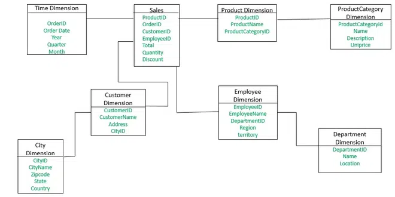
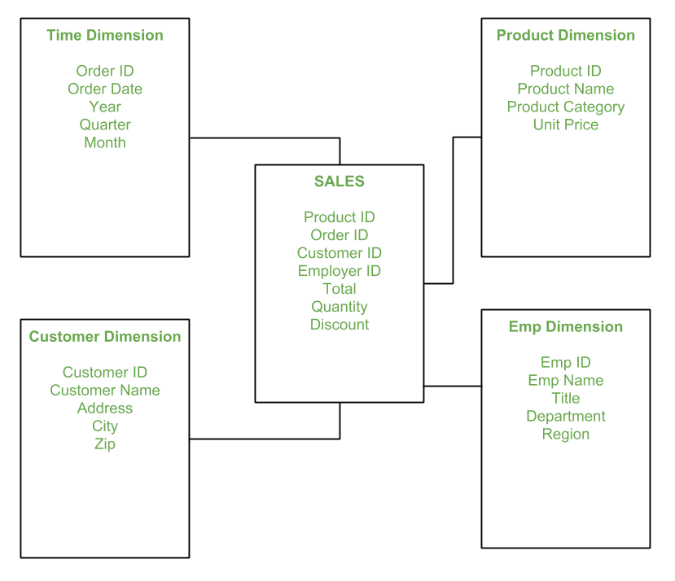
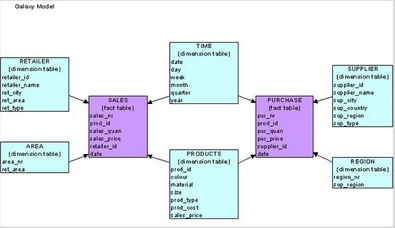

## [Main title](../README.md)
### [Interview questions](full.md)
# ETL

## Оглавление
- [1. Что такое ETL?](#1-что-такое-etl)
- [2. Что такое ELT?](#2-что-такое-elt)
- [3. В чем ключевые отличия между ETL и ELT? Когда использовать ETL и ELT?](#3-в-чем-ключевые-отличия-между-etl-и-elt-когда-использовать-etl-и-elt)
- [4. Что такое ETL pipeline?](#4-что-такое-etl-pipeline)
- [5. Какие бывают триггеры ETL/ELT пайплайнов?](#5-какие-бывают-триггеры-etlelt-пайплайнов)
- [6. Объясните трехслойную архитектуру цикла ETL](#6-объясните-трехслойную-архитектуру-цикла-etl)
- [7. Что такое Data Warehouse (DWH)?](#7-что-такое-data-warehouse-dwh)
- [8. Из каких систем состоит Data Warehouse?](#8-из-каких-систем-состоит-data-warehouse)
- [9. Что такое факты и измерения в Data Warehouse?](#9-что-такое-факты-и-измерения-в-data-warehouse)
- [10. Что такое Snowflake Schema?](#10-что-такое-snowflake-schema)
- [11. Что такое Star Schema?](#11-что-такое-star-schema)
- [12. Что такое Galaxy Schema?](#12-что-такое-galaxy-schema)
- [13. Что такое OLAP-система?](#13-что-такое-olap-система)
- [14. Что такое OLTP-система?](#14-что-такое-oltp-система)
- [15. В чем разница между OLAP и OLTP системами?](#15-в-чем-разница-между-olap-и-oltp-системами)
- [16. В чем разница между Data Warehouse и Operational Database?](#16-в-чем-разница-между-data-warehouse-и-operational-database)
- [17. Что такое OLAP-куб?](#17-что-такое-olap-куб)
- [18. Как устроены OLAP-кубы?](#18-как-устроены-olap-кубы)
- [19. Что такое идемпотентность и как её реализовать в ETL?](#19-что-такое-идемпотентность-и-как-её-реализовать-в-etl)
- [20. Что такое dbt (Data Build Tool)?](#20-что-такое-dbt-data-build-tool)
- [21. Что такое оркестрация (orchestration) в контексте ETL и data pipelines?](#21-что-такое-оркестрация-orchestration-в-контексте-etl-и-data-pipelines)
- [22. Какие задачи решает Apache Airflow?](#22-какие-задачи-решает-apache-airflow)
- [23. Что такое DAG и что он означает в контексте ETL?](#23-что-такое-dag-и-что-он-означает-в-контексте-etl)
- [24. Как решать проблему конкурентного доступа к данным в ETL?](#24-как-решать-проблему-конкурентного-доступа-к-данным-в-etl)
- [25. Какие ETL Architecture Patterns ты знаешь?](#25-какие-etl-architecture-patterns-ты-знаешь)
- [26. Что такое Data Lake и Lakehouse?](#26-что-такое-data-lake-и-lakehouse)
- [27. Какие подходы к обработке ошибок в процессе выполнения pipeline-ов существуют?](#27-какие-подходы-к-обработке-ошибок-в-процессе-выполнения-pipeline-ов-существуют)
- [28. Что такое Slowly Changing Dimensions (SCD)?](#28-что-такое-slowly-changing-dimensions-scd)
- [29. Что такое Long Updating Dimensions (LUD)?](#29-что-такое-long-updating-dimensions-lud)

## 1. Что такое ETL?

**ETL (Extract, Transform, Load)** — это процесс в data engineering и аналитике, который используется для извлечения данных из разных источников, их преобразования в удобный формат и загрузки в централизованное хранилище (обычно — data warehouse).

### Этапы ETL
1. **Extract (извлечение):**
    - Данные собираются из различных источников:
        - базы данных,
        - API,
        - файловые системы,
        - сторонние платформы.
    - Главная цель: собрать все необходимые данные.

2. **Transform (преобразование):**
    - Данные очищаются, стандартизируются, обогащаются, объединяются или агрегируются.
    - Примеры преобразований:
        - удаление дубликатов,
        - нормализация форматов (например, даты),
        - объединение справочников,
        - расчёт метрик.
    - Главная цель: привести данные к единым бизнес-правилам и аналитическим требованиям.

3. **Load (загрузка):**
    - Преобразованные данные загружаются в целевую систему:
        - Data Warehouse (Snowflake, BigQuery, Redshift),
        - Data Lake,
        - аналитическую платформу.
    - Главная цель: подготовить данные для построения отчётов, дашбордов и BI.

- Обеспечивает **точность и консистентность** данных.
- Делает данные **структурированными и пригодными для анализа**.
- Является основой для построения **data pipelines** и **analytics platforms**.
- Ускоряет доступ аналитиков к информации.

### Итог
ETL — это фундаментальный процесс работы с данными, который обеспечивает сбор, обработку и доставку информации в аналитические системы в удобном и надёжном виде.

## 2. Что такое ELT?

**ELT (Extract, Load, Transform)** — это современный подход к интеграции данных, чаще всего используемый в облачных архитектурах.  
Главное отличие от ETL: данные сначала **извлекаются и загружаются в хранилище**, а преобразования выполняются **внутри самого data warehouse** (например, Snowflake, BigQuery, Redshift).

### Этапы ELT

1. **Extract (извлечение):**
    - Данные берутся из источников (базы данных, API, файлы).
    - Цель: быстро собрать данные в «сыром» виде.

2. **Load (загрузка):**
    - Извлечённые данные сразу загружаются в **централизованное хранилище** или **data lake** в неизменённом виде.

3. **Transform (преобразование):**
    - Все преобразования выполняются уже **внутри хранилища** с использованием его нативных возможностей:
        - SQL-запросы,
        - специализированные инструменты (например, **dbt**),
        - встроенные механизмы параллельной обработки.

### Ключевые особенности ELT

1. **Использует мощность облачных DWH**  
   Современные хранилища (Snowflake, BigQuery, Redshift) оптимизированы для масштабной параллельной обработки.

2. **Более быстрая загрузка (faster ingestion)**  
   Данные загружаются без ожидания преобразований → быстрее попадают в хранилище.

3. **Гибкость (flexibility)**  
   Сырые данные доступны для разных сценариев (не только аналитики, но и data science, machine learning).

4. **Модульность и контроль версий**  
   Отлично сочетается с инструментами вроде **dbt**, позволяющими строить модульные, документированные и тестируемые пайплайны.

### Итог
ELT — это подход, при котором «сырой» слой данных сразу сохраняется в хранилище, а все преобразования выполняются уже на стороне DWH.  
Он лучше подходит для облачных решений, где можно масштабировать вычисления и гибко управлять трансформациями.

## 3. В чем ключевые отличия между ETL и ELT? Когда использовать ETL и ELT?

### Главное различие
- **ETL (Extract, Transform, Load):**
    - Данные сначала извлекаются (**Extract**),
    - затем преобразуются вне хранилища (отдельным ETL-сервером или инструментом) (**Transform**),
    - и только потом загружаются в хранилище в готовом виде (**Load**).

- **ELT (Extract, Load, Transform):**
    - Данные извлекаются (**Extract**),
    - сразу загружаются в хранилище в «сыром» виде (**Load**),
    - преобразования выполняются внутри самого хранилища (**Transform**) с использованием его вычислительных мощностей (например, SQL).

### Когда использовать **ETL**
- Вы работаете с **on-premise системами** или традиционными DWH с ограниченными вычислительными ресурсами (Teradata, Oracle).
- Требования по **безопасности и соответствию** (compliance) требуют обработки до загрузки.
- Сложные преобразования удобнее делать **вне хранилища** (на Python, Java).

### Когда использовать **ELT**
- Вы работаете с **облачными масштабируемыми DWH** (Snowflake, BigQuery, Redshift).
- Нужно хранить «сырые» данные для **повторной обработки или аудита**.
- Хотите использовать преимущества встроенных возможностей DWH для SQL-преобразований (и инструментов вроде **dbt**).
- Важна **гибкость, модульность и CI/CD-дружественные пайплайны**.

### Таблица сравнения

| Характеристика              | **ETL**                              | **ELT**                                |
|-----------------------------|--------------------------------------|----------------------------------------|
| Порядок операций            | Extract → Transform → Load           | Extract → Load → Transform             |
| Где выполняется Transform   | Внешний сервер / ETL-инструмент      | Внутри DWH (SQL, dbt и т.п.)           |
| Подходит для                | On-premise систем, legacy DWH        | Облачных, масштабируемых DWH           |
| Скорость загрузки           | Медленнее (ждём трансформаций)       | Быстрее (данные сразу загружаются)     |
| Хранение сырых данных       | Обычно не сохраняются                | Сохраняются для reprocessing/audit     |
| Гибкость и DevOps           | Ограниченная                         | Высокая (подходит для CI/CD)           |

### Итог
- **ETL** — классический подход, оптимален для старых систем и строгих требований безопасности.
- **ELT** — современный облачный стандарт, позволяющий масштабировать обработку и хранить «сырые» данные для разных сценариев.

## 4. Что такое ETL pipeline?

**ETL pipeline** — это автоматизированный процесс (workflow), который перемещает данные через три основных этапа:  
**Extract → Transform → Load**.

Он отвечает за то, чтобы данные последовательно извлекались, преобразовывались и загружались в хранилище или аналитическую систему.

### Инструменты для ETL
1. **Классические ETL-платформы**:
    - *Informatica, Talend, SSIS*.

2. **Кастомный код**:
    - на *Python, SQL, Apache Spark*.

3. **Современные оркестраторы**:
    - *Apache Airflow, Prefect*.

### Типы Data Pipelines
1. **Batch pipeline (пакетный)**
    - Запускается по расписанию (например, каждый час, раз в день).
    - Подходит для регулярных отчётов и плановой загрузки данных.

2. **Real-time / Streaming pipeline (стриминговый, потоковый)**
    - Обрабатывает данные «на лету» по мере их поступления.
    - Используются технологии вроде *Kafka, Flink*.
    - Применяется для real-time аналитики и мониторинга.

3. **Incremental pipeline (инкрементальный)**
    - Загружает только новые или изменённые данные.
    - Очень эффективный подход, снижает нагрузку на систему.

### Итог
ETL pipeline — это «конвейер» для данных. Он может работать пакетно, в реальном времени или инкрементально и строится с использованием ETL-инструментов, кастомного кода или современных оркестраторов.

## 5. Какие бывают триггеры ETL/ELT пайплайнов?

ETL/ELT пайплайны могут запускаться по-разному в зависимости от архитектуры и инструментов оркестрации.  
Триггер определяет **условие старта выполнения пайплайна**.

### Основные виды триггеров

1. **Scheduled Trigger (по расписанию, Cron-based)**
    - Пайплайн запускается через фиксированные интервалы (ежечасно, ежедневно).
    - Используется в: *Airflow, dbt Cloud, GitHub Actions*.

2. **Upstream Dependency (зависимость от других задач, DAG-based)**
    - Пайплайн стартует после успешного выполнения другой задачи или пайплайна.
    - Часто используется в: *Airflow, Prefect*.

3. **Event-based Trigger (событийный)**  
   Запускается при наступлении внешнего события, например:
    - появление нового файла (S3, FTP),
    - завершение синхронизации (например, Fivetran),
    - сообщение из *Kafka* или webhook.

4. **Manual Trigger (ручной запуск)**
    - Запуск через CLI, UI или API.
    - Применяется для ad hoc задач или отладки.
    - Пример: кнопка в *Airflow UI*, команда `dbt run`.

5. **Git-based CI/CD Trigger**
    - Запускается при изменениях в системе контроля версий (Git).
    - Пример: push в main-ветку вызывает `dbt run` через GitHub Actions.

### Итог
Триггеры позволяют гибко управлять запуском ETL/ELT пайплайнов:
- от простого расписания (cron),
- до событийных и CI/CD интеграций.  
  Благодаря этому пайплайны легко встроить в общую инфраструктуру обработки и доставки данных.

## 6. Объясните трехслойную архитектуру цикла ETL

**Трёхслойная архитектура (three-layer architecture)** в ETL — это дизайн-паттерн, при котором обработка данных разделяется на **три последовательных слоя**.  
Цель: повысить **ясность, управляемость и производительность** пайплайнов.

### Слои архитектуры

1. **Staging Layer (слой загрузки / буферизации)**
    - Здесь данные **извлекаются** из исходных систем и загружаются **без трансформаций** или с минимальным форматированием.
    - Содержит «сырые», нефильтрованные данные (*например: stg_orders, stg_customers*).
    - Используется для:
        - валидации данных,
        - бэкапов,
        - воспроизводимости загрузок.

2. **Core / Integration Layer (ядро / слой интеграции)**
    - На этом уровне данные **стандартизируются и интегрируются** из разных источников.
    - Выполняются: объединение таблиц, обогащение данных (*например: core_orders, core_customers*).
    - Применяются бизнес-правила:
        - нормализация дат,
        - удаление дублей.
    - Формируется **единственный источник правды (single source of truth)** для фактов и измерений.

3. **Data Marts / Presentation Layer (витрины / слой представления)**
    - Финальный слой, где данные **агрегируются и структурируются** под конкретные задачи аналитики и BI.
    - Примеры готовых таблиц: *sales_summary, customer_lifetime*.
    - Часто организован в виде схем:
        - **звезда (star schema)**,
        - **снежинка (snowflake schema)**.

### Итог
Трёхслойная архитектура позволяет:
- хранить **сырые данные** для проверки и восстановления,
- строить **стандартизированное ядро** с бизнес-правилами,
- предоставлять **готовые витрины** для аналитики и BI.  

## 7. Что такое Data Warehouse (DWH)?

**Data Warehouse (хранилище данных)** — это централизованная система, предназначенная для **хранения, интеграции и анализа данных** из разных источников.  
DWH используется для поддержки:
- отчетности,
- бизнес-аналитики (BI),
- принятия решений (decision-making).

### Ключевые характеристики
1. **Хранение исторических и структурированных данных**
    - обычно за многие годы,
    - данные неизменяемые (append-only).

2. **Оптимизация под аналитические запросы (read-heavy)**
    - не для транзакционной обработки (как OLTP),
    - а для сложных агрегаций и аналитики.

3. **Поддержка сложных операций**
    - агрегаты,
    - джойны,
    - временные ряды (time-series analysis).

4. **Структурирование по схемам**
    - *звезда (star schema)*,
    - *снежинка (snowflake schema)*,
    - таблицы фактов и измерений.

### Примеры Data Warehouse
- **Snowflake**
- **Azure Synapse Analytics**
- **Google BigQuery**
- **Amazon Redshift**

### Итог
DWH — это основа аналитической инфраструктуры.  
Он объединяет данные из разных систем, делает их структурированными и доступными для построения BI-отчетов, дашбордов и продвинутой аналитики.

## 8. Из каких систем состоит Data Warehouse?

### Основные компоненты DWH

1. **Source Systems (источники данных)**
    - Транзакционные базы (OLTP: PostgreSQL, MySQL, Oracle).
    - CRM, ERP, финансовые системы.
    - API, лог-файлы, IoT, внешние данные.

2. **ETL/ELT Layer (процесс загрузки данных)**
    - Используется для **извлечения, преобразования и загрузки** данных.
    - Инструменты: *Informatica, Talend, SSIS, dbt, Apache Airflow, Fivetran, Spark*.
    - Формирует staging и core-слои.

3. **Staging Area (буфер загрузки / слой сырья)**
    - Хранит «сырые» данные. (Snowflake)
    - Используется для валидации и воспроизводимости.

4. **Integration / Core Layer (ядро хранилища)**
    - Здесь данные очищаются, нормализуются, объединяются.
    - Формируется **single source of truth**.

5. **Data Marts (витрины данных)**
    - Оптимизированные под конкретные аналитические задачи.
    - Часто строятся в виде **star schema** или **snowflake schema**.
    - Примеры: *sales_mart, customer_mart*.

6. **Metadata & Master Data Management**
    - Метаданные описывают источники, трансформации, lineage.
    - MDM отвечает за единые справочники (например, список клиентов).

7. **BI & Analytics Tools (инструменты потребления)**
    - Отчётность и визуализация: *Power BI, Tableau, Looker, Qlik*.
    - Data Science и ML: Python, R, Databricks.

### Итог
DWH — это не просто база данных, а **целая экосистема**, которая включает:
- источники данных,
- слой загрузки (ETL/ELT),
- staging, core и витрины,
- управление метаданными,
- BI-инструменты. 

## 9. Что такое факты и измерения в Data Warehouse?

**Факты (Facts)** — это числовые, измеримые данные, которые описывают бизнес-события или транзакции.  
Они хранятся в **таблицах фактов (Fact Tables)** и обычно подлежат агрегации (суммирование, усреднение, подсчет).

📌 Примеры фактов:
- сумма продажи (`sales_amount`),
- количество проданных товаров (`quantity`),
- прибыль (`profit`),
- количество кликов (`clicks`),
- продолжительность звонка (`duration`).

**Измерения (Dimensions)** — это описательные атрибуты, которые дают контекст фактам.  
Они хранятся в **таблицах измерений (Dimension Tables)** и используются для группировки, фильтрации и аналитики.

📌 Примеры измерений:
- **Время (Time):** дата, месяц, год, квартал,
- **Продукт (Product):** название, категория, бренд,
- **Клиент (Customer):** имя, возраст, регион, сегмент,
- **Магазин (Store):** город, страна, тип магазина.

### Пример:

**Fact Table: Sales**
```sql
    DateKey | ProductKey | CustomerKey | StoreKey | SalesAmount | Quantity
```
**Dimension: Product**
```sql
    ProductKey | ProductName | Category | Brand
```
**Dimension: Time**
```sql
    DateKey | Date | Month | Year | Quarter
```
**Dimension: Customer**
```sql
    CustomerKey | Name | Age | Region | Segment
```

### Итог:
- **Факты = что произошло (числовые метрики).**
- **Измерения = в каком контексте произошло (время, клиент, продукт, место).**

📊 Пример аналитического вопроса:  
*"Сколько продаж (факт) было у клиентов из Москвы (измерение) в 2023 году (измерение)?"*

## 10. Что такое Snowflake Schema?

**Snowflake Schema (схема "снежинка")** — это тип схемы базы данных в Data Warehouse, при котором таблица фактов связана с **нормализованными таблицами измерений**.  
Название «снежинка» связано с тем, что диаграмма имеет древовидную форму с разветвлениями, напоминающими снежинку.

### Структура
- **Fact Table (таблица фактов)**
    - содержит числовые метрики (например, `sales_amount`, `quantity`, `profit`),
    - ключи, ссылающиеся на таблицы измерений.

- **Dimension Tables (таблицы измерений)**
    - описывают контекст фактов (например, `customer`, `product`, `time`, `region`).
    - в отличие от Star Schema, измерения здесь **нормализованы**:
        - таблица `product` может быть разделена на `product → category → department`,
        - таблица `location` может быть разделена на `city → state → country`.

### Пример


### Преимущества
- Экономия памяти (нет дублирования в измерениях).
- Улучшенная структурированность данных.
- Подходит для случаев, где важна **нормализация** и избежание избыточности.

### Недостатки
- Более сложные запросы (нужно больше JOIN).
- Медленнее по сравнению с **Star Schema**.
- Сложнее для понимания бизнес-пользователям.

### Итог
- **Snowflake Schema** = нормализованная модель измерений (многоуровневая структура).
- Используется в Data Warehouse, когда нужно оптимизировать хранение и поддерживать строгую структуру данных.
- Противопоставляется **Star Schema**, которая проще и быстрее, но хранит данные с избыточностью.

## 11. Что такое Star Schema?

**Star Schema (схема «звезда»)** — это тип организации данных в Data Warehouse, при котором:
- в центре находится **Fact Table (таблица фактов)** с числовыми метриками,
- вокруг неё располагаются **Dimension Tables (таблицы измерений)**, которые напрямую связаны с fact table.

Так как связи образуют структуру, напоминающую звезду ⭐ — схема получила название **Star Schema**.

### Структура

### Пример


### Преимущества Star Schema
- Простота понимания и использования (ближе к бизнес-логике).
- Высокая скорость выполнения запросов (меньше JOIN).
- Отлично подходит для BI-инструментов (Power BI, Tableau).
- Удобна для построения **OLAP-кубов**.

### Недостатки
- Избыточность данных (например, название категории продукта может дублироваться).
- Требует больше места для хранения, чем Snowflake Schema.

### Отличие от Snowflake Schema
- В **Star Schema** таблицы измерений **денормализованы** (все атрибуты хранятся в одной таблице).
- В **Snowflake Schema** измерения **нормализованы** и могут разноситься на несколько связанных таблиц.

### Итог
- **Star Schema** = простая и быстрая структура для аналитики.
- Используется, когда важны **производительность и удобство BI**, а не минимизация избыточности.  

## 12. Что такое Galaxy Schema?

**Galaxy Schema** (или **Fact Constellation Schema**) — это модель организации данных в Data Warehouse, при которой используется **несколько таблиц фактов**, которые могут **разделять общие таблицы измерений**.

Её называют **«схемой галактика»** или **«созвездие фактов»**, потому что она объединяет несколько «звёзд» (Star Schemas) в единую систему.

### Пример


### Преимущества:
- Возможность анализировать **несколько бизнес-процессов** в одной модели.
- Экономия места за счёт общих dimension tables.
- Поддержка более комплексной аналитики (например, сравнение продаж и возвратов).


### Недостатки:
- Более сложная структура, чем у Star или Snowflake Schema.
- Запросы могут быть тяжелее (больше JOIN).
- Требует внимательного проектирования, чтобы избежать путаницы.

### Отличие от других схем:
- **Star Schema** → одна таблица фактов + простые измерения.
- **Snowflake Schema** → одна таблица фактов + нормализованные измерения.
- **Galaxy Schema** → несколько таблиц фактов + общие измерения.

### Итог:
**Galaxy Schema** применяется в крупных хранилищах данных, где нужно моделировать и анализировать **несколько бизнес-процессов одновременно**: продажи, возвраты, логистику, финансы и т. д.

## 13. Что такое OLAP-система?

**OLAP (Online Analytical Processing)** — это тип системы, предназначенный для поддержки:
- **сложного анализа данных**,
- **отчетности (reporting)**,
- **принятия решений (decision-making)**,

обычно на больших объёмах **исторических данных**.

### Основные характеристики OLAP:
1. **Хранение исторических данных** — агрегированные и структурированные данные из разных источников.
2. **Оптимизация под аналитические запросы** (read-heavy workload), а не транзакционную обработку.
3. **Поддержка многомерного анализа**: измерения (time, product, region) и факты (sales, profit).
4. **Высокая производительность для агрегаций и срезов** (drill-down, roll-up, slice & dice).
5. Часто реализуется на основе **звёздной (Star Schema)** или **снежинки (Snowflake Schema)**.

### Примеры OLAP-систем:
- **Microsoft Analysis Services (SSAS)**,
- **Oracle OLAP**,
- **SAP BW**,
- **Snowflake, BigQuery, Redshift** (в контексте BI и аналитики),
- **Cognos, MicroStrategy, Tableau** (как потребители OLAP-кубов).

### Итог:
OLAP-система — это инструмент для построения аналитики на больших исторических данных.  
Она даёт возможность бизнесу быстро отвечать на вопросы вида:  
*"Какая выручка (факт) была у категории 'Электроника' (измерение) по регионам за последние 3 года (измерение)?"*

## 14. Что такое OLTP-система?

**OLTP (Online Transaction Processing)** — это тип системы управления базами данных, предназначенный для обработки **операционных транзакций** в реальном времени.  
Такие системы используются для **повседневных операций** бизнеса.

### Основные характеристики OLTP:
1. **Оперативная обработка транзакций** (insert, update, delete).
2. **Поддержка большого количества одновременных пользователей**.
3. **Оптимизация под запись и быстрый доступ к отдельным строкам**.
4. **Данные хранятся в нормализованном виде**, чтобы избежать избыточности.
5. Высокая скорость выполнения простых запросов (например: найти заказ по ID).

### Примеры OLTP-систем:
- Интернет-магазины (создание и оплата заказов).
- Банковские системы (транзакции, платежи, переводы).
- CRM и ERP системы (управление клиентами, инвентарем, логистикой).
- Базы данных: **PostgreSQL, MySQL, Oracle, SQL Server** (в режиме OLTP).

### Итог:
- **OLTP** = система для **операций в реальном времени** (создать заказ, провести платеж).
- **OLAP** = система для **анализа данных** (отчеты, аналитика, прогнозы).  

## 15. В чем разница между OLAP и OLTP системами?

**OLTP (Online Transaction Processing)** и **OLAP (Online Analytical Processing)** решают разные задачи в работе с данными.  
OLTP используется для **операционных транзакций в реальном времени**, а OLAP — для **анализа и отчетности на больших объемах исторических данных**.

### Сравнение OLTP vs OLAP

| Характеристика        | OLTP (операционные системы) | OLAP (аналитические системы) |
|------------------------|-----------------------------|-------------------------------|
| Цель работы           | Повседневные транзакции (создание заказов, платежи, инвентарь) | Анализ данных, отчетность, принятие решений |
| Данные                | Текущие, детализированные   | Исторические, агрегированные |
| Тип нагрузки          | Много операций записи и обновления | Много операций чтения и агрегации |
| Модель хранения       | Нормализованная (3NF)       | Денормализованная (Star, Snowflake Schema) |
| Кол-во пользователей  | Тысячи (операторы, кассиры, менеджеры) | Сотни (аналитики, BI, руководство) |
| Запросы               | Простые и короткие (поиск по ID) | Сложные, с агрегациями и группировками |
| Производительность    | Оптимизирована для транзакций | Оптимизирована для аналитики |
| Примеры систем        | PostgreSQL, MySQL, Oracle (OLTP режим) | Snowflake, BigQuery, Redshift, SSAS |

### Итог:
- **OLTP** = быстрые транзакции и операции в реальном времени.
- **OLAP** = анализ данных, построение отчетов и бизнес-аналитика.

📌 На практике данные из OLTP-систем **попадают в OLAP через ETL/ELT-процессы**:  
👉 *OLTP (операционные данные) → ETL → Data Warehouse (OLAP для анализа)*.  

## 16. В чем разница между Data Warehouse и Operational Database?

**Data Warehouse (DWH)** — это система, предназначенная для хранения и анализа **исторических данных**.  
Она поддерживает **аналитическую обработку (OLAP)**, используется для построения отчетов и принятия решений.

**Operational Database (OLTP)** — это система для управления **операционными данными** в реальном времени.  
Она поддерживает **транзакционную обработку** и используется для повседневных бизнес-операций.

### Сравнение Data Warehouse vs Operational Database

| Характеристика          | Data Warehouse (DWH)         | Operational Database (OLTP) |
|--------------------------|------------------------------|------------------------------|
| Основная цель            | Аналитика и отчетность       | Операционные транзакции в реальном времени |
| Тип данных               | Исторические, агрегированные | Текущие, актуальные |
| Тип нагрузки             | **Чтение (read-heavy)**      | **Запись и обновления (write-heavy)** |
| Запросы                  | Сложные, с агрегациями       | Простые, быстрые транзакции |
| Кол-во пользователей     | Аналитики, BI, руководство   | Менеджеры, кассиры, клиенты |
| Модель хранения          | Денормализованная (звезда, снежинка) | Нормализованная (3NF) |
| Объем данных             | Очень большие (TB–PB)        | Сравнительно меньше |
| Примеры систем           | Snowflake, BigQuery, Redshift | PostgreSQL, MySQL, Oracle, SQL Server |

### Итог:
- **Data Warehouse (OLAP)** = хранилище для **аналитики, отчетов, стратегических решений**.
- **Operational Database (OLTP)** = база для **операций в реальном времени** (платежи, заказы, CRM).

📌 На практике:  
👉 Данные из **OLTP** систем переносятся в **DWH** с помощью **ETL/ELT-процессов**.

## 17. Что такое OLAP-куб?

**OLAP-куб (OLAP Cube)** — это многомерная структура данных, которая используется в **OLAP-системах** для быстрого анализа больших объемов информации.  
Он называется «кубом», потому что данные организованы не в плоские таблицы, а в **многомерные измерения (dimensions)**, что позволяет анализировать их под разными углами.

### Основные элементы OLAP-куба:
1. **Факты (Facts)** — числовые показатели (продажи, прибыль, количество заказов).
2. **Измерения (Dimensions)** — контекст для фактов:
    - Время (год, месяц, день),
    - География (страна, город, регион),
    - Продукт (категория, бренд, модель),
    - Клиент (возраст, сегмент).
3. **Меры (Measures)** — агрегаты фактов (SUM, AVG, COUNT).

### Пример:
**Вопрос аналитика:**  
*"Какова общая сумма продаж (факт) по продуктам (измерение) в регионах (измерение) по месяцам (измерение)?"*

В OLAP-кубе:
- Ось X = Время (Year → Month → Day),
- Ось Y = Продукты (Category → Brand → SKU),
- Ось Z = География (Region → City).

На пересечении этих измерений хранится метрика: **SalesAmount**.

### Операции с OLAP-кубом:
- **Slice** — выбор одного среза (например, продажи только за 2024 год).
- **Dice** — выбор подмножества по нескольким измерениям (например, продажи телефонов в Европе в 2023 году).
- **Drill-down** — детализация (год → месяц → день).
- **Roll-up** — агрегация (день → месяц → год).
- **Pivot (Rotate)** — поворот куба для смены перспективы анализа.

### Преимущества OLAP-кубов:
- Очень быстрое выполнение аналитических запросов.
- Удобство многомерного анализа.
- Поддержка бизнес-пользователей (BI, отчеты, дашборды).

### Итог:
**OLAP-куб** — это способ хранения и анализа данных в многомерной структуре, которая позволяет выполнять сложные аналитические запросы (агрегации, группировки) быстро и удобно.

## 18. Как устроены OLAP-кубы?

**OLAP-куб (Online Analytical Processing Cube)** — это многомерная структура данных, которая используется для анализа больших объемов информации.  
Он хранит **факты (measures)** и связывает их с **измерениями (dimensions)**, образуя многомерное пространство для аналитики.

### Основные элементы куба
- **Факты (Facts)** — числовые показатели, которые анализируются (например: продажи, количество заказов, прибыль).
- **Измерения (Dimensions)** — атрибуты, которые задают контекст фактов (например: время, продукт, регион, клиент).
- **Меры (Measures)** — агрегаты фактов (SUM, AVG, COUNT).
- **Ячейки куба** — пересечение измерений с конкретными значениями фактов.

### Логическая структура
OLAP-куб выглядит как **n-мерный массив**:
- 3 измерения → куб (3D),
- 4 измерения → гиперкуб (4D),
- в реальности куб может иметь десятки измерений.


### Физическая реализация OLAP-кубов
Существует три подхода:

1. **MOLAP (Multidimensional OLAP)**
   - Данные хранятся в многомерных массивах.
   - Очень быстрый доступ (O(1)), так как данные индексированы по координатам.
   - Проблема: много пустых ячеек (sparse data) → нужна компрессия.

2. **ROLAP (Relational OLAP)**
   - Данные хранятся в реляционных таблицах (звезда, снежинка).
   - Куб реализован как Fact Table + Dimension Tables.
   - Запросы выполняются через SQL (JOIN + GROUP BY).
   - Медленнее, но лучше масштабируется.

3. **HOLAP (Hybrid OLAP)**
   - Гибридный подход: агрегаты хранятся в многомерной структуре (MOLAP),
   - детальные данные — в реляционной БД (ROLAP).
   - Баланс скорости и гибкости.

### Хранение и поиск данных
- Данные куба обычно **разреженные** (sparse), поэтому хранятся только непустые ячейки.
- Для ускорения поиска применяются:
   - **Bitmap indexing** (маски для категориальных атрибутов),
   - **Pre-aggregation** (материализованные представления),
   - **Star-join optimization** (оптимизация SQL-запросов).

### Операции с OLAP-кубами
- **Slice** — выбор одного измерения (например, продажи только за 2024 год).
- **Dice** — выбор подмножества по нескольким измерениям (например, продажи телефонов в Европе).
- **Drill-down** — детализация (год → месяц → день).
- **Roll-up** — агрегация (день → месяц → год).
- **Pivot** — поворот куба для смены угла анализа.

### Итог:
OLAP-кубы — это **многомерные структуры данных**, где:
- факты (числа) связаны с измерениями (контекст),
- данные могут храниться в многомерных массивах (MOLAP), реляционных таблицах (ROLAP) или гибриде (HOLAP),
- поддерживают быстрый многомерный анализ через операции slice, dice, drill-down и roll-up.

## 19. Что такое идемпотентность и как её реализовать в ETL?

**Идемпотентность** — это свойство операции, при котором повторное выполнение даёт тот же результат, что и одно выполнение.

В контексте **ETL** это означает, что если один и тот же процесс загрузки или трансформации данных будет выполнен несколько раз, состояние целевой системы не изменится некорректным образом (не будет дубликатов, повторной агрегации и т. д.).

### Зачем нужна идемпотентность в ETL
- **Надёжность:** при сбоях или падении джоба можно безопасно перезапустить загрузку.
- **Предсказуемость:** повторные запуски всегда приводят к одинаковому результату.
- **Безопасность в продакшене:** особенно критично при работе с большими данными и инкрементальными обновлениями.


### Примеры идемпотентности в ETL

1. **Загрузка данных в staging-таблицу с полной очисткой**
```sql
   TRUNCATE TABLE staging_orders;
    INSERT INTO staging_orders SELECT * FROM source_orders;
```
- Повторный запуск всегда даст одинаковое состояние staging.

2. **Использование UPSERT (MERGE) вместо INSERT**
```sql
   MERGE INTO target_orders AS t
   USING staging_orders AS s
   ON t.order_id = s.order_id
   WHEN MATCHED THEN UPDATE SET t.amount = s.amount
   WHEN NOT MATCHED THEN INSERT (order_id, amount) VALUES (s.order_id, s.amount);
```
- Повторный запуск не создаст дубликатов.

3. **Уникальные ключи и ограничения**
```sql
   CREATE UNIQUE INDEX idx_orders_id ON target_orders(order_id);
```
- Даже при ошибочном повторном вставлении дубликат не появится.

4. **Idempotency Key в потоковых загрузках**
- Для каждой партии данных хранить уникальный идентификатор загрузки (batch_id).
- Перед загрузкой проверять, обрабатывался ли этот batch_id. 
```sql
   IF NOT EXISTS (SELECT 1 FROM etl_log WHERE batch_id = ‘2024-08-26-001’)
   THEN вставить данные
   ELSE пропустить
```

### Подходы к реализации идемпотентности в ETL
1. **Полная перезапись (full refresh)** — очищаем и загружаем заново.
2. **Инкрементальная загрузка с upsert** — обновляем только новые/изменённые записи.
3. **Hash-сравнение** — сравниваем хэши строк для определения изменений.
4. **Логирование batch_id** — исключаем повторную обработку одной и той же партии данных.


### Итог
В ETL идемпотентность означает, что процесс можно безопасно перезапускать без риска дублирования или искажения данных.  
Реализуется через:
- `TRUNCATE + INSERT`,
- `UPSERT (MERGE)`,
- уникальные ключи,
- контроль batch_id,
- хэширование строк.  

## 20. Что такое dbt (Data Build Tool)?

**dbt (Data Build Tool)** — это open-source фреймворк для **трансформации данных внутри хранилища (data warehouse)** с помощью SQL, при этом он использует лучшие практики из мира разработки ПО: модульность, тестирование, контроль версий.

### Основные возможности dbt
1. **SQL как основной язык**
   - Все трансформации пишутся в SQL, без сложного ETL-кода.
   - dbt управляет зависимостями и порядком выполнения.

2. **Построение моделей (models)**
   - SQL-скрипты превращаются в **таблицы или представления (views)** внутри хранилища.
   - Пример модели:
     ```
     SELECT
         customer_id,
         SUM(amount) AS total_sales
     FROM raw.sales
     GROUP BY customer_id
     ```

3. **Управление зависимостями**
   - Используется макрос `ref()` для ссылок на другие модели.
   - dbt сам выстраивает DAG (граф зависимостей) и запускает модели в правильном порядке.

4. **Инкрементальная загрузка и материализация**
   - Поддержка **incremental refresh** (обновление только новых данных).
   - Разные стратегии материализации: `view`, `table`, `incremental`, `ephemeral`.

5. **Контроль версий и CI/CD**
   - Полная интеграция с Git.
   - Поддержка автоматических пайплайнов (GitHub Actions, GitLab CI).

6. **Тестирование и документация**
   - Возможность задавать тесты качества данных (например, `unique`, `not_null`).
   - Автоматическая генерация документации и lineage (цепочки зависимостей).

7. **Поддержка современных облачных DWH**
   - Работает с **Snowflake, BigQuery, Redshift, Databricks, Postgres**.

### Итог
**dbt** — это инструмент, который позволяет:
- управлять трансформациями **непосредственно в хранилище**,
- писать всё в SQL, но при этом использовать инженерные практики (Git, CI/CD, тестирование),
- легко строить повторяемые и прозрачные data pipelines.

Он стал стандартом де-факто для **Modern Data Stack**.

## 21. Что такое оркестрация (orchestration) в контексте ETL и data pipelines?

**Оркестрация (orchestration)** — это автоматизированная координация, планирование и мониторинг выполнения задач в рамках пайплайна данных.  
Она обеспечивает запуск задач:
- **в правильном порядке**,
- **в правильное время**,
- **с правильными параметрами**,
- и гарантирует корректную обработку ошибок.

### Основные задачи оркестрации
1. **Управление зависимостями**
   - Задача B запускается только после успешного выполнения задачи A.

2. **Планирование (scheduling)**
   - Задачи выполняются по расписанию (например, каждый день в 2:00 ночи).

3. **Обработка ошибок и повторные попытки**
   - Автоматический retry при сбое.
   - Отправка уведомлений (например, в Slack или email).

4. **Параллелизация и оптимизация ресурсов**
   - Несколько задач могут выполняться одновременно, если нет зависимостей.
   - Гибкое распределение нагрузки.

5. **Контроль окружений и параметров**
   - Разделение выполнения в dev/staging/prod.
   - Передача параметров в пайплайны.

### Примеры инструментов оркестрации
- **Apache Airflow** — самый популярный инструмент (DAG-и, Python + UI).
- **Prefect** — современный аналог, фокус на простоте и облачной интеграции.
- **Luigi** — используется для построения пайплайнов.
- **Dagster** — data orchestrator с расширенными возможностями тестирования.
- **Azure Data Factory / AWS Step Functions / GCP Composer** — облачные решения для оркестрации.

### Пример сценария
ETL пайплайн для загрузки данных о продажах:
1. **Extract** — загрузить CSV из S3.
2. **Transform** — почистить данные (удалить дубликаты, привести даты).
3. **Load** — загрузить данные в DWH (например, Snowflake).
4. **Report** — построить агрегированные таблицы для BI.

Оркестратор гарантирует, что шаги выполняются последовательно и перезапустятся в случае ошибки.

### Итог
Оркестрация — это «дирижёр» в мире ETL: она управляет зависимостями, временем запуска, повторными попытками и мониторингом пайплайнов. Без неё сложные процессы ETL/Data Engineering становятся хаотичными и ненадёжными.

## 22. Какие задачи решает Apache Airflow?

**Apache Airflow** — это open-source платформа для управления и планирования workflow (ETL, data pipelines, аналитика).  
Она используется для автоматизации сложных процессов обработки данных, построенных из множества зависимых задач.

### Основные задачи, которые решает Airflow

1. **Управление пайплайнами (Pipeline management)**
   - Позволяет **описывать, планировать и мониторить** пайплайны в виде DAG (Directed Acyclic Graph).
   - Все зависимости между задачами заданы явно.

2. **Централизованный логинг**
   - Все логи выполнения задач доступны в одном месте.
   - Удобно для мониторинга и отладки.

3. **Обработка ошибок**
   - Возможность настроить **callbacks** при сбое (например, уведомления в Slack/Discord/email).
   - Поддержка retry-политик (повторные попытки выполнения).

4. **Пользовательский интерфейс (UI)**
   - Web-интерфейс для визуализации DAG-ов и мониторинга прогресса.
   - Возможность перезапускать упавшие задачи вручную.

5. **Интеграция с инструментами**
   - Поддержка работы с базами данных, облаками (AWS, GCP, Azure), Spark, dbt, Kubernetes и др.
   - Использует операторов (Operators) и сенсоров (Sensors) для интеграции.

6. **Гибкость и расширяемость**
   - Пайплайны описываются на **Python**, что даёт возможность использовать циклы, условия, параметры.
   - Можно создавать собственные операторы.

7. **Open-source и комьюнити**
   - Бесплатен и активно поддерживается сообществом.
   - Множество плагинов и готовых интеграций.

### Пример использования
Airflow часто применяют для:
- ETL/ELT процессов (выгрузка → трансформация → загрузка в DWH),
- запусков ML-пайплайнов (обучение моделей по расписанию),
- автоматизации аналитических отчётов,
- управления сложными workflow в продакшене.

### Итог
Apache Airflow решает проблему **оркестрации и управления пайплайнами данных**:  
он обеспечивает прозрачность, контроль, интеграцию с различными системами и надёжную обработку ошибок, что делает его стандартом де-факто для современных data engineering команд.

## 23. Что такое DAG и что он означает в контексте ETL?

**DAG (Directed Acyclic Graph)** — это **ориентированный ациклический граф**, структура, где:
- **узлы (nodes)** — это задачи (например, extract, transform, load),
- **рёбра (edges)** — зависимости между задачами,
- **отсутствуют циклы** — задача не может зависеть сама от себя напрямую или косвенно.

### DAG в ETL-процессах
В ETL контексте DAG описывает последовательность выполнения шагов:
1. **Extract** — загрузка данных из источников,
2. **Transform** — очистка, агрегация, обогащение,
3. **Load** — загрузка в хранилище или витрину.

Каждая задача запускается **только после завершения предыдущих**, что гарантирует **логичный и предсказуемый порядок** обработки данных.

### Пример DAG для обработки данных о продажах
```
   [ extract_crm_data ]
   ↓
   [ transform_customers ]
   ↓
   [ join_sales_and_customers ]
   ↓
   [ aggregate_sales_by_region ]
   ↓
   [ export_to_dashboard ]
```
- Каждая задача запускается только после завершения предыдущей.
- Выполняется один раз (или с параметрами, но без зацикливания).

### Где используются DAG-и?
1. **Apache Airflow**
   - Каждый пайплайн в Airflow — это DAG.
   - DAG описывается на Python.

   Пример:
   ```python
   with DAG('sales_pipeline') as dag:
       t1 = PythonOperator(task_id='extract', python_callable=extract_func)
       t2 = PythonOperator(task_id='transform', python_callable=transform_func)
       t3 = PythonOperator(task_id='load', python_callable=load_func)

       t1 >> t2 >> t3   # порядок выполнения
   ```
2. Prefect / Luigi / Dagster — альтернативные оркестраторы, где пайплайны тоже представляются DAG-ами.

### Зачем нужны DAG-и?
- Явно показывают зависимости между задачами.
- Гарантируют правильный порядок выполнения.
- Обеспечивают повторяемость и надёжность пайплайнов.
- Упрощают мониторинг и сопровождение ETL-процессов.

### Итог
DAG — это основа оркестрации ETL.
Он превращает сложный процесс из множества задач в чёткую схему зависимостей, что позволяет системам вроде Airflow управлять пайплайнами прозрачно и предсказуемо.

## 24. Как решать проблему конкурентного доступа к данным в ETL?

### Основные цели
- Избежать дублирования (двойной обработки данных)
- Предотвратить конфликты при записи
- Гарантировать согласованность для читающих процессов
- Сделать повторные запуски безопасными (идемпотентность)

### 1. Идемпотентность записей
- Использовать **upsert/merge** вместо простых вставок.
- Создавать **уникальные индексы** по бизнес-ключам.
- Вести учёт **batch_id** и пропускать уже загруженные партии.

### 2. Управление конкурентными записями
### a) Single-writer (один писатель)
   Использовать **блокировки или leases**
### b) На уровне оркестратора
- В Airflow использовать **pools** или ограничение concurrency.
- В распределённых системах — **Redis/ZooKeeper locks**.

### c) Разделение по партициям
- Каждый процесс пишет только в свою **дату/регион/шард**, чтобы избежать пересечений.

### 3. Изоляция читателей от писателей
### a) Снимки (MVCC / snapshot isolation)
- Читатели получают консистентную картину данных.
- В хранилищах — использовать copy-on-write (Delta Lake, Iceberg, Hudi).

### b) Staging + атомарная подмена
- Загружаем данные во временную таблицу, затем меняем ссылку.

### 4. Exactly-once и дедупликация
- Хранить **offset / watermark** (например, max id или timestamp).
- Добавлять **dedupe key** (хэш бизнес-ключа + время).  

### 5. Работа с файлами (Data Lake)
- Сначала писать во временную папку: `/incoming/_tmp/run123/*`
- Затем **атомарно переименовывать** в рабочую директорию.
- Для ACID-операций использовать Delta/Iceberg/Hudi.

### 6. SCD (Slowly Changing Dimensions)
- Для Type-2 контролировать непересекающиеся диапазоны дат.

## 7. Обработка сбоев и повторные запуски
- Все шаги должны быть **идемпотентными**.
- Использовать retries с задержкой (**jitter**).

## 8. Наблюдаемость
- Вести учёт: **row counts, checksums, список файлов/партиций**.
- Проверять качество загрузки после завершения партии.

### Итог
Для надёжного ETL-конвейера:
- Используйте **idempotency + уникальные ключи**,
- Делайте загрузку через **staging и атомарный swap**,
- Обеспечивайте **snapshot isolation** для читающих,
- Разделяйте ответственность (partitioning / sharding),
- Храните **offsetы и batch_id** для контроля.

Такой подход убирает большинство проблем конкурентного доступа и делает процесс устойчивым.

## 25. Какие ETL Architecture Patterns ты знаешь ?

### 1. Single-tier Architecture (одноуровневая архитектура)
**Описание:**
- Данные извлекаются из источников и сразу загружаются в аналитическую систему без промежуточных слоёв.

**Пример:** Excel или Access, где данные загружаются напрямую из CSV или базы.

**Плюсы:**
- Простота реализации.
- Минимальные задержки (меньше шагов).

**Минусы:**
- Нет очистки данных перед загрузкой.
- Нет гибкости, сложно масштабировать.

### 2. Two-tier Architecture (двухуровневая)
**Описание:**
- Источники → хранилище данных.
- Трансформации выполняются на лету во время загрузки.

**Пример:** Старые DWH-проекты, где ETL-сервер (например, DataStage, SSIS) сразу пишет в Warehouse.

**Плюсы:**
- Быстрое построение.
- Меньше систем для поддержки.

**Минусы:**
- Сложно добавлять новые источники.
- Нет staging-слоя для отладки.


### 3. Three-tier Architecture (трёхуровневая, классическая)
**Описание:**
- Включает:
   1. **Staging Layer** → хранит "сырые" данные.
   2. **Integration/Core Layer** → очищает, объединяет и нормализует.
   3. **Presentation Layer / Data Marts** → агрегированные данные для аналитики.

**Пример:** Классические корпоративные хранилища (Teradata, Oracle DWH).

**Плюсы:**
- Масштабируемость и гибкость.
- Поддержка историчности (SCD).
- Проверка данных на каждом слое.

**Минусы:**
- Высокая стоимость хранения.
- Задержки из-за batch-загрузок.

### 4. Lambda Architecture
**Описание:**
- Сочетает batch + streaming.
- Два пути:
   - Batch layer → загрузка больших объёмов (например, за сутки).
   - Speed/Stream layer → потоковая обработка событий в реальном времени.

**Пример:** IoT, аналитика кликов в рекламе.

**Плюсы:**
- Поддержка real-time и исторических данных.
- Баланс между скоростью и полнотой.

**Минусы:**
- Дублирование логики.
- Усложнение архитектуры.

### 5. Kappa Architecture
**Описание:**
- Все данные обрабатываются в стриминге, batch отсутствует.
- Исторические данные можно "переигрывать" повторно через тот же стриминг.

**Пример:** Event-driven системы (Kafka + Flink / ksqlDB).

**Плюсы:**
- Нет дублирования batch/stream.
- Минимальная задержка.

**Минусы:**
- Требует мощной инфраструктуры.
- Сложные трансформации реализовать трудно.

### 6. ELT (Extract → Load → Transform)
**Описание:**
- Данные сначала загружаются "как есть" в DWH, а уже внутри выполняются трансформации.
- Используется в **cloud data warehouses**.

**Пример:** BigQuery + dbt, Snowflake.

**Плюсы:**
- Масштабируемость (мощности DWH).
- Простота поддержки (SQL).
- Подходит для agile-разработки.

**Минусы:**
- Высокая нагрузка на DWH.
- Ограничения для сложных бизнес-правил.

### 7. Data Lake + ETL (или Data Lakehouse)
**Описание:**
- Данные сохраняются в **Data Lake** (HDFS, S3, GCS).
- Далее очищаются и преобразуются в DWH или Lakehouse.

**Пример:** Сырые JSON → S3 → Spark/Databricks → Delta Lake.

**Плюсы:**
- Хранение любых данных (структурированных и неструктурированных).
- Универсальность (Lake + Warehouse).

**Минусы:**
- Сложнее поддерживать.
- Требует data governance.

### 8. Micro-batch / Streaming ETL
**Описание:**
- Промежуточный вариант между batch и streaming.
- Данные обрабатываются мини-батчами (каждые 1–5 минут).

**Пример:** Spark Structured Streaming в micro-batch режиме.

**Плюсы:**
- Почти real-time аналитика.
- Проще, чем полноценный streaming.

**Минусы:**
- Есть задержка (> 1 мин).
- Не всегда подходит для критически важных real-time систем.

### ✨ Итог
- Малые системы → **Single-tier / Two-tier**.
- Корпоративные DWH → **Three-tier**.
- Real-time + Big Data → **Lambda или Kappa**.
- Cloud-native → **ELT**.
- Универсальные lake-системы → **Lakehouse**.  

## 26.Что такое Data Lake и Lakehouse?

### Data Lake
**Определение:**  
Data Lake — это централизованное хранилище данных, которое позволяет сохранять **огромные объёмы данных в сыром виде** (raw data), вне зависимости от их формата.  
Данные могут быть структурированными, полуструктурированными и неструктурированными.

**Особенности:**
- Хранение любых типов данных: CSV, JSON, Parquet, логи, изображения, видео.
- Данные обычно сохраняются в **облачных файловых системах** (Amazon S3, Azure Data Lake, HDFS).
- Поддерживает "schema-on-read" (схема применяется только во время чтения).

**Плюсы:**
- Гибкость — можно хранить абсолютно всё.
- Масштабируемость и низкая стоимость хранения.
- Подходит для Data Science, ML, AI.

**Минусы:**
- "Data swamp" (болото данных) — без строгого управления и каталогизации данные становятся неуправляемыми.
- Сложность интеграции с BI-инструментами (нужен ETL/ELT).

### Data Lakehouse
**Определение:**  
Data Lakehouse — это гибридная архитектура, которая объединяет преимущества **Data Lake (гибкость хранения)** и **Data Warehouse (структурированность, ACID, оптимизация запросов)**.  
Фактически это **Data Lake + слой управления + SQL-анализ**.

**Ключевые технологии:**
- Delta Lake (Databricks),
- Apache Iceberg,
- Apache Hudi.

**Особенности:**
- Поддержка **ACID-транзакций** в хранилище.
- Поддержка **schema enforcement** и эволюции схем.
- Возможность выполнять **SQL-запросы напрямую** по данным в Lake.
- Подходит как для аналитики (BI), так и для ML/AI.

**Плюсы:**
- Универсальность: один слой для Data Engineering, BI и Data Science.
- Высокая производительность (оптимизированные форматы: Parquet + метаданные).
- Гибкость и масштабируемость как у Data Lake.

**Минусы:**
- Относительно новая технология (ещё развивается).
- Требует внедрения систем управления метаданными.

### 💡 Итог
- **Data Lake** — это просто "озеро" для хранения любых данных.
- **Lakehouse** — это "озеро с инфраструктурой", где данные можно сразу использовать и для BI, и для ML, сохраняя при этом контроль и транзакционность.  

## 27. Какие подходы к обработке ошибок в процессе выполнения pipeline-ов существуют ?

### Основные подходы к обработке ошибок в ETL/ELT пайплайнах

1. **Fail-fast + Alerting**
   - Выполнение останавливается при первой критической ошибке.
   - Сразу уведомляем ответственных (Slack, email, monitoring system).

2. **Dead-letter Queue (DLQ)**
   - Ошибочные записи (или задачи) **не блокируют основную обработку**.
   - Они перенаправляются в отдельное хранилище для дальнейшего анализа.

3. **Quarantine Layer / Error Table**
   - Ошибочные строки сохраняются в специальную таблицу  
     *(например: `error_orders`, `quarantine_customers`)*.
   - Используется при нарушении схемы данных или бизнес-правил.

4. **Retry with exponential backoff**
   - Автоматический повтор задачи через интервалы, увеличивающиеся экспоненциально.
   - Пример: повторить через 1 сек → 2 сек → 4 сек → 8 сек и т.д.

5. **Split-by-task Isolation**
   - Деление пайплайна на независимые задачи с отдельным трекингом.
   - Пример: загрузка заказов не должна падать из-за проблем в клиентских данных.

Таким образом, в реальных проектах обычно комбинируют несколько стратегий:
- **Fail-fast** для критических системных ошибок.
- **DLQ + Error Table** для сохранения и последующей отладки данных.
- **Retry** для временных сбоев.  

## 28. Что такое Slowly Changing Dimensions (SCD)?

**Slowly Changing Dimensions (SCD)** — это измерения в хранилище данных (Data Warehouse), значения которых  
**меняются со временем**, но не часто (например, фамилия клиента, адрес, должность).  
Такие изменения нужно хранить особым образом, чтобы **сохранять историю** и при этом поддерживать актуальные данные.

### Типы SCD

1. **SCD Type 0 — Static (Статическое измерение)**
   - Данные не обновляются.
   - Пример: дата рождения клиента.

2. **SCD Type 1 — Overwrite (Перезапись)**
   - Старое значение заменяется новым, история не сохраняется.
   - Пример: исправление опечатки в имени.
   - Транзакция:
     ```
     UPDATE customers SET address = 'New York' WHERE customer_id = 123;
     ```  

3. **SCD Type 2 — History Tracking (Историзация)**
   - Создаётся новая запись при изменении значения.
   - Сохраняется полная история (часто с полями `start_date`, `end_date`, `is_active`).
   - Пример: клиент переехал → старая запись закрывается, добавляется новая.

4. **SCD Type 3 — Limited History (Ограниченная история)**
   - Храним только **одно предыдущее значение** в отдельной колонке.
   - Пример: `current_address`, `previous_address`.

5. **SCD Type 4 — History Table (Таблица истории)**
   - Основная таблица хранит только актуальные значения.
   - Отдельная таблица содержит полную историю изменений.

6. **SCD Type 6 — Hybrid (Гибридный подход, комбинация Type 1 + Type 2 + Type 3)**
   - Используется для гибкости.
   - Храним и текущие данные, и историю, и отдельные поля для предыдущего значения.

### Пример (SCD Type 2)

Таблица `customer_dimension`:

| customer_id | name     | city      | start_date | end_date   | is_active |
|-------------|----------|-----------|------------|------------|-----------|
| 123         | John Doe | New York  | 2018-01-01 | 2021-05-01 | 0         |
| 123         | John Doe | Chicago   | 2021-05-01 | NULL       | 1         |

👉 Здесь видно, что у клиента была история:  
сначала он жил в **New York**, потом переехал в **Chicago**.

### Зачем это нужно?

- Поддержка **исторической аналитики** (например, сколько заказов сделали клиенты, живущие в New York в 2019 году).
- Корректный анализ при изменении данных со временем.
- Возможность построения OLAP-кубов с учётом временного контекста. 

## 29. Что такое Long Updating Dimensions (LUD)?

**Long Updating Dimensions (LUD)** — это разновидность измерений в хранилище данных,  
у которых **атрибуты изменяются очень редко**, но при этом изменение занимает  
**долгое время** и может происходить **постепенно**.

### Отличие от Slowly Changing Dimensions (SCD)
- **SCD (Slowly Changing Dimensions)** — фиксирует изменения значений атрибутов во времени  
  (например, смена фамилии или адреса клиента).
- **LUD (Long Updating Dimensions)** — характерно **длительное и поэтапное обновление** данных,  
  которое может затрагивать большие объёмы и длиться часы или даже дни.

### Примеры LUD
1. **Продуктовая справочника (Product Dimension)**
   - Новая линейка товаров добавляется постепенно (цены, характеристики, категории).
   - Полная информация по атрибутам может быть внесена только через несколько дней.

2. **Организационная структура**
   - Изменение департаментов, руководителей и сотрудников.
   - Обновление происходит долго из-за согласований и этапов миграции.

### Проблемы LUD
- Не все аналитические запросы могут корректно работать во время обновления.
- Риск, что часть данных будет **неполной** или **несогласованной**.
- Длительная нагрузка на систему при массовых апдейтах.

### Подходы к работе с LUD
1. **Staging area** — изменения сначала грузятся во временную область,  
   а затем атомарно заменяют старые данные.

2. **Partition update** — обновления делаются по частям (например, по датам или регионам).

3. **Versioning (как в SCD Type 2)** — можно хранить старую и новую версии записи,  
   но закрывать старую только после того, как все атрибуты обновлены.


### Итог:
**Long Updating Dimensions** — это измерения, где изменения происходят редко,  
но сами обновления занимают длительное время и проходят постепенно.  
